# Smart Library Database ERD

This ERD replaces the first draft with the entities required by the completed
frontend. It intentionally excludes subscriptions, which are outside the
current project scope.

```mermaid
erDiagram
    USERS {
        uuid id PK
        string email UK
        string password_hash
        string full_name
        boolean is_active
        datetime deleted_at
    }
    ROLES {
        uuid id PK
        string name UK
    }
    USER_ROLES {
        uuid user_id FK
        uuid role_id FK
        uuid assigned_by_user_id FK
    }
    USER_SESSIONS {
        uuid id PK
        uuid user_id FK
        string refresh_token_hash UK
        datetime expires_at
        datetime revoked_at
    }
    ACCOUNT_INVITATIONS {
        uuid id PK
        uuid library_id FK
        string email
        string role
        string token_hash UK
        string status
        datetime expires_at
    }
    PASSWORD_RESET_TOKENS {
        uuid id PK
        uuid user_id FK
        string token_hash UK
        datetime expires_at
        datetime used_at
    }

    LIBRARIES {
        uuid id PK
        string code UK
        string name
        string status
        uuid primary_owner_user_id FK
        string timezone
        datetime deleted_at
    }
    LIBRARY_MEMBERSHIPS {
        uuid id PK
        uuid library_id FK
        uuid user_id FK
        string role
        string status
    }
    LIBRARY_SETTINGS {
        uuid id PK
        uuid library_id FK,UK
        time opening_time
        time closing_time
        decimal default_monthly_fee
        int fee_due_day
        string receipt_prefix
    }
    PLATFORM_SETTINGS {
        uuid id PK
        string key UK
        json value
        uuid updated_by_user_id FK
    }

    STUDENTS {
        uuid id PK
        uuid library_id FK
        uuid user_id FK,UK
        string enrollment_number
        string email
        decimal monthly_fee
        string status
        datetime deleted_at
    }
    FLOORS {
        uuid id PK
        uuid library_id FK
        string code
        string name
        boolean is_active
    }
    SHIFTS {
        uuid id PK
        uuid library_id FK
        string name
        time start_time
        time end_time
        boolean crosses_midnight
        boolean is_active
    }
    SEATS {
        uuid id PK
        uuid library_id FK
        uuid floor_id FK
        string seat_number
        string seat_type
        string operational_status
        datetime deleted_at
    }
    SEAT_STATUS_EVENTS {
        uuid id PK
        uuid library_id FK
        uuid seat_id FK
        string from_status
        string to_status
        datetime effective_from
        datetime effective_until
    }
    SEAT_ALLOCATIONS {
        uuid id PK
        uuid library_id FK
        uuid student_id FK
        uuid seat_id FK
        uuid shift_id FK
        date start_date
        date end_date
        string status
        time shift_start_time
        time shift_end_time
        uuid previous_allocation_id FK
        uuid transfer_group_id
    }
    SEAT_CHANGE_REQUESTS {
        uuid id PK
        uuid library_id FK
        uuid student_id FK
        uuid current_allocation_id FK
        uuid preferred_seat_id FK
        uuid preferred_floor_id FK
        uuid preferred_shift_id FK
        string status
        uuid resulting_allocation_id FK
    }

    FEE_RECORDS {
        uuid id PK
        uuid library_id FK
        uuid student_id FK
        date billing_month
        date due_date
        decimal total_amount
        string status
    }
    PAYMENT_TRANSACTIONS {
        uuid id PK
        uuid library_id FK
        uuid student_id FK
        uuid fee_record_id FK
        decimal amount
        string method
        string status
        datetime paid_at
    }
    RECEIPTS {
        uuid id PK
        uuid library_id FK
        uuid student_id FK
        uuid transaction_id FK,UK
        string receipt_number
        json snapshot
    }
    PAYMENT_REMINDERS {
        uuid id PK
        uuid library_id FK
        uuid student_id FK
        uuid fee_record_id FK
        string channel
        string status
        datetime sent_at
    }

    ANNOUNCEMENTS {
        uuid id PK
        uuid library_id FK
        string title
        string audience
        string priority
        string status
        datetime scheduled_for
        datetime published_at
    }
    ANNOUNCEMENT_READS {
        uuid id PK
        uuid library_id FK
        uuid announcement_id FK
        uuid student_id FK
        datetime read_at
    }
    AUDIT_LOGS {
        uuid id PK
        uuid library_id FK
        uuid actor_user_id FK
        string action
        string entity_type
        string entity_id
        json old_values
        json new_values
        datetime created_at
    }

    USERS ||--o{ USER_ROLES : has
    ROLES ||--o{ USER_ROLES : grants
    USERS ||--o{ USER_SESSIONS : opens
    USERS ||--o{ PASSWORD_RESET_TOKENS : requests
    USERS ||--o{ LIBRARY_MEMBERSHIPS : joins
    USERS ||--o| STUDENTS : logs_in_as
    USERS ||--o{ AUDIT_LOGS : performs

    LIBRARIES ||--o{ LIBRARY_MEMBERSHIPS : contains
    LIBRARIES ||--|| LIBRARY_SETTINGS : configures
    LIBRARIES ||--o{ ACCOUNT_INVITATIONS : issues
    LIBRARIES ||--o{ STUDENTS : enrolls
    LIBRARIES ||--o{ FLOORS : contains
    LIBRARIES ||--o{ SHIFTS : defines
    LIBRARIES ||--o{ SEATS : owns
    LIBRARIES ||--o{ ANNOUNCEMENTS : publishes
    LIBRARIES ||--o{ AUDIT_LOGS : scopes

    FLOORS ||--o{ SEATS : groups
    SEATS ||--o{ SEAT_STATUS_EVENTS : changes
    STUDENTS ||--o{ SEAT_ALLOCATIONS : receives
    SEATS ||--o{ SEAT_ALLOCATIONS : hosts
    SHIFTS ||--o{ SEAT_ALLOCATIONS : schedules
    SEAT_ALLOCATIONS o|--o{ SEAT_ALLOCATIONS : precedes
    STUDENTS ||--o{ SEAT_CHANGE_REQUESTS : submits
    SHIFTS ||--o{ SEAT_CHANGE_REQUESTS : requests

    STUDENTS ||--o{ FEE_RECORDS : billed
    FEE_RECORDS ||--o{ PAYMENT_TRANSACTIONS : settles
    PAYMENT_TRANSACTIONS ||--o| RECEIPTS : produces
    FEE_RECORDS ||--o{ PAYMENT_REMINDERS : prompts

    ANNOUNCEMENTS ||--o{ ANNOUNCEMENT_READS : tracks
    STUDENTS ||--o{ ANNOUNCEMENT_READS : reads
```

The complete column definitions, indexes, checks, and deletion behavior are in
`app/models/` and the initial Alembic migration.
