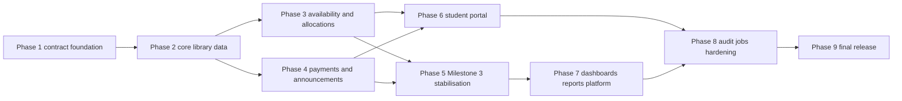
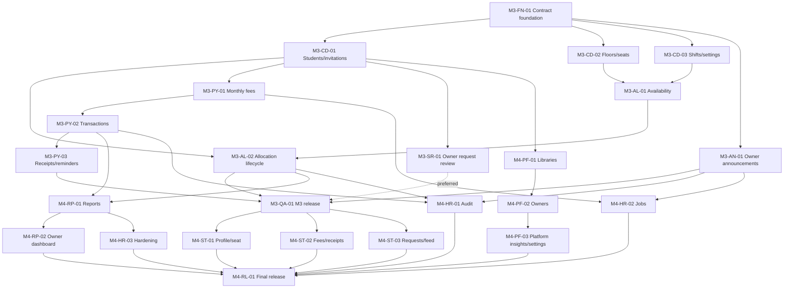

# Smart Library Milestone 3 and 4 Detailed Implementation Plan

Document owner: Smart Library engineering team  
Repository baseline reviewed: `shubham-backend3` at `ac4ea6f` on 26 July 2026  
Planning horizon: 25 July through 12 August 2026  
Status legend: Complete, Mostly complete, Partial, Placeholder, Missing, Blocked, Needs verification, Not required  
Scope rule: this document plans work only. It does not change application behavior.

## 1. Document purpose

This is the execution plan, API discovery record, Jira source, testing strategy, and submission-evidence checklist for Milestones 3 and 4. It is based on the repository as implemented, rather than on a generic library-management API.

The team should use it to:

1. Build one backend-to-frontend vertical slice at a time.
2. Avoid repeating authentication, API foundation, and core-library work that already exists.
3. Replace production-path mocks only after their real API and error states are verified.
4. preserve tenant isolation, role permissions, audit history, and transactional business rules.
5. Maintain `docs/api/openapi.yaml` as the reviewed contract.
6. Create Jira epics, stories, subtasks, PRs, test records, and milestone evidence directly from this plan.

Any conflict between this plan and later accepted product feedback must become a documented Jira decision before implementation.

## 2. Executive summary

The repository is ahead of the starting assumptions in the project brief:

- JWT authentication and browser-session integration are complete and merged into `main`.
- Phase 1, including OpenAPI 3.1, shared errors, request IDs, role and tenant dependencies, fixtures, and drift tests, is implemented in commit `ecc3fdb` on the current branch.
- Phase 2, including students, invitations, floors, physical seats, shifts, library settings, and corresponding frontend integration, is implemented in commit `ac4ea6f` on the current branch.
- Backend tests currently pass: 37 tests.
- Frontend unit tests, lint, and production build pass. Automated frontend coverage is currently authentication-only, and the build reports a 535.90 kB main chunk warning.
- Allocation, payment, announcement, reporting, super-admin, audit, and scheduled-job backend layers remain placeholders.
- Their frontend screens are substantially implemented but still obtain business data from mocks.

The critical path is:



The safest next implementation PR after Phase 2 is a seat-availability and allocation slice. Payment and announcement work may proceed in parallel because it uses separate endpoint, schema, repository, service, model, store, and page areas. Shared files such as `backend/app/api/v1/router.py`, `docs/api/openapi.yaml`, and generated schema snapshots require one nominated integrator.

## 3. Current repository status

### 3.1 Verified baseline

| Area | Verified state | Repository evidence | Planning consequence |
|---|---|---|---|
| Git baseline | `origin/main` includes frontend JWT integration; current branch adds Phase 1 and Phase 2 | Recent Git history; commits `ecc3fdb`, `ac4ea6f` | Merge status must be checked before teammates branch |
| FastAPI application | App, CORS, exception handlers, request-ID middleware, API router, health route are active | `backend/app/main.py` | Extend shared behavior; do not create a second app foundation |
| API dependencies | Authenticated user, active session, active membership, tenant, pagination, and role factories exist | `backend/app/api/deps.py` | Reuse dependencies on every planned route |
| Contract | Reviewed OpenAPI 3.1 YAML and export/drift support exist | `docs/api/openapi.yaml`, `backend/scripts/export_openapi.py`, `backend/tests/test_openapi_contract.py` | Update contract first in every vertical slice |
| Authentication | Real backend and frontend integration | `backend/app/api/v1/endpoints/auth.py`, `frontend/src/services/authService.js`, `frontend/src/api/axios.js` | Complete; only hardening/evidence remains |
| Core library APIs | Student, floor, seat, shift, and settings routes implemented | `backend/app/api/v1/endpoints/{students,floors,seats,shifts,settings}.py` | Treat as Phase 2 complete on current branch |
| Core frontend integration | Real student, seat, shift, floor, and settings calls | `frontend/src/services/studentService.js`, `frontend/src/services/seatService.js`, `frontend/src/services/librarySettingsService.js` | Stabilise rather than rewrite |
| Remaining backend | Allocation, payment, announcement, report, platform, audit, and job code is empty or placeholder | `backend/app/api/v1/endpoints/{allocations,payments,announcements,reports,super_admin}.py`, related layers | Implement as vertical slices |
| Remaining frontend | Owner, student, and super-admin business screens mostly use mocks | `frontend/src/services/{dashboard,payment,announcement,analytics,studentPortal,superAdmin}Service.js` | Replace service boundary, preserve page architecture |
| Tests | Backend 37 passing; frontend one auth suite passing; lint/build passing | `backend/tests/`, frontend test scripts | Expand domain and UI coverage in each PR |

### 3.2 Verified commands

| Check | Result on reviewed baseline | Follow-up |
|---|---|---|
| `backend/venv/bin/python -m pytest -q` from repository root, equivalent venv invocation from `backend` | 37 passed in 9.16 seconds | Preserve and extend |
| `npm test` in `frontend` | One authentication suite passed | Add service/store/component tests |
| `npm run lint` in `frontend` | Passed | Required per frontend PR |
| `npm run build` in `frontend` | Passed | Address 535.90 kB main chunk during hardening |
| Git worktree before planning edit | Clean | Final diff must contain only this document |

### 3.3 Branch caveat

Phase 1 and Phase 2 are verified in the current branch, not assumed merged into `origin/main`. Before parallel work starts, the release owner must either merge the branch or declare it as the common integration base. Jira status should be "Done, awaiting merge verification" until the remote PR state is checked.

## 4. Authentication completion status

Authentication implementation is **Complete**. It must not be reimplemented.

### 4.1 Completed capabilities

- Library registration with initial owner account.
- JSON-token login and browser-cookie session login.
- Access-token validation and authenticated `/auth/me`.
- Refresh-token rotation and reused-token rejection.
- Browser refresh through an HttpOnly refresh cookie.
- Session revocation on logout.
- Profile update and password change.
- Invitation validation and acceptance.
- Backend role and active-membership dependencies.
- Frontend token refresh, session restoration, route guards, and logout cleanup.

Evidence:

- `backend/app/api/v1/endpoints/auth.py`
- `backend/app/services/auth.py`
- `backend/app/core/security.py`
- `backend/app/api/deps.py`
- `frontend/src/services/authService.js`
- `frontend/src/stores/authStore.js`
- `frontend/src/api/authSession.js`
- `frontend/src/api/axios.js`
- `frontend/src/guards/`
- `backend/tests/test_auth_api.py`
- `backend/tests/test_auth_service.py`
- `backend/tests/test_browser_auth.py`

### 4.2 Remaining authentication work

| Work | Classification | Milestone |
|---|---|---|
| Keep OpenAPI examples and security responses current | Documentation/hardening | Every phase |
| Add permission regression tests as protected modules are added | Integration hardening | M3 and M4 |
| Test rate limiting on sensitive endpoints if feasible | Optional hardening | M4 |
| Simulated forgot-password request | Needs product decision | Deferred unless reset UI is approved |

`frontend/src/pages/auth/ForgotPassword.vue` currently simulates a request, while no reset-confirmation page or implemented backend reset route exists. `PasswordResetToken` model support alone is not enough evidence to call the workflow committed. The team must either approve and design both request and confirmation screens/routes or clearly label the current screen as deferred.

## 5. Repository analysis methodology

The analysis followed these evidence steps:

1. Inspected Git status and recent history to separate merged, current-branch, and placeholder work.
2. Enumerated backend app, route, schema, service, repository, model, migration, task, and test files.
3. Read route registration, dependencies, exception handling, request context, OpenAPI generation, and database session behavior.
4. Traced each owner, student, and super-admin route through pages, components, stores, services, and mocks.
5. Searched production code for `mock`, `placeholder`, `TODO`, `FIXME`, `setTimeout`, `localStorage`, `pass`, and `NotImplemented`.
6. Mapped UI fields and actions to SQLAlchemy models, constraints, status enums, and business rules.
7. Compared implemented FastAPI schema with `docs/api/openapi.yaml`.
8. Ran backend tests and frontend tests, lint, and build.
9. Rejected proposed endpoints that had no committed caller or business workflow.
10. Marked uncertain workflows for product decision instead of inventing behavior.

The primary repository evidence is under `backend/app/`, `backend/tests/`, `frontend/src/`, `docs/api/`, `docs/milestones/`, and `backend/docs/DATABASE_RULES.md`.

## 6. Architecture review

### 6.1 Intended architecture

```text
FastAPI router
  -> Pydantic request/response schema
  -> service business rules and transaction
  -> repository tenant-scoped persistence
  -> SQLAlchemy model
```

The frontend follows:

```text
Vue page/component
  -> Pinia store
  -> service
  -> Axios API client
```

### 6.2 Findings

| Check | Finding | Required response |
|---|---|---|
| Thin routers | Existing routers are generally thin | Keep parsing/auth in router and rules in service |
| Service boundaries | `auth.py`, `student.py`, `seat.py`, and `library.py` sometimes query or mutate through `AsyncSession` directly | Do not launch a broad refactor; new complex queries should use repositories |
| Repository boundaries | Existing core repositories correctly apply tenant and soft-delete filters | Reuse this pattern for all new list/get/update operations |
| Transactions | Allocation, transfer-like request review, payment posting, receipt issue, and batch generation require explicit atomic transactions | Service owns transaction; repository must not commit independently |
| Tenant checks | Shared active-membership and current-library dependencies exist | Derive tenant from JWT membership; never accept `libraryId` from owner/student request bodies |
| Exceptions | Structured application, HTTP, validation, and unexpected error handlers exist | Raise domain exceptions with stable error codes |
| Request trace | Request/correlation ID middleware exists | Persist request ID in audit logs and return it in errors |
| Schemas | Shared response/error/pagination schemas exist | Do not expose hashes, session tokens, soft-delete internals, or cross-tenant identifiers |
| Presentation logic | Seat availability and report calculations currently occur in mocks/utilities | Move authoritative calculations to services; retain only rendering/formatting client-side |
| Repeated validation | Shift overlap exists in frontend utility and backend Phase 2 rules | Backend remains authoritative; frontend validation is advisory |
| Circular dependencies | None blocking found | Keep domain services acyclic; audit service receives event data, not domain service objects |
| Naming | API JSON uses camelCase while Python uses snake_case aliases | Preserve the established alias generator and documented contract |

### 6.3 Required architecture guardrails

- A router must not construct report totals, resolve seat conflicts, calculate payment status, or decide announcement visibility.
- A service must use one transaction for all state changes in one command.
- A repository must scope every tenant-owned read and write by `library_id`.
- Student self-service routes derive the student from authenticated user membership and linked student record.
- Background jobs call the same idempotent service functions as HTTP commands.
- Audit writing must not replace domain rollback behavior. If the main transaction fails, no success audit may be recorded.

## 7. Frontend mock inventory

### 7.1 Production-path mocks

| Service | Mock evidence | Active callers | Data currently simulated | Replacement phase |
|---|---|---|---|---|
| `frontend/src/services/dashboardService.js` | Imports `frontend/src/mocks/dashboardMock.js` | `dashboardStore.js`, `pages/admin/Dashboard.vue` | Owner metrics, collection trend, seat/shift summaries, recent activity | Phase 7 |
| `frontend/src/services/paymentService.js` | Imports `frontend/src/mocks/paymentMock.js` | `paymentStore.js`, owner Payments/Receipts and student Fees/Receipts | Fee records, payments, receipts, reminders, monthly generation | Phase 4 and Phase 6 |
| `frontend/src/services/announcementService.js` | Imports `frontend/src/mocks/announcementMock.js` | `announcementStore.js`, owner/student announcement pages | Announcement lifecycle, feed, read state | Phase 4 and Phase 6 |
| `frontend/src/services/analyticsService.js` | Imports `frontend/src/mocks/analyticsMock.js` | `analyticsStore.js`, `pages/admin/Reports.vue` | Revenue, occupancy, student, and pending-fee aggregates | Phase 7 |
| `frontend/src/services/studentPortalService.js` | Imports `frontend/src/mocks/studentPortalMock.js` and `shiftMock` from `seatMock.js` | `studentPortalStore.js`, all student pages | Student profile, seat, fees, receipts, requests, feed | Phase 6 |
| `frontend/src/services/superAdminService.js` | Imports `frontend/src/mocks/superAdminMock.js` | `superAdminStore.js`, all super-admin pages | Platform dashboard, libraries, owners, analytics, settings | Phase 7 |

### 7.2 Direct mock constants

- `frontend/src/pages/admin/Reports.vue` imports `REPORT_TABS` from analytics mock. Move this UI-only constant to `frontend/src/constants/` before deleting the mock.
- `frontend/src/stores/paymentStore.js` imports `PAYMENT_STATUSES` from payment mock. Move it to a production constant or derive display options from a domain constant.
- `frontend/src/mocks/dashboardMock.js` composes other mocks. It is demo data, not an authoritative aggregation design.
- `frontend/src/mocks/authMock.js` and `frontend/src/mocks/librarySettingsMock.js` are no longer production service dependencies. They may remain as fixtures only if tests or demos explicitly use them.

### 7.3 Non-problems

- `setTimeout` in mock services is a fake latency mechanism and must disappear with those service replacements.
- Toast dismissal and menu timing in UI components are real interaction behavior and should remain.
- `localStorage` and `sessionStorage` usage is limited to authentication session metadata. Business records are not being persisted there.
- Static display constants, empty-state copy, and component placeholders are not business-data mocks.

## 8. Backend placeholder inventory

| Layer/file | Current state | Evidence-backed use | Action |
|---|---|---|---|
| `backend/app/api/v1/endpoints/allocations.py` | Placeholder | Availability, allocation lifecycle, owner/student seat requests | Implement in Phase 3 |
| `backend/app/api/v1/endpoints/payments.py` | Placeholder | Fee lists/generation, transactions, receipts, reminders, student fees | Implement in Phase 4/6 |
| `backend/app/api/v1/endpoints/announcements.py` | Placeholder | Owner lifecycle and student feed/read | Implement in Phase 4/6 |
| `backend/app/api/v1/endpoints/reports.py` | Placeholder | Owner dashboard and reports | Implement in Phase 7 |
| `backend/app/api/v1/endpoints/super_admin.py` | Placeholder | Platform dashboards, libraries, owners, settings | Implement in Phase 7 |
| `backend/app/api/v1/endpoints/libraries.py` | Placeholder | No separate committed owner workflow found | Do not implement unless a route not covered by `/platform` is approved |
| `backend/app/schemas/{payment,announcement,report}.py` | Placeholder | Required by corresponding UI | Implement with contract slices |
| `backend/app/repositories/{payment,announcement,report}.py` | Placeholder | Required persistence and aggregation | Implement with domain slices |
| `backend/app/services/{payment,announcement,report}.py` | Placeholder | Required business rules | Implement with domain slices |
| `backend/app/services/audit.py` | Placeholder | All administrative mutations | Implement append-only event writes in Phase 8; add critical writes earlier where noted |
| `backend/app/tasks/{monthly_fees,reminders,announcements}.py` | Placeholder | Scheduled generation, reminders, publish/expire | Implement Phase 8 after synchronous services |

No evidence supports exposing jobs as public API routes. Jobs should be scheduler entry points around idempotent services.

## 9. Database and migration review

### 9.1 Workflow support

| Module | Models and support | Constraints/risks | Migration need |
|---|---|---|---|
| Identity/tenancy | `User`, `Library`, `LibraryMembership`, sessions/invitations | Active membership is the tenant boundary | No M3 change currently required |
| Students | `Student` links library/user, status, joining/contact/profile data | Enrollment generation uses count-plus-one and may collide concurrently | Add retry/locking before load testing |
| Floors/seats/shifts | `Floor`, `Seat`, `Shift`; physical status and active flags | Service uniqueness checks exclude deleted rows while DB unique constraints include them | Decide identifier reuse; likely partial unique-index migration |
| Allocations | `SeatAllocation` has dates, status, shift snapshot, close actor/reason, previous allocation, transfer group | No database exclusion constraint; conflict correctness depends on locks and service queries | No exclusion migration required for M3 if locking is proven |
| Seat requests | `SeatChangeRequest` has preferred seat/floor/shift, review fields, resulting allocation | Partial unique index permits one pending request per student | No initial change required |
| Fees/payments | `FeeRecord`, `PaymentTransaction`, `Receipt`, `PaymentReminder` support monthly fees, partial payments, receipts, channels | Generation and receipt numbering require idempotency and concurrency protection | Validate unique indexes in PostgreSQL; add only if missing |
| Announcements | `Announcement`, `AnnouncementRead` support lifecycle, audience, schedule, expiry, unique reads | Scheduled state and read idempotency need service enforcement | No initial change required |
| Audit | `AuditLog` supports actor, tenant, entity, before/after/context, IP, user agent, request ID | Append-only behavior is not yet enforced by service policy | No initial change required |
| Platform | `PlatformSetting` stores typed JSON settings | Allowed keys and values must be schema-validated | No initial change required |

### 9.2 Required database review tasks

1. Run the initial and Phase 2 migrations against an empty PostgreSQL database.
2. Test downgrade then upgrade for the latest migration in a disposable database.
3. Decide whether soft-deleted student email/enrollment, floor code, seat number, and shift name may be reused.
4. If reuse is allowed, create a new migration replacing full unique constraints with partial unique indexes on active rows.
5. Add safe enrollment-number generation using a locked counter, sequence, or retry on unique conflict.
6. Profile report queries before adding indexes. Likely candidates are student join date, fee due date, and allocation range filters; do not add speculative indexes.
7. Verify foreign-key delete behavior preserves allocations, payments, receipts, and audit history.

### 9.3 Transaction requirements

- Lock the seat and student conflict sets before creating allocation rows.
- Create all selected non-overlapping shift allocations atomically.
- Close/cancel an allocation and write its audit record atomically.
- Generate one monthly fee per active eligible student and billing month, safely rerunnable.
- Post payment transaction, recalculate fee status, and issue receipt in one transaction.
- Review a seat request and link any resulting action atomically if allocation changes are later approved.
- Publish/archive an announcement and record audit state in one transaction.

## 10. User workflow inventory

| Role | Existing workflow | Current implementation | Required backend authority |
|---|---|---|---|
| Public | Register a library and initial owner | Real | Existing auth contract |
| Public/invited | Accept student or owner invitation | Real | Existing invitation contract |
| Owner/admin | Manage own profile/password | Real | Existing auth profile contract |
| Owner/admin | Create, edit, deactivate, invite, search, and page students | Real Phase 2 | Existing student contract |
| Owner/admin | Manage floors, physical seats, statuses, and shifts | Real Phase 2 | Existing seat/floor/shift contract |
| Owner/admin | Configure library settings | Real Phase 2 | Existing settings contract |
| Owner/admin | Inspect selected-shift seat availability | UI partial; core seats real, availability computed incompletely | Dedicated date-aware availability API |
| Owner/admin | Allocate seats and view/cancel history | UI/service partial; backend placeholder | Transactional allocation API |
| Owner/admin | Review student seat-change requests | Mock | Tenant-scoped request review API |
| Owner/admin | Generate monthly fees and post partial/full payments | Mock | Idempotent generation and transaction API |
| Owner/admin | View/download receipts and send WhatsApp reminders | Mock | Authorised receipt/reminder API |
| Owner/admin | Create, publish, archive, and delete announcements | Mock | Lifecycle API |
| Owner/admin | View dashboard and reports, print/export CSV | Mock | Database aggregates; CSV/print stay local |
| Student | View own profile, allocation, fees, receipts, requests, announcements | Mock and currently accepts frontend student ID | Self routes derive identity from JWT |
| Student | Submit/cancel seat-change request | Mock | One pending request rule |
| Super admin | Monitor platform, manage libraries/owners/settings | Mock | Platform-role routes without owner tenant scope |

Operations that do **not** need their own API:

- Report tab switching, shift-tab selection, clearing seat selection, filter-chip rendering, modal state, client-side print, and CSV construction from an already authorised report response.
- A separate "payment history" endpoint; the fee/payment list can use status, month, search, and pagination filters.
- A separate "pending payments" endpoint; use the same list contract with unpaid/partially-paid filters.
- A separate receipt-generation command; successful payment posting should issue the receipt transactionally.
- A standalone seat-transfer endpoint. The standalone transfer UI was intentionally removed. Preserve model history fields, but defer the command until a committed workflow is approved.
- CRUD for `backend/app/api/v1/endpoints/libraries.py` when the super-admin `/platform/libraries` workflow already owns platform library management.

## 11. Evidence-based API inventory

### 11.1 Contract rules used by every row

Unless a row says otherwise:

- Base path is `/api/v1`.
- Owner and student tenant scope is derived from the authenticated user's active `LibraryMembership`; clients do not send `libraryId`.
- Super-admin routes require the repository-defined super-admin role and operate across libraries.
- JSON uses camelCase aliases.
- Validation errors return 422, unauthenticated requests 401, forbidden role/tenant access 403, missing or tenant-hidden records 404, and domain conflicts 409.
- List routes use the shared page/page-size metadata from `backend/app/schemas/common.py` and stable sorting.
- All responses include the request ID header and all errors follow the shared structured error schema.
- Mutations write an audit event once the Phase 8 audit service is active; critical allocation/payment events should integrate that writer as their service is built.
- Exact request/response schema names must be agreed in the OpenAPI-first subtask. Names below describe required data, not permission to bypass reviewed YAML.

### 11.2 Complete API route catalogue

These routes are already implemented and documented. Each is **authenticated when stated, tenant-scoped through dependencies/repositories, covered by the shared error contract, and included in OpenAPI drift checks**.

| ID | Module | User workflow | Role | Method | Route | Status | Request/response summary | Evidence |
|---|---|---|---|---|---|---|---|---|
| AUTH-01 | Auth | Register library and owner, JSON-token client | Public | POST | `/api/v1/auth/register-library` | Complete | Library, owner, credentials, seat count; registration and tokens | `auth.py`, `authService.registerLibrary` |
| AUTH-02 | Auth | Login, JSON-token client | Public | POST | `/api/v1/auth/login` | Complete | Email/password; access and refresh tokens/user | `auth.py`, `authService.login` |
| AUTH-03 | Auth | Rotate JSON refresh token | Public with token | POST | `/api/v1/auth/refresh` | Complete | Refresh token; rotated pair | `auth.py`, auth tests |
| AUTH-04 | Auth | Revoke JSON session | Authenticated | POST | `/api/v1/auth/logout` | Complete | Refresh/access session context; 204 | `auth.py`, auth tests |
| AUTH-05 | Auth | Restore current identity | Authenticated | GET | `/api/v1/auth/me` | Complete | User, roles, memberships, active library | `auth.py`, `authStore` |
| AUTH-06 | Browser auth | Register and set refresh cookie | Public | POST | `/api/v1/auth/session/register-library` | Complete | Registration; user/session and access token | `auth.py`, browser auth tests |
| AUTH-07 | Browser auth | Login and set refresh cookie | Public | POST | `/api/v1/auth/session/login` | Complete | Credentials; user/session and access token | `auth.py`, `authService.login` |
| AUTH-08 | Browser auth | Rotate HttpOnly refresh cookie | Cookie session | POST | `/api/v1/auth/session/refresh` | Complete | Cookie; new access token and rotated cookie | `axios.js`, browser auth tests |
| AUTH-09 | Browser auth | Revoke cookie session | Cookie session | POST | `/api/v1/auth/session/logout` | Complete | Cookie/session; 204 and cleared cookie | `authService.logout` |
| AUTH-10 | Profile | Edit own account profile | Authenticated | PATCH | `/api/v1/auth/profile` | Complete | Name/email/phone allowed fields; current user | admin Profile page |
| AUTH-11 | Profile | Change own password | Authenticated | POST | `/api/v1/auth/change-password` | Complete | Current/new password; success | admin Profile page |
| AUTH-12 | Invitation | Validate invitation before form | Token holder | GET | `/api/v1/auth/invitations/validate` | Complete | Token query; invitation summary | `AcceptInvitation.vue` |
| AUTH-13 | Invitation | Accept invitation and set password | Token holder | POST | `/api/v1/auth/invitations/accept` | Complete | Token/password; authenticated account result | `AcceptInvitation.vue` |
| STU-01 | Students | List/search/filter students | Owner/staff | GET | `/api/v1/students` | Complete on current branch | Page/filter/sort; student page | `studentService.fetchStudents` |
| STU-02 | Students | Register student | Owner/staff | POST | `/api/v1/students` | Complete on current branch | Student form; student record | `AddStudent.vue`, `StudentForm.vue` |
| STU-03 | Students | View student details | Owner/staff | GET | `/api/v1/students/{student_id}` | Complete on current branch | Path ID; student details | `StudentDetails.vue` |
| STU-04 | Students | Edit student | Owner/staff | PATCH | `/api/v1/students/{student_id}` | Complete on current branch | Editable profile/fee/shift data; student | `EditStudent.vue` |
| STU-05 | Students | Soft-delete student | Owner/staff | DELETE | `/api/v1/students/{student_id}` | Complete on current branch | Path ID; 204 | `studentService.deleteStudent` |
| STU-06 | Students | Change active/left/inactive status | Owner/staff | PATCH | `/api/v1/students/{student_id}/status` | Complete on current branch | Status; updated student | student action workflow |
| STU-07 | Students | Send/reissue account invitation | Owner/staff | POST | `/api/v1/students/{student_id}/invitation` | Complete on current branch | Path ID; invitation delivery metadata | student details workflow |
| FLR-01 | Floors | List active floors | Owner/staff | GET | `/api/v1/floors` | Complete on current branch | Filters; floor list/page | `FloorManagementModal.vue` |
| FLR-02 | Floors | Create floor | Owner/staff | POST | `/api/v1/floors` | Complete on current branch | Code/name/notes; floor | floor modal |
| FLR-03 | Floors | Edit floor | Owner/staff | PATCH | `/api/v1/floors/{floor_id}` | Complete on current branch | Editable fields; floor | floor modal |
| FLR-04 | Floors | Soft-delete floor | Owner/staff | DELETE | `/api/v1/floors/{floor_id}` | Complete on current branch | Path ID; 204/conflict | floor modal |
| SEA-01 | Physical seats | List/search/filter seats | Owner/staff | GET | `/api/v1/seats` | Complete on current branch | Floor/status/search/page; physical seats | `SeatManagement.vue` |
| SEA-02 | Physical seats | Create seat | Owner/staff | POST | `/api/v1/seats` | Complete on current branch | Number/floor/type/status/notes; seat | `AddSeatModal.vue` |
| SEA-03 | Physical seats | View seat | Owner/staff | GET | `/api/v1/seats/{seat_id}` | Complete on current branch | Path ID; physical seat | seat details/action |
| SEA-04 | Physical seats | Edit seat | Owner/staff | PATCH | `/api/v1/seats/{seat_id}` | Complete on current branch | Editable physical fields; seat | `EditSeatModal.vue` |
| SEA-05 | Physical seats | Soft-delete seat | Owner/staff | DELETE | `/api/v1/seats/{seat_id}` | Complete on current branch | Path ID; 204/conflict | seat row action |
| SEA-06 | Physical seats | Change one status | Owner/staff | PATCH | `/api/v1/seats/{seat_id}/status` | Complete on current branch | available/maintenance/blocked; seat | `SeatActionMenu.vue` |
| SEA-07 | Physical seats | Bulk status change | Owner/staff | PATCH | `/api/v1/seats/bulk/status` | Complete on current branch | Seat IDs/status; updated records | `BulkActionMenu.vue` |
| SEA-08 | Physical seats | Bulk soft-delete | Owner/staff | POST | `/api/v1/seats/bulk/delete` | Complete on current branch | Seat IDs; deleted IDs/results | `BulkActionMenu.vue` |
| SHF-01 | Shifts | List shifts | Owner/staff | GET | `/api/v1/shifts` | Complete on current branch | Active/status filters; shifts | `ShiftManagement.vue` |
| SHF-02 | Shifts | Create shift | Owner/staff | POST | `/api/v1/shifts` | Complete on current branch | Name/start/end/default/active; shift | `ShiftFormModal.vue` |
| SHF-03 | Shifts | Edit shift | Owner/staff | PATCH | `/api/v1/shifts/{shift_id}` | Complete on current branch | Editable fields; shift | shift modal |
| SHF-04 | Shifts | Soft-delete shift | Owner/staff | DELETE | `/api/v1/shifts/{shift_id}` | Complete on current branch | Path ID; 204/conflict | shift action |
| SHF-05 | Shifts | Activate/deactivate shift | Owner/staff | PATCH | `/api/v1/shifts/{shift_id}/status` | Complete on current branch | Active flag; shift | shift action |
| SHF-06 | Shifts | Validate multi-shift selection | Owner/staff | POST | `/api/v1/shifts/validate-selection` | Complete on current branch | Shift IDs; valid/conflicting pairs | student/seat form selection |
| SET-01 | Library settings | Load tenant settings | Owner/staff | GET | `/api/v1/settings/library` | Complete on current branch | No tenant ID; settings | admin Settings page |
| SET-02 | Library settings | Update tenant settings | Owner | PATCH | `/api/v1/settings/library` | Complete on current branch | Allowed setting fields; settings | `librarySettingsService.js` |

For the complete rows above, detailed schemas, status codes, examples, operation IDs, and error responses are the reviewed source in `docs/api/openapi.yaml`. Their minimum regression suite remains: positive response, validation failure, unauthenticated request, wrong-role request, cross-library hidden/denied access, not-found behavior, and contract drift.

#### Completed-route engineering profile

This table completes the remaining required inventory fields for each implemented route. Request/response data and repository evidence are in the immediately preceding catalogue.

| API ID | Authentication requirement | Authorisation requirement | Tenant scope | Pagination, filtering, sorting, or search | Expected success statuses | Expected error conditions | Business rules and database entities | Concurrency or transaction requirement | Frontend caller and backend files affected | Test requirements | User-story mapping | Planned milestone | Dependencies |
|---|---|---|---|---|---|---|---|---|---|---|---|---|---|
| AUTH-01 | Public | None | New tenant created | None | 201 | 409 duplicate, 422 validation | Library/User/Membership/session; owner/library atomic registration | One transaction; unique conflicts | RegisterLibrary; auth endpoint/service/schema/repo/models | registration, duplicate, rollback | AUTH-REG | Complete before M3 | DB/auth security |
| AUTH-02 | Public | None | Membership resolved after login | None | 200 | 401 credentials/inactive, 422 | User/password/session/membership | Session issue atomic | Login; auth endpoint/service/security | valid/invalid/inactive/session | AUTH-LOGIN | Complete before M3 | Existing account |
| AUTH-03 | Refresh token | Token session only | Session/user membership | None | 200 | 401 invalid/expired/reused | AuthSession/refresh token rotation | Lock/revoke old and issue new atomically | Axios refresh; auth endpoint/service/security | rotation/reuse/concurrency | AUTH-REFRESH | Complete before M3 | AUTH-02 |
| AUTH-04 | Auth/session token | Owning session | Session-derived | None | 200 | 401 invalid token | AuthSession revocation | Idempotent revocation policy | authService.logout; auth endpoint/service | revoke/expired token/protected denial | AUTH-LOGOUT | Complete before M3 | AUTH-02/03 |
| AUTH-05 | Bearer | Authenticated active user | Active memberships returned | None | 200 | 401 invalid/revoked | User/Membership/Library; no secrets | Read | authStore.restore; auth endpoint/deps | session/user/role payload | AUTH-ME | Complete before M3 | AUTH-02 |
| AUTH-06 | Public | None | New tenant created | None | 201 | 409, 422 | Same registration rules as AUTH-01 plus cookie | Registration/session/cookie issue atomic | RegisterLibrary/authService; browser endpoint | cookie flags/registration/rollback | AUTH-BROWSER-REG | Complete before M3 | AUTH-01 |
| AUTH-07 | Public | None | Membership resolved | None | 200 | 401, 422 | Same login rules as AUTH-02 plus HttpOnly cookie | Session/cookie issue atomic | Login/authService; browser endpoint | cookie/login/invalid | AUTH-BROWSER-LOGIN | Complete before M3 | AUTH-02 |
| AUTH-08 | HttpOnly refresh cookie | Owning browser session | Session-derived | None | 200 | 401 missing/expired/reused | Rotation and cookie replacement | Atomic rotation; reuse revokes family policy | `axios.js`; browser endpoint/service | cookie rotation/retry/reuse | AUTH-BROWSER-REFRESH | Complete before M3 | AUTH-07 |
| AUTH-09 | HttpOnly refresh cookie/session | Owning browser session | Session-derived | None | 200 | 401 policy-specific | Revoke session and clear cookie | Atomic revoke; response clears cookie | authService.logout; browser endpoint | logout/cookie/protected denial | AUTH-BROWSER-LOGOUT | Complete before M3 | AUTH-07/08 |
| AUTH-10 | Bearer/session | Current user | User plus active context | None | 200 | 401, 409 email, 422 | User allowed profile fields only | Atomic update | Admin Profile; auth endpoint/service/schema | whitelist/duplicate/validation | AUTH-PROFILE | Complete before M3 | AUTH-05 |
| AUTH-11 | Bearer/session | Current user | User-derived | None | 200 | 401 current password, 422 new password | User password hash; revoke/retain sessions per implemented policy | Atomic hash/session policy | Admin Profile; auth endpoint/service/security | wrong current/weak/reuse/success | AUTH-PASSWORD | Complete before M3 | AUTH-05 |
| AUTH-12 | Invitation token | Token holder | Invitation library | None | 200 | 404/410 invalid/expired/used, 422 | AccountInvitation/User/Student context; no secret exposure | Read | AcceptInvitation; auth endpoint/service | valid/expired/used/malformed | AUTH-INVITE-VALIDATE | Complete before M3 | Invitation created |
| AUTH-13 | Invitation token | Token holder | Invitation library | None | 200 | 404/409/410/422 | Invitation/User/Membership/Student; set password and consume once | Lock invitation; account activation atomic | AcceptInvitation; auth endpoint/service | success/reuse/rollback/password | AUTH-INVITE-ACCEPT | Complete before M3 | AUTH-12 |
| STU-01 | Bearer/session | Owner/staff | Current library | page, pageSize, search, status, sort | 200 | 401/403/422 | Student/User; active/deleted policy and tenant filters | Read | Students/store/service; student route/repo | page/filter/search/sort/tenant | M3-CD-01 | M3 baseline | AUTH-05 |
| STU-02 | Bearer/session | Owner/staff | Current library | None | 201 | 401/403/409/422 | Student identity/status/enrollment, optional shift references | Atomic create; enrollment race hardening | AddStudent/Form/service; student layers | duplicate/invalid/tenant/rollback | M3-CD-01 | M3 baseline | STU-01, SHF-01 |
| STU-03 | Bearer/session | Owner/staff | Record in current library | None | 200 | 401/403/404 | Student/User and allowed related summary | Read | StudentDetails/service; student layers | found/not-found/cross-tenant | M3-CD-01 | M3 baseline | STU-01 |
| STU-04 | Bearer/session | Owner/staff | Record/current library | None | 200 | 401/403/404/409/422 | Editable Student fields; preserve account/history | Atomic update | EditStudent/Form/service; student layers | whitelist/duplicate/tenant | M3-CD-01 | M3 baseline | STU-03 |
| STU-05 | Bearer/session | Owner/staff | Record/current library | None | 200 | 401/403/404/409 | Student soft delete; historical allocations/fees remain | Atomic soft delete/audit | Students action/service; student layers | history/conflict/tenant/idempotency | M3-CD-01 | M3 baseline | STU-03 |
| STU-06 | Bearer/session | Owner/staff | Record/current library | None | 200 | 401/403/404/409/422 | Allowed Student status transition; non-active blocks new allocation | Atomic update/audit | student action/service; student layers | transition/allocation eligibility | M3-CD-01 | M3 baseline | STU-03 |
| STU-07 | Bearer/session | Owner/staff | Student/current library | None | 200 | 401/403/404/409/422 | Student/User/AccountInvitation; one valid pending invite | Lock/expire/reissue atomically | Student details/service; student/auth layers | first/reissue/active account/tenant | M3-CD-01 | M3 baseline | STU-03, AUTH-12/13 |
| FLR-01 | Bearer/session | Owner/staff | Current library | optional search/status/order | 200 | 401/403/422 | Floor; exclude soft-deleted | Read | Floor modal/seatService; floor route/seat repo | list/order/tenant/deleted | M3-CD-02 | M3 baseline | AUTH-05 |
| FLR-02 | Bearer/session | Owner/staff | Current library | None | 201 | 401/403/409/422 | Floor unique active code/name policy | Atomic create | Floor modal/seatService; floor layers | duplicate/validation/tenant | M3-CD-02 | M3 baseline | FLR-01 |
| FLR-03 | Bearer/session | Owner/staff | Floor/current library | None | 200 | 401/403/404/409/422 | Editable Floor fields and uniqueness | Atomic update | Floor modal/seatService; floor layers | duplicate/not-found/tenant | M3-CD-02 | M3 baseline | FLR-01 |
| FLR-04 | Bearer/session | Owner/staff | Floor/current library | None | 200 | 401/403/404/409 | Soft delete only when dependent active-seat policy permits | Atomic soft delete/audit | Floor modal/seatService; floor layers | seat conflict/history/tenant | M3-CD-02 | M3 baseline | FLR-01, SEA rows |
| SEA-01 | Bearer/session | Owner/staff | Current library | page, pageSize, floor, physical status, search, sort | 200 | 401/403/422 | Seat/Floor; physical status only, occupancy derived separately | Read | SeatManagement/store/service; seat layers | filters/page/sort/tenant/deleted | M3-CD-02 | M3 baseline | FLR-01 |
| SEA-02 | Bearer/session | Owner/staff | Current library/floor | None | 201 | 401/403/404/409/422 | Seat unique number, valid floor/type/status | Atomic create | AddSeatModal/store/service; seat layers | duplicate/floor/validation/tenant | M3-CD-02 | M3 baseline | FLR-01 |
| SEA-03 | Bearer/session | Owner/staff | Seat/current library | None | 200 | 401/403/404 | Physical Seat/Floor detail, not student allocation | Read | seat action/service; seat layers | found/deleted/cross-tenant | M3-CD-02 | M3 baseline | SEA-01 |
| SEA-04 | Bearer/session | Owner/staff | Seat/current library | None | 200 | 401/403/404/409/422 | Editable physical seat fields; no allocation edit | Atomic update | EditSeatModal/store/service; seat layers | duplicate/floor/status/tenant | M3-CD-02 | M3 baseline | SEA-03 |
| SEA-05 | Bearer/session | Owner/staff | Seat/current library | None | 200 | 401/403/404/409 | Soft delete subject to active allocation/history policy | Atomic soft delete/audit | row action/store/service; seat layers | active allocation/conflict/tenant | M3-CD-02 | M3 baseline | SEA-03 |
| SEA-06 | Bearer/session | Owner/staff | Seat/current library | None | 200 | 401/403/404/409/422 | available/maintenance/blocked physical state; active allocation handling explicit | Atomic update/audit | SeatActionMenu/store/service; seat layers | transition/occupied/tenant | M3-CD-02 | M3 baseline | SEA-03 |
| SEA-07 | Bearer/session | Owner/staff | All IDs/current library | None | 200 | 401/403/404/409/422 | Apply one physical status to selected seats | All-or-none transaction | BulkActionMenu/store/service; seat layers | mixed tenant/missing/rollback | M3-CD-02 | M3 baseline | SEA-01 |
| SEA-08 | Bearer/session | Owner/staff | All IDs/current library | None | 200 | 401/403/404/409/422 | Bulk soft-delete, preserve histories, report deleted IDs | All-or-none transaction | BulkActionMenu/store/service; seat layers | conflict/mixed tenant/rollback | M3-CD-02 | M3 baseline | SEA-01 |
| SHF-01 | Bearer/session | Owner/staff | Current library | active/status/search/order if contract permits | 200 | 401/403/422 | Shift excludes deleted; active options for allocation | Read | ShiftManagement/student forms/seatService; shift layers | filter/tenant/deleted | M3-CD-03 | M3 baseline | AUTH-05 |
| SHF-02 | Bearer/session | Owner/staff | Current library | None | 201 | 401/403/409/422 | Unique shift; valid nonzero normal/overnight interval | Atomic create | ShiftFormModal/store/service; shift layers | duplicate/time/overnight | M3-CD-03 | M3 baseline | SHF-01 |
| SHF-03 | Bearer/session | Owner/staff | Shift/current library | None | 200 | 401/403/404/409/422 | Edit future behavior; snapshots preserve allocation history | Atomic update | ShiftFormModal/store/service; shift layers | used shift/time/duplicate/tenant | M3-CD-03 | M3 baseline | SHF-01 |
| SHF-04 | Bearer/session | Owner/staff | Shift/current library | None | 200 | 401/403/404/409 | Soft delete; historical snapshot remains | Atomic soft delete/audit | shift action/store/service; shift layers | active use/history/tenant | M3-CD-03 | M3 baseline | SHF-01 |
| SHF-05 | Bearer/session | Owner/staff | Shift/current library | None | 200 | 401/403/404/409/422 | Inactive shift unavailable for new allocation | Atomic update/audit | shift action/store/service; shift layers | transition/tenant/allocation options | M3-CD-03 | M3 baseline | SHF-01 |
| SHF-06 | Bearer/session | Owner/staff | All shift IDs/current library | None | 200 | 401/403/404/422 | Pairwise daily interval overlap including midnight | Read-only validation | StudentForm/SeatAllocationDialog/seatService; shift service/route | normal/contained/boundary/overnight/tenant | M3-CD-03 | M3 baseline | SHF-01 |
| SET-01 | Bearer/session | Owner/staff | Current library | None | 200 | 401/403 | LibrarySettings defaults/record | Read | Settings/store/service; settings/library layers | defaults/tenant/role | M3-CD-03 | M3 baseline | Membership |
| SET-02 | Bearer/session | Owner per contract | Current library | None | 200 | 401/403/422 | Typed allowed LibrarySettings fields and runtime policies | Atomic upsert/audit | Settings/store/service; settings/library layers | type/range/role/tenant | M3-CD-03 | M3 baseline | SET-01 |

### 11.3 Planned API contract inventory

The following three linked tables form one complete inventory. `API ID` joins the required contract, data/rules, and implementation/evidence fields.

#### A. Workflow, route, security, and tenant scope

| API ID | Module | User workflow | User role | Proposed HTTP method | Proposed route | Current implementation status | Authentication requirement | Authorisation requirement | Tenant scope |
|---|---|---|---|---|---|---|---|---|---|
| AL-01 | Seat availability | Inspect seats for selected shift/date range | Owner/staff | GET | `/api/v1/seat-allocations/availability` | Missing | Bearer/session | Owner or staff | Current active library |
| AL-02 | Allocations | List history/current allocations | Owner/staff | GET | `/api/v1/seat-allocations` | Missing | Bearer/session | Owner or staff | Current active library |
| AL-03 | Allocations | Allocate one seat for multiple non-overlapping shifts | Owner/staff | POST | `/api/v1/seat-allocations` | Missing | Bearer/session | Owner or staff | Current active library |
| AL-04 | Allocations | Complete or cancel allocation | Owner/staff | PATCH | `/api/v1/seat-allocations/{allocation_id}/status` | Missing | Bearer/session | Owner or staff | Allocation must belong to current library |
| AL-05 | Self allocation | Student views own active/history seat data | Student | GET | `/api/v1/seat-allocations/me` | Missing | Bearer/session | Student | Student derived from identity/membership |
| SR-01 | Seat requests | Owner lists student requests | Owner/staff | GET | `/api/v1/seat-requests` | Missing | Bearer/session | Owner or staff | Current active library |
| SR-02 | Seat requests | Owner approves/rejects request | Owner/staff | PATCH | `/api/v1/seat-requests/{request_id}/review` | Missing | Bearer/session | Owner or staff | Request belongs to current library |
| SR-03 | Seat requests | Student lists own requests | Student | GET | `/api/v1/seat-requests/me` | Missing | Bearer/session | Student | Student derived from identity |
| SR-04 | Seat requests | Student submits request | Student | POST | `/api/v1/seat-requests` | Missing | Bearer/session | Student | Student/library derived from identity |
| SR-05 | Seat requests | Student cancels pending request | Student | PATCH | `/api/v1/seat-requests/{request_id}/cancel` | Missing | Bearer/session | Owning student only | Student and library derived from identity |
| ME-01 | Student profile | View own student profile | Student | GET | `/api/v1/students/me` | Missing | Bearer/session | Student | Identity-derived student only |
| ME-02 | Student profile | Edit allowed own profile fields | Student | PATCH | `/api/v1/students/me` | Missing | Bearer/session | Student | Identity-derived student only |
| PAY-01 | Fees | Owner lists/searches monthly fee records | Owner/staff | GET | `/api/v1/payments` | Missing | Bearer/session | Owner or staff | Current active library |
| PAY-02 | Fee generation | Generate a tenant billing month | Owner | POST | `/api/v1/payments/monthly-generation` | Missing | Bearer/session | Owner | Current active library |
| PAY-03 | Payment | Post full/partial transaction | Owner/staff | POST | `/api/v1/payments/{fee_record_id}/transactions` | Missing | Bearer/session | Owner or staff | Fee belongs to current library |
| PAY-04 | Receipts | Owner lists receipts | Owner/staff | GET | `/api/v1/payments/receipts` | Missing | Bearer/session | Owner or staff | Current active library |
| PAY-05 | Receipts | Owner/student views one receipt | Owner/student | GET | `/api/v1/payments/receipts/{receipt_id}` | Missing | Bearer/session | Tenant owner/staff or receipt student | Tenant plus record ownership |
| PAY-06 | Receipts | Download receipt document | Owner/student | GET | `/api/v1/payments/receipts/{receipt_id}/download` | Missing | Bearer/session | Tenant owner/staff or receipt student | Tenant plus record ownership |
| PAY-07 | Reminders | Create reminder attempt/WhatsApp link | Owner/staff | POST | `/api/v1/payments/{fee_record_id}/reminders` | Missing | Bearer/session | Owner or staff | Fee belongs to current library |
| PAY-08 | Student fees | Student lists own fees/summary | Student | GET | `/api/v1/payments/me` | Missing | Bearer/session | Student | Identity-derived student only |
| PAY-09 | Student receipts | Student lists own receipts | Student | GET | `/api/v1/payments/receipts/me` | Missing | Bearer/session | Student | Identity-derived student only |
| AN-01 | Announcements | Owner lists announcements | Owner/staff | GET | `/api/v1/announcements` | Missing | Bearer/session | Owner or staff | Current active library |
| AN-02 | Announcements | Owner creates draft/scheduled item | Owner/staff | POST | `/api/v1/announcements` | Missing | Bearer/session | Owner or staff | Current active library |
| AN-03 | Announcements | Owner edits allowed lifecycle state | Owner/staff | PATCH | `/api/v1/announcements/{announcement_id}` | Missing | Bearer/session | Owner or staff | Announcement belongs to library |
| AN-04 | Announcements | Publish item | Owner/staff | POST | `/api/v1/announcements/{announcement_id}/publish` | Missing | Bearer/session | Owner or staff | Announcement belongs to library |
| AN-05 | Announcements | Archive item | Owner/staff | POST | `/api/v1/announcements/{announcement_id}/archive` | Missing | Bearer/session | Owner or staff | Announcement belongs to library |
| AN-06 | Announcements | Delete eligible draft/archive | Owner/staff | DELETE | `/api/v1/announcements/{announcement_id}` | Missing | Bearer/session | Owner or staff | Announcement belongs to library |
| AN-07 | Announcement feed | Student reads visible feed | Student | GET | `/api/v1/announcements/feed` | Missing | Bearer/session | Student | Identity-derived library and eligibility |
| AN-08 | Announcement read | Student marks visible item read | Student | POST | `/api/v1/announcements/{announcement_id}/read` | Missing | Bearer/session | Student | Identity-derived student and library |
| RP-01 | Reports | Load filter options | Owner/staff | GET | `/api/v1/reports/options` | Missing | Bearer/session | Owner or staff | Current active library |
| RP-02 | Reports | Load overview/revenue/occupancy/student/pending report | Owner/staff | GET | `/api/v1/reports` | Missing | Bearer/session | Owner or staff | Current active library |
| RP-03 | Owner dashboard | Load owner operational dashboard | Owner/staff | GET | `/api/v1/reports/dashboard` | Missing | Bearer/session | Owner or staff | Current active library |
| PF-01 | Platform dashboard | Monitor platform | Super admin | GET | `/api/v1/platform/dashboard` | Missing | Bearer/session | Super admin | Cross-library, platform authorised |
| PF-02 | Platform libraries | Search/list libraries | Super admin | GET | `/api/v1/platform/libraries` | Missing | Bearer/session | Super admin | Cross-library |
| PF-03 | Platform libraries | Create library | Super admin | POST | `/api/v1/platform/libraries` | Missing | Bearer/session | Super admin | Platform scope |
| PF-04 | Platform libraries | Edit library | Super admin | PATCH | `/api/v1/platform/libraries/{library_id}` | Missing | Bearer/session | Super admin | Target library explicit and audited |
| PF-05 | Platform libraries | Activate/suspend library | Super admin | PATCH | `/api/v1/platform/libraries/{library_id}/status` | Missing | Bearer/session | Super admin | Target library explicit and audited |
| PF-06 | Platform owners | Search/list owners | Super admin | GET | `/api/v1/platform/owners` | Missing | Bearer/session | Super admin | Cross-library |
| PF-07 | Platform owners | Create/invite owner | Super admin | POST | `/api/v1/platform/owners` | Missing | Bearer/session | Super admin | Optional target library assignment |
| PF-08 | Platform owners | Edit owner/assignment | Super admin | PATCH | `/api/v1/platform/owners/{owner_id}` | Missing | Bearer/session | Super admin | Cross-library, validate assignment |
| PF-09 | Platform owners | Activate/suspend owner | Super admin | PATCH | `/api/v1/platform/owners/{owner_id}/status` | Missing | Bearer/session | Super admin | Cross-library |
| PF-10 | Platform analytics | View platform analytics | Super admin | GET | `/api/v1/platform/analytics` | Missing | Bearer/session | Super admin | Cross-library aggregates |
| PF-11 | Platform settings | Load platform settings | Super admin | GET | `/api/v1/platform/settings` | Missing | Bearer/session | Super admin | Platform scope |
| PF-12 | Platform settings | Update platform settings | Super admin | PATCH | `/api/v1/platform/settings` | Missing | Bearer/session | Super admin | Platform scope |

#### B. Request, response, behavior, status, rules, entities, and transaction

| API ID | Request data | Response data | Pagination, filtering, sorting, or search | Expected success statuses | Expected error conditions | Business rules | Database entities | Concurrency or transaction requirement |
|---|---|---|---|---|---|---|---|---|
| AL-01 | `shiftId`, `startDate`, `endDate`, optional `floorId` | Seats with available/allotted/blocked/reserved/maintenance, blocker time/shift, summary | Floor; stable floor/seat order | 200 | 401/403/404 shift, 422 dates | Inclusive date overlap plus daily time overlap; physical status precedence; active records only | Seat, Floor, Shift, SeatAllocation, Student | Consistent read snapshot; no mutation |
| AL-02 | Query only | Allocation rows with seat/shift snapshot/status/dates | student/seat/status/date/search/page/sort | 200 | 401/403/422 | Preserve completed/cancelled history | SeatAllocation and references | Read snapshot |
| AL-03 | `studentId`, `seatId`, `shiftIds[]`, `startDate`, `endDate`, `notes` | Created allocation rows and refreshed availability | None | 201 | 404, 409 conflict, 422 overlap/dates | Active student; valid active same-library seat/shifts; no selected-shift overlap; no seat/student interval conflict; consecutive starts after prior inclusive end | Student, Seat, Shift, SeatAllocation | Lock seat/student conflict rows; create all or none |
| AL-04 | `status` completed/cancelled, optional `effectiveEndDate`, `closeReason` | Closed allocation | None | 200 | 404/409/422 | Never hard-delete; closed records stop blocking; end cannot precede start | SeatAllocation | Lock target; update and audit atomically |
| AL-05 | Optional history/status query | Own seat, shift snapshots, status/dates/history | status/page if history shown | 200 | 401/403/404 linked student | No arbitrary student ID | Student, SeatAllocation, Seat, Shift | Read snapshot |
| SR-01 | Query only | Requests and summary counts, no unrelated private student data | status/search/page/sort | 200 | 401/403/422 | Tenant only | SeatChangeRequest, Student, preferred refs | Read snapshot |
| SR-02 | `decision`, `adminNote` | Reviewed request | None | 200 | 404/409 already reviewed, 422 | Approve/reject pending only; rejection note validation; current UI does not implicitly transfer allocation | SeatChangeRequest | Lock pending row; review/audit atomically |
| SR-03 | Query only | Own request history | status/page | 200 | 401/403 | Identity-derived student | SeatChangeRequest | Read snapshot |
| SR-04 | Preferred seat/floor/shift IDs, reason | Pending request | None | 201 | 404 refs, 409 pending exists/disabled, 422 | Library setting enabled; active student; one pending request; preferred refs same tenant | SeatChangeRequest, settings, Student, Seat/Floor/Shift | Unique pending constraint; atomic create |
| SR-05 | No body or reason | Cancelled request | None | 200 | 404/409 not pending | Only owning student and pending state | SeatChangeRequest | Lock/update atomically |
| ME-01 | None | Allowed profile and library context | None | 200 | 401/403/404 linked student | Identity-derived; no owner-selected ID | User, Student, Library | Read |
| ME-02 | Phone/address/guardian/preferred language fields | Updated allowed profile | None | 200 | 401/403/422 | Name/email/status/fees/allocation not self-editable | Student | Atomic update |
| PAY-01 | Query only | Fee rows, paid/due balances, transaction summary, totals | month/status/search/page/sort | 200 | 401/403/422 | Totals calculated from transactions; no duplicated UI truth | FeeRecord, PaymentTransaction, Student | Read snapshot |
| PAY-02 | `billingMonth`, optional approved due-date override | Counts created/existing/skipped and records | None | 200 or 201 | 409 policy conflict, 422 month | Derive eligible active students and settings server-side; one record/student/month; rerun safe | Student, FeeRecord, LibrarySettings | One transaction or safe batches; unique conflict/idempotency |
| PAY-03 | `amount`, `method`, optional reference/paidAt/notes | Transaction, updated fee balance/status, receipt | None | 201 | 404, 409 overpayment/closed fee/duplicate ref, 422 | Positive amount; partial status calculated; receipt only for completed transaction; no unsafe mark-unpaid | FeeRecord, PaymentTransaction, Receipt | Lock fee; transaction+status+receipt+audit atomically |
| PAY-04 | Query only | Receipt summaries | month/search/page/sort | 200 | 401/403/422 | Tenant receipts only, void state visible | Receipt, transaction, fee, student | Read |
| PAY-05 | Path ID | Receipt detail/snapshot | None | 200 | 403/404 | Student only owns receipt; owner only same tenant | Receipt and references | Read |
| PAY-06 | Path ID, optional format if approved | PDF/download response | None | 200 | 403/404/406 | Same authorisation as detail; stable receipt snapshot | Receipt | Read; generation must not mutate |
| PAY-07 | `channel`, optional message | Persisted attempt and WhatsApp deep link | None | 201 | 404, 409 disabled/no due, 422 phone/channel | M3 supports WhatsApp UI; record attempted/sent/failed outcome; do not claim delivery from link open | PaymentReminder, FeeRecord, Student, settings | Persist attempt atomically; external open is client action |
| PAY-08 | Optional month/status/page | Own fee rows and summary | month/status/page | 200 | 401/403 | Identity-derived student; no arbitrary ID | Student, FeeRecord, transactions | Read |
| PAY-09 | Optional month/page | Own receipt summaries | month/page | 200 | 401/403 | Identity-derived student | Receipt and references | Read |
| AN-01 | Query only | Admin rows and status counts | search/status/category/page/sort | 200 | 401/403/422 | Tenant records including lifecycle states | Announcement | Read |
| AN-02 | title/body/category/priority/audience/status/schedule/expiry | Announcement | None | 201 | 409/422 | Title 5-120, body 10-1000; valid lifecycle and dates | Announcement | Atomic create/audit |
| AN-03 | Editable announcement fields | Updated item | None | 200 | 404/409 lifecycle, 422 | Published content restrictions must be explicit; schedule/expiry valid | Announcement | Lock/update/audit |
| AN-04 | Optional publish timestamp | Published item | None | 200 | 404/409/422 | Draft/scheduled only; publish time and expiry valid | Announcement | Lock/update/audit |
| AN-05 | Optional reason | Archived item | None | 200 | 404/409 | Allowed active lifecycle states only | Announcement | Lock/update/audit |
| AN-06 | None | No content | None | 204 | 404/409 published/not deletable | Soft-delete draft/archive only; preserve history | Announcement | Lock/soft-delete/audit |
| AN-07 | Query only | Visible items with read flag/unread count | category/page/sort | 200 | 401/403 | Published, due, unexpired, matching audience/fee status/active state | Announcement, AnnouncementRead, Student, FeeRecord | Read |
| AN-08 | None | Read marker or 204 | None | 200 or 204 | 403/404 invisible item | Idempotent; only visible announcement | AnnouncementRead | Unique pair; upsert/idempotent |
| RP-01 | None | Available months, active floors/shifts | None | 200 | 401/403 | Options tenant-derived | FeeRecord, Floor, Shift | Read |
| RP-02 | `startMonth`, `endMonth`, optional `floorId`, `shiftId` | Metrics, revenue series/methods, occupancy, student trends/status, pending rows/ageing, insights | Date/floor/shift filters; pending detail may be capped/paged | 200 | 401/403/404 filter refs, 422 range | Calculate from source records; no duplicated counters | Students, seats, allocations, fees, transactions | Consistent aggregate read; profile query |
| RP-03 | Optional current month/date | Metrics, seat statuses, 3-month collection, shift status summary, attention, recent activity | Fixed recent limits | 200 | 401/403/422 | Database-derived, same availability/payment rules as detail screens | Core domain and AuditLog | Consistent aggregate read |
| PF-01 | Optional date window | Platform metrics/trends/status/activity | Fixed recent limits | 200 | 401/403 | Real aggregates, no tenant client input | Libraries, memberships, students, seats, allocations, AuditLog | Read |
| PF-02 | Query | Library summaries | search/status/state/page/sort | 200 | 401/403/422 | Include assigned owner and calculated counts | Library, membership, related aggregate tables | Read |
| PF-03 | Name/location/contact/status/seatCount policy, optional owner | Library result | None | 201 | 409 duplicate, 422 | Creation semantics must not silently create hundreds of seats unless confirmed; registration currently does | Library, Floor/Seat if confirmed, membership | Atomic creation and optional assignment |
| PF-04 | Editable library fields/optional owner assignment | Updated library | None | 200 | 404/409/422 | Preserve memberships; validate reassignment | Library, Membership | Lock/update/audit |
| PF-05 | Active/suspended status and reason | Updated library | None | 200 | 404/409 | Suspension effect on member access must be defined | Library, Membership/session policy | Lock/update/audit |
| PF-06 | Query | Owner summaries/assignment | search/status/library/page/sort | 200 | 401/403/422 | Owner-role memberships only | User, Membership, Library | Read |
| PF-07 | Name/email/phone/optional library | Owner plus invitation metadata | None | 201 | 409 email/membership, 422 | Use invitation/account flow; no plaintext password | User, Membership, AccountInvitation, Library | Atomic account/invitation/assignment |
| PF-08 | Editable profile/library assignment | Updated owner | None | 200 | 404/409/422 | One assignment rule follows product decision; preserve history | User, Membership, Library | Atomic reassignment/audit |
| PF-09 | Active/suspended status/reason | Updated owner | None | 200 | 404/409 | Define active sessions after suspension | User, Membership, AuthSession | Atomic status/session policy/audit |
| PF-10 | Date range | Platform trends/distributions | date filters | 200 | 401/403/422 | Calculate from source tenant records | Platform-wide domain tables | Aggregate read/profile |
| PF-11 | None | Allowed platform settings | None | 200 | 401/403 | Whitelist typed keys | PlatformSetting | Read |
| PF-12 | Platform name/support/session/security toggles represented in UI | Updated settings | None | 200 | 401/403/422 | Validate key/type/range; never expose secrets | PlatformSetting | Atomic upsert/audit |

#### C. Caller, backend layers, tests, stories, dependencies, and evidence

| API ID | Frontend caller | Backend files affected | Test requirements | User-story mapping | Planned milestone | Dependencies | Evidence |
|---|---|---|---|---|---|---|---|
| AL-01 | `seatService.fetchSeatAvailability`, `seatStore`, `SeatAvailability.vue` | allocation router/schema/service; seat repository; OpenAPI | status precedence, all overlap forms, overnight, dates, tenant, physical states | M3-AL-01 | M3 | Phase 2 shifts/seats; overlap utility | `SeatAvailability.vue`, `seatAvailability.js`, `SeatAllocation` |
| AL-02 | allocation history in seat/student management | allocation layers | filters/page/sort, history visibility, tenant | M3-AL-02 | M3 | AL-03/04 records | seat store methods; allocation model |
| AL-03 | `seatService.allocateSeat`, `seatStore`, `SeatAllocationDialog.vue` and approved host page | allocation layers, audit integration | success, all conflicts, inactive entities, rollback, concurrency, cross-tenant | M3-AL-02 | M3 | AL-01, SHF-06 | dialog, store actions, database rules |
| AL-04 | allocation row/action | allocation layers, audit | status transitions, dates, repeat close, tenant | M3-AL-02 | M3 | AL-02/03 | allocation model lifecycle fields |
| AL-05 | `studentPortalService.getSeat`, `studentPortalStore`, `MySeat.vue` | allocation router/schema/service/repo | own identity, no IDOR, history | M4-ST-01 | M4 | AL-02/03; student link | student portal mock/service |
| SR-01 | `seatRequestStore`, `SeatRequests.vue` | allocation router/schema/service/repo | filters, summary, tenant/privacy | M3-SR-01 | M3 | Phase 2 students | owner request page |
| SR-02 | `SeatRequestReviewModal.vue` | same plus audit | valid decisions, stale review, note validation, tenant | M3-SR-01 | M3 | SR-01 | review modal/service mock |
| SR-03 | `studentPortalStore`, `Requests.vue` | same | self-only, pagination | M4-ST-03 | M4 | SR-04 | student request page |
| SR-04 | `SeatRequestModal.vue` | same | disabled setting, duplicate pending, references, tenant | M4-ST-03 | M4 | settings, Phase 2 refs | request modal/mock rules |
| SR-05 | `Requests.vue` cancel action | same | ownership, state transition, idempotency decision | M4-ST-03 | M4 | SR-03/04 | student portal service |
| ME-01 | `studentPortalService.getProfile`, Profile/Dashboard | student route/schema/service/repo | linked/unlinked user, tenant, fields | M4-ST-01 | M4 | auth identity/student account | current service's `ensureStudentAccess` shows flaw |
| ME-02 | `studentPortalService.updateProfile`, Profile.vue | student layers | editable whitelist, validation, self-only | M4-ST-01 | M4 | ME-01 | Profile.vue fields |
| PAY-01 | `paymentService.getPayments`, `paymentStore`, Payments.vue | payment layers/OpenAPI | totals, filters/page/sort, tenant, empty | M3-PY-01 | M3 | Phase 2 students/settings | payment service and Payments page |
| PAY-02 | `paymentService.generateMonthlyPayments` | payment layers/audit | first run/rerun, active-only, month, rollback, concurrency | M3-PY-01 | M3 | PAY-01, settings | monthly mock implementation, FeeRecord unique rule |
| PAY-03 | replacement for `updatePaymentStatus`, PaymentStatusDialog | payment layers/audit | partial/full/overpay/duplicate ref/rollback/concurrency | M3-PY-02 | M3 | PAY-01 | payment UI, payment models |
| PAY-04 | `paymentService.getReceipts`, Receipts.vue | payment layers | filter/page/tenant/void | M3-PY-03 | M3 | PAY-03 | owner Receipts page |
| PAY-05 | receipt preview, student receipt detail | payment layers | owner/student auth matrix and IDOR | M3-PY-03, M4-ST-02 | M3/M4 | PAY-03 | ReceiptPreviewDialog, Receipt model |
| PAY-06 | `paymentService` download action | payment layers/document renderer | content type, snapshot, IDOR | M3-PY-03 | M3 | PAY-05; format decision | receipt download controls |
| PAY-07 | `generateWhatsAppReminder`, reminder dialog | payment layers/audit | settings, phone, due status, persistence | M3-PY-03 | M3 | PAY-01/settings | WhatsAppReminderDialog, PaymentReminder |
| PAY-08 | studentPortal fees/`Fees.vue` | payment layers | self-only, summaries, filters | M4-ST-02 | M4 | PAY-01 | student Fees page |
| PAY-09 | studentPortal receipts/`Receipts.vue` | payment layers | self-only, no other-student leak | M4-ST-02 | M4 | PAY-04/05 | student Receipts page |
| AN-01 | `announcementStore.fetchAnnouncements`, admin page | announcement layers | filters/page/status/tenant | M3-AN-01 | M3 | auth/tenant | admin Announcements page |
| AN-02 | announcement form create | announcement layers/audit | validation/lifecycle/tenant | M3-AN-01 | M3 | AN-01 | AnnouncementFormModal |
| AN-03 | announcement form edit | announcement layers/audit | lifecycle conflicts/concurrent update | M3-AN-01 | M3 | AN-01/02 | form/action menu |
| AN-04 | publish action | announcement layers/audit | state/date/idempotency policy | M3-AN-02 | M3 | AN-02/03 | AnnouncementActionMenu |
| AN-05 | archive action | announcement layers/audit | transition/tenant | M3-AN-02 | M3 | AN-04 | action menu |
| AN-06 | delete action | announcement layers/audit | allowed states/soft delete/history | M3-AN-02 | M3 | AN-01 | action menu |
| AN-07 | studentPortal announcements/Announcements.vue | announcement layers | audience, dates, active/fee eligibility, self tenant | M4-ST-04 | M4 | AN-04; fee state | student page/mock |
| AN-08 | mark read action | announcement layers | visible-only/idempotent/unique | M4-ST-04 | M4 | AN-07 | AnnouncementRead model |
| RP-01 | `analyticsStore.fetchOptions`, ReportFilters | report layers | empty/options/tenant | M4-RP-01 | M4 | real core data | analytics service/store |
| RP-02 | `analyticsService.getReports`, Reports.vue/components | report layers/queries | every metric/filter, tenant, boundaries, performance | M4-RP-01 | M4 | allocations/payments | all report components |
| RP-03 | `dashboardService.getDashboard`, dashboard store/page | report layers/queries | metric reconciliation, empty/tenant/performance | M4-RP-02 | M4 | all M3 domains, audit | dashboard service/mock |
| PF-01 | `superAdminStore.fetchDashboard`, superadmin Dashboard | super-admin layers | role denial, aggregate reconciliation | M4-PF-01 | M4 | audit/domain data | superadmin dashboard |
| PF-02 | `fetchLibraries`, Libraries.vue | super-admin layers | search/filter/page/sort | M4-PF-02 | M4 | library model | mock service/page |
| PF-03 | `createLibrary`, LibraryFormModal | super-admin layers | validation/duplicates/rollback | M4-PF-02 | M4 | creation semantics decision | form/mock |
| PF-04 | `updateLibrary`, LibraryFormModal | super-admin layers | assignment/conflict | M4-PF-02 | M4 | PF-02 | form/mock |
| PF-05 | `updateLibraryStatus`, Libraries.vue | super-admin layers/audit | transitions/session effect | M4-PF-02 | M4 | policy decision | mock service |
| PF-06 | `fetchOwners`, Owners.vue | super-admin layers | search/filter/page/sort | M4-PF-03 | M4 | memberships | page/mock |
| PF-07 | `createOwner`, OwnerFormModal | super-admin/auth invitation layers | invitation, duplicate, rollback | M4-PF-03 | M4 | existing invitation service | form/mock |
| PF-08 | `updateOwner`, OwnerFormModal | super-admin layers | assignment rules/conflict | M4-PF-03 | M4 | PF-06/07 | form/mock |
| PF-09 | `updateOwnerStatus`, Owners.vue | super-admin layers/audit | transitions/sessions | M4-PF-03 | M4 | policy decision | mock service |
| PF-10 | `fetchAnalytics`, Analytics.vue | super-admin/report queries | date/aggregate/performance/role | M4-PF-04 | M4 | real domain data | platform analytics components |
| PF-11 | `fetchSettings`, superadmin Settings.vue | super-admin layers | role/whitelist/types | M4-PF-05 | M4 | PlatformSetting | page/mock |
| PF-12 | `updateSettings`, superadmin Settings.vue | super-admin layers/audit | validation/atomic update | M4-PF-05 | M4 | PF-11 | settings toggles/mock |

### 11.4 Design decisions and rejected alternatives

1. **Allocation request with `shiftIds[]`:** one UI submission may create several `SeatAllocation` rows because the model is one allocation per shift. A single atomic command fits `SeatAllocationDialog.vue` and prevents partial success. A route per shift was rejected because it would let the frontend create half an allocation.
2. **Dedicated availability query:** `/seats` describes physical inventory and currently calculates only limited present-day state. Availability depends on shift plus date range and belongs under allocation rules. Adding many optional availability semantics to physical-seat CRUD was rejected.
3. **Payment transactions, not status patches:** partial payments are additive financial events. Directly changing paid/unpaid status would lose history and enable invalid reversals.
4. **Receipt issued with payment:** a separate generation command creates race and duplicate risks. Receipt download remains a read.
5. **One filtered fee list:** monthly, history, and pending are views over the same records. Three endpoints would duplicate filtering and total logic.
6. **Local CSV and print:** report data is already authorised and loaded. Current exports can be built in `ReportExportMenu.vue`; server export is optional only if data volume later exceeds client limits.
7. **Composed student dashboard:** `studentPortalStore.js` should compose self-profile, self-seat, self-fees, requests, and announcements. A mega endpoint was rejected until profiling proves it necessary.
8. **No standalone transfer API:** no committed UI currently invokes transfer. Request approval also must not silently transfer. This remains a product decision.
9. **Platform routes own library management:** the placeholder `libraries.py` is unnecessary while committed super-admin screens map cleanly to `/platform/libraries`.
10. **Explicit announcement actions:** publish/archive commands make lifecycle rules and audit events clearer than a generic status patch.

## 12. Module-by-module implementation status

| Module | Frontend UI | Frontend service | Store | Router | Schema | Service | Repository | Model | Migration | Tests | OpenAPI | Integration | Feedback |
|---|---|---|---|---|---|---|---|---|---|---|---|---|---|
| Authentication | Complete | Complete | Complete | Complete | Complete | Complete | Mostly complete | Complete | Complete | Mostly complete | Complete | Complete | Needs verification |
| Student CRUD/invitation | Complete | Complete | Complete | Complete | Complete | Complete | Complete | Complete | Complete | Partial | Complete | Complete on branch | Missing |
| Floors | Complete | Complete | Complete | Complete | Complete | Complete | Complete | Complete | Complete | Partial | Complete | Complete on branch | Missing |
| Physical seats | Complete | Complete | Complete | Complete | Complete | Complete | Complete | Complete | Complete | Partial | Complete | Complete on branch | Missing |
| Shifts/selection validation | Complete | Complete | Complete | Complete | Complete | Complete | Complete | Complete | Complete | Partial | Complete | Complete on branch | Missing |
| Library settings | Complete | Complete | Complete | Complete | Complete | Complete | Complete | Complete | Complete | Partial | Complete | Complete on branch | Missing |
| Availability/allocation | Partial | Partial | Partial | Placeholder | Partial | Partial | Partial | Complete | Complete | Missing | Missing | Missing | Missing |
| Seat requests | Complete | Mock | Complete | Placeholder | Partial | Placeholder | Placeholder | Complete | Complete | Missing | Missing | Mock only | Missing |
| Payments/fees | Complete | Mock | Complete | Placeholder | Placeholder | Placeholder | Placeholder | Complete | Complete | Missing | Missing | Mock only | Missing |
| Receipts/reminders | Complete | Mock | Complete | Placeholder | Placeholder | Placeholder | Placeholder | Complete | Complete | Missing | Missing | Mock only | Missing |
| Announcements | Complete | Mock | Complete | Placeholder | Placeholder | Placeholder | Placeholder | Complete | Complete | Missing | Missing | Mock only | Missing |
| Student portal | Complete | Mock | Complete | Missing/placeholder domain routes | Partial | Partial | Partial | Complete | Complete | Missing | Missing | Mock only | Missing |
| Owner dashboard | Complete | Mock | Complete | Placeholder reports | Placeholder | Placeholder | Placeholder | Complete source data | Complete | Missing | Missing | Mock only | Missing |
| Reports | Complete | Mock | Complete | Placeholder | Placeholder | Placeholder | Placeholder | Complete source data | Complete | Missing | Missing | Mock only | Missing |
| Super admin | Complete | Mock | Complete | Placeholder | Partial model reuse | Placeholder | Placeholder | Complete | Complete | Missing | Missing | Mock only | Missing |
| Audit writes | No read UI required | Not required | Not required | Not required | Internal DTO needed | Placeholder | Missing | Complete | Complete | Missing | Not required as public API | Missing | Missing |
| Scheduled jobs | No admin trigger UI required | Not required | Not required | Not required | Internal input needed | Placeholder | Placeholder | Complete source data | Complete | Missing | Not required | Missing | Missing |

### Status interpretation

- "Complete on branch" means verified in `ac4ea6f`; remote merge must still be confirmed.
- "Mock only" means the UI can be demonstrated but does not prove real persistence, permissions, or tenant isolation.
- Models being complete does not imply services or APIs are complete.
- Audit records and jobs are internal capabilities; they do not need public CRUD screens or route sets.

## 13. Milestone 3 scope

### 13.1 Minimum acceptable scope

- Merge/verify Phase 1 and Phase 2.
- Implement AL-01 through AL-04 with conflict, overnight, locking, history, and cancellation tests.
- Implement PAY-01 through PAY-05 with idempotent monthly generation, partial payments, and receipt detail.
- Implement AN-01 through AN-06 for owner announcement management.
- Replace owner production mocks for those completed workflows.
- Update OpenAPI before code and keep drift tests passing.
- Run positive, negative, role, tenant, migration, rollback, and selected concurrency tests.
- Complete API test matrix, primary-owner feedback, one accepted critical fix, and Milestone 3 evidence.

### 13.2 Preferred scope

Add SR-01/SR-02 owner seat-request review, PAY-06 receipt download, PAY-07 WhatsApp reminder logging, improved frontend automated tests, and critical audit writes for allocation/payment/announcement mutations.

### 13.3 Scope at risk

- Full student self-service is intentionally Milestone 4 because it depends on finished allocation, payment, request, and announcement domains.
- Dashboards and reports must wait for real transaction data to avoid implementing aggregates against mocks.
- Full super-admin management is not needed for the Milestone 3 minimum.
- Scheduled jobs should not be started before synchronous generation/publish/reminder services are idempotent.

### 13.4 Milestone 3 exit

An owner can manage core library data, view trustworthy shift/date seat availability, create and close conflict-free allocations, generate and collect monthly fees, view receipts, and manage announcements through real tenant-aware APIs. Reviewed YAML, tests, test records, feedback, and evidence agree with the implementation.

## 14. Milestone 4 scope

### 14.1 Minimum acceptable scope

- Implement accepted Milestone 3 feedback.
- Implement identity-derived student profile, own allocation, fees, receipts, seat requests, and announcements.
- Replace owner dashboard/report mocks with database aggregates.
- Implement the highest-value super-admin library/owner/platform workflows.
- Implement audit writes for all administrative mutations.
- Implement and test at least monthly fee and scheduled-announcement jobs.
- Remove all production-path business mocks for included workflows.
- Run full regression, contract validation, clean PostgreSQL migration, clean install, frontend tests/lint/build, and end-to-end role workflows.
- Capture final feedback and submission evidence.

### 14.2 Preferred scope

Include all PF-01 through PF-12 routes, reminder scheduling, complete aggregate report tabs, query/index profiling, transaction rollback/concurrency coverage, chunk splitting, and final feedback improvements.

### 14.3 Deferral order if schedule slips

1. Defer server-generated report export because client CSV/print already works.
2. Defer optional SMS/email reminder delivery while retaining WhatsApp attempt records.
3. Defer low-value platform settings not represented by validated UI fields.
4. Defer a standalone allocation transfer command and full transfer history UI.
5. Defer sensitive-route rate limiting if it cannot be added without destabilising core security.
6. Do not defer tenant isolation, allocation conflicts, payment idempotency, student self-ID security, audit of financial/admin mutations, or contract/test evidence.

### 14.4 Milestone 4 exit

Owner, student, and super-admin journeys use real APIs; critical jobs and audit records are active; no included production page imports business mock data; all tests and contract checks pass; accepted feedback is demonstrably implemented; and a clean environment can install, migrate, run, and build from the README.

## 15. Detailed Phase 1 plan

Target: 25-26 July 2026  
Status: **Complete on current branch; merge verification required**  
Primary implementation commit: `ecc3fdb`

| Required planning field | Phase 1 plan |
|---|---|
| 1. Objective | Freeze shared API conventions so parallel vertical slices use one contract, error shape, request trace, security model, tenant rule, and test harness. |
| 2. Current repository state | `docs/api/openapi.yaml`, shared schemas, exception handlers, request-ID middleware, role/tenant dependencies, fixtures, export script, drift test, and CI checks are implemented. |
| 3. Detailed tasks in execution order | 1. Confirm merge base. 2. Validate YAML. 3. Export FastAPI schema. 4. Compare semantic structure. 5. Run foundation/auth tests. 6. Record conventions in `docs/api/README.md`. 7. Merge before parallel feature branches. |
| 4. APIs discovered | AUTH-01 through AUTH-13 plus shared `/`, `/health`, and Phase 2 routes now represented in the contract. |
| 5. Frontend work | No feature rewrite. Verify Axios sends bearer access token, browser refresh cookie behavior, request ID visibility, and shared error parsing. |
| 6. Backend work | Existing work in `main.py`, `api/deps.py`, `core/exceptions.py`, `core/request_context.py`, `core/openapi.py`, shared schemas, test fixtures, and export script. |
| 7. Database work | None beyond fixtures and tenant/member test records. |
| 8. Testing work | Contract parse/export/drift, structured 404/422/500 shape, request-ID propagation, pagination validation, authentication and role dependency tests. |
| 9. OpenAPI work | OpenAPI 3.1 metadata, servers, tags, BearerAuth, RefreshCookie, parameters, shared errors, examples, operation IDs, `x-user-stories`. |
| 10. Documentation work | Maintain `docs/api/README.md`; document export and comparison commands and camelCase convention. |
| 11. Jira work | Close M3-FN-01 and M3-FN-02 after merge/CI evidence is attached. |
| 12. Dependencies | Completed JWT backend/frontend integration. |
| 13. Parallelisation opportunities | Once merged, all domain teams branch from this baseline. Contract edits remain serialised through a contract owner. |
| 14. Risks | Phase work exists only on current branch; generated/reviewed schema ordering may differ; teammates may branch from stale main. |
| 15. Mitigations | Merge gate, semantic comparison, stable operation IDs, one integration owner, branch announcement in Jira/README. |
| 16. Pull-request boundaries | PR 1 only: shared foundation and documented completed auth, no domain feature implementation. |
| 17. Review checkpoints | Security schemes, error examples, request IDs, tenant dependency, generated-versus-reviewed diff, CI command. |
| 18. Evidence to capture | YAML validation, export command, passing contract/auth tests, request-ID response/error, PR review. |
| 19. Exit criteria | Shared conventions are frozen and every teammate can build/test against the same contract. |
| 20. Definition of done | PR merged, checks pass, contract readable in Swagger tooling, drift fails on intentional mismatch, documentation explains maintenance. |
| 21. Must not include | Duplicate auth implementation, feature routers, speculative endpoints, broad service/repository refactor. |
| 22. Estimated effort | 2 developer-days, already implemented; 0.5 day merge/evidence verification. |
| 23. Suggested owner role | Backend platform engineer with security reviewer. |

### Phase 1 verification checklist

- [ ] Confirm `ecc3fdb` or equivalent is present in the integration branch.
- [ ] Attach contract and test output to Jira.
- [ ] Ensure no teammate creates a second OpenAPI file or error schema.
- [ ] Reopen only for defects, drift, or missing evidence.

## 16. Detailed Phase 2 plan

Target: 26-28 July 2026  
Status: **Complete on current branch; merge verification required**  
Primary implementation commit: `ac4ea6f`

| Required planning field | Phase 2 plan |
|---|---|
| 1. Objective | Enable owners to manage students, account invitations, floors, physical seats, shifts, and library settings through real APIs. |
| 2. Current repository state | STU-01..07, FLR-01..04, SEA-01..08, SHF-01..06, SET-01..02 and frontend integrations are implemented; broad API tests exist but coverage needs expansion. |
| 3. Detailed tasks in execution order | 1. Confirm migration/application on clean DB. 2. Run Phase 2 API tests. 3. Verify every owner screen against backend. 4. Test cross-tenant/wrong-role matrix. 5. Decide soft-delete identifier reuse. 6. Capture UI/error evidence. 7. Merge baseline. |
| 4. APIs discovered | All STU, FLR, SEA, SHF, and SET rows in section 11.2. |
| 5. Frontend work | Real `studentService.js`, `seatService.js`, and `librarySettingsService.js`; remove direct shift mock use from owner student forms; verify loading/empty/error/pagination. |
| 6. Backend work | Implemented routers, schemas, `student.py`, `seat.py`, `library.py` services and repositories, tenant/role checks. |
| 7. Database work | Migration `83c42dc2a7e1_phase_2_core_library_data.py`; validate partial invitation uniqueness and clean upgrade. Decide active-only identifier uniqueness. |
| 8. Testing work | Expand endpoint matrix, status transitions, duplicates, active/deleted filters, floor-with-seats delete conflict, shift overlap/overnight, bulk rollback, tenant and role denial. |
| 9. OpenAPI work | Phase 2 paths and schemas are present; verify examples and all conflict responses. |
| 10. Documentation work | `docs/milestones/PHASE_2_CORE_LIBRARY_DATA.md` plus migration/endpoint notes. |
| 11. Jira work | Mark core stories Done only after branch merge and tenant/role evidence. Add identifier-reuse and enrollment-concurrency follow-ups. |
| 12. Dependencies | Phase 1 foundation and auth. |
| 13. Parallelisation opportunities | Frontend workflow verification can run in parallel with migration and test expansion. |
| 14. Risks | Branch not merged; soft-delete uniqueness mismatch; enrollment count race; only broad route tests; stale mock imports in indirect paths. |
| 15. Mitigations | Merge gate, explicit product decision/migration, retry/lock enrollment creation, per-route test matrix, production import scan. |
| 16. Pull-request boundaries | PR 2: coherent core data vertical slices and integration. Follow-up test/schema correction PR only if needed. |
| 17. Review checkpoints | Tenant scope in every repository method, role requirements, no physical occupancy persisted as seat status, overnight selection behavior, error mapping. |
| 18. Evidence to capture | Student CRUD/invite, seat bulk status, floor conflict, overnight shift validation, settings update, tenant denial, clean migration. |
| 19. Exit criteria | Owners manage core records and settings with real APIs; no owner core screen relies on direct shift/student/seat mock data. |
| 20. Definition of done | Contract, implementation, migrations, backend tests, frontend lint/build, UI verification, review, and evidence pass. |
| 21. Must not include | Allocations, payment records, dashboard aggregates, student portal self-service, platform admin. |
| 22. Estimated effort | 3 developer-days, already implemented; 1 day stabilisation/merge verification. |
| 23. Suggested owner role | Backend domain engineer plus Vue integration engineer. |

### Phase 2 verification checklist

- [ ] Merge current branch into the agreed integration branch.
- [ ] Validate all list APIs with pagination/filter/search.
- [ ] Test owner/staff/student/super-admin role boundaries.
- [ ] Open the active-only unique-identifier decision before Phase 5.
- [ ] Add a concurrent student-create regression before final hardening.

## 17. Detailed Phase 3 plan

Target: 28-30 July 2026  
Status: **Not started beyond models, UI, and partial service/store scaffolding**

| Required planning field | Phase 3 plan |
|---|---|
| 1. Objective | Make seat availability authoritative and create conflict-free, historical allocations and owner request reviews. |
| 2. Current repository state | `SeatAllocation` and `SeatChangeRequest` models are rich; allocation router is placeholder; `SeatAvailability.vue` expects per-shift statuses; `SeatAllocationDialog.vue` lacks date fields and is not clearly hosted; existing `/seats` availability is present-day/exact-shift only. |
| 3. Detailed tasks in execution order | 1. Approve AL-01..04/SR-01..02 contract. 2. Add allocation/request schemas. 3. Implement tenant repositories and conflict query. 4. Implement time/date overlap and status precedence service. 5. Add locks/transactions. 6. Implement routes/audit events. 7. Test service/routes/concurrency. 8. Integrate seat map. 9. Add dates and wire allocation dialog to approved owner page. 10. Integrate request review. 11. Remove only replaced mocks/scaffolding. |
| 4. APIs discovered | AL-01, AL-02, AL-03, AL-04, SR-01, SR-02. AL-05 and SR-03..05 wait for Phase 6. |
| 5. Frontend work | Map AL-01 statuses; add default-today/date-range behavior; refresh after mutation; add allocation start/end fields; remove obsolete first-selected-shift payload; handle 409 blocker detail; wire owner request list/review. |
| 6. Backend work | Implement `allocations.py`, allocation/request schemas, repository queries, service rules, request/audit context. Keep endpoint thin. |
| 7. Database work | Use existing allocation/request schema. Verify partial pending-request index and conflict indexes. No exclusion constraint unless locks prove inadequate. |
| 8. Testing work | Unit interval cases, service conflicts, overnight, containment/partial/equal boundaries, status precedence, atomic multi-shift create, cancellation, tenant/role/404, concurrent double booking, request stale-review. |
| 9. OpenAPI work | Add operation IDs, status/error examples including occupant/period conflict, availability status schema, list pagination, audit-relevant commands. |
| 10. Documentation work | Add allocation state diagram, inclusive date rule, lock order, seat-map precedence, and API test records. |
| 11. Jira work | M3-AL-01, M3-AL-02, M3-SR-01; link schema, tests, UI, evidence subtasks. |
| 12. Dependencies | Phase 2 active students, floors, seats, shifts, selection validation, settings; Phase 1 contract/dependencies. |
| 13. Parallelisation opportunities | Availability read path and owner request read/review can progress while allocation mutation is implemented; frontend maps against reviewed examples. |
| 14. Risks | Double booking, deadlock, overnight miscalculation, stale map, wrong tenant blocker details, orphaned allocation dialog, inclusive-date misunderstanding. |
| 15. Mitigations | Deterministic lock order, PostgreSQL concurrency test, split overnight ranges, single service calculator, no cross-tenant detail leakage, product checkpoint for host page, explicit date examples. |
| 16. Pull-request boundaries | PR 3A availability and map; PR 3B allocation lifecycle; PR 3C owner seat-request review if time requires separation. |
| 17. Review checkpoints | Contract review before code; service-rule review before route merge; concurrency review; UI reconciliation against seeded examples. |
| 18. Evidence to capture | Office-hours blocking morning/afternoon, overnight overlap, occupied-seat 409 with period, same-student conflict, successful consecutive booking, cancellation/history, cross-tenant denial. |
| 19. Exit criteria | Seat map and allocation commands agree for selected shift/date; no tested double booking is possible; closed history remains visible. |
| 20. Definition of done | Contract, service/repo/route, locks, audit event, tests, real frontend mapping, error/empty/loading states, docs/evidence, reviewed PR. |
| 21. Must not include | Standalone transfer API, hard deletion, student self routes, dashboard aggregates, new seat CRUD semantics. |
| 22. Estimated effort | 6-8 engineer-days across two engineers plus review. |
| 23. Suggested owner role | Senior backend domain engineer; Vue engineer for seat map/dialog; database reviewer for locking. |

### Phase 3 ordered implementation checklist

1. Write AL-01 examples for available, exact allotted, overlapping blocked, future reserved, maintenance, and physical blocked.
2. Implement one reusable interval splitter supporting `22:00-02:00` against `01:00-06:00`.
3. Implement inclusive allocation-date overlap: `new.start <= old.end AND new.end >= old.start`.
4. Reject overlapping selected shifts before any row is created.
5. Query and lock seat conflicts and student conflicts in a deterministic order.
6. Return blocker student name/period only to authorised owner/staff callers.
7. Close records by status/end-date; never delete.
8. Refresh AL-01 after create/close and prove UI counts equal cards.

## 18. Detailed Phase 4 plan

Target: 27-30 July 2026, parallel with Phase 3 where safe  
Status: **Models and owner/student UI complete; backend and service integration missing**

| Required planning field | Phase 4 plan |
|---|---|
| 1. Objective | Replace mock owner payment, receipt, reminder, and announcement workflows with auditable tenant APIs. |
| 2. Current repository state | Financial/announcement models support required workflows; owner screens and stores are mature; services use mock arrays and fake delays; backend layers/tasks are placeholders. |
| 3. Detailed tasks in execution order | 1. Contract PAY-01..07 and AN-01..06. 2. Implement payment/announcement schemas and repositories. 3. Implement idempotent fee generation and list. 4. Implement payment transaction/status/receipt. 5. Implement receipt read/download and reminder attempt. 6. Implement announcement lifecycle. 7. Add tests/audit. 8. Integrate owner services/stores/pages. 9. Verify UI states. |
| 4. APIs discovered | PAY-01..07 and AN-01..06. Student PAY-08/09 and AN-07/08 remain Phase 6. |
| 5. Frontend work | Replace mock methods; map monthly/history/pending to one filtered list; change status dialog to transaction amount/method; default current month; preview/download receipts; record WhatsApp attempt then open link; use real announcement lifecycle. |
| 6. Backend work | Implement payment and announcement router/schema/service/repository layers; add document rendering abstraction; integrate critical audit calls. |
| 7. Database work | Use current FeeRecord/Transaction/Receipt/Reminder/Announcement models; validate month and receipt uniqueness under concurrency; no speculative schema changes. |
| 8. Testing work | Generation rerun/concurrency/active-only, partial/full/overpay, rollback, receipt authorisation, reminder settings/phone, announcement validation/transitions/audience-ready data, tenant/role checks. |
| 9. OpenAPI work | Examples for generation summary, partial payment balance, receipt, WhatsApp attempt, and lifecycle conflicts. Document binary content for download. |
| 10. Documentation work | Payment state diagram, receipt numbering, idempotency key, announcement transition table, owner API test records. |
| 11. Jira work | M3-PY-01, M3-PY-02, M3-PY-03, M3-AN-01, M3-AN-02. |
| 12. Dependencies | Phase 1, Phase 2 students/settings, current payment/announcement models. Independent of allocation except dashboard later. |
| 13. Parallelisation opportunities | Payment and announcement slices can run in parallel; frontend can integrate list endpoints while mutation tests finish on separate branches. |
| 14. Risks | Duplicate fees, overpayment, forged status, duplicate receipt, pretending WhatsApp delivery, lifecycle race, response-shape mismatch. |
| 15. Mitigations | Unique month rule plus idempotent service, row lock fee, derive status, transactionally issue receipt, label attempt accurately, lock announcement, contract fixtures used by frontend tests. |
| 16. Pull-request boundaries | PR 4A fees/payment transactions; PR 4B receipts/reminders; PR 4C owner announcements. |
| 17. Review checkpoints | Financial transaction review; security review for receipt ownership; product review of receipt format; lifecycle review; frontend response mapping. |
| 18. Evidence to capture | First/rerun generation, partial then full payment, rejected overpay, receipt preview/download, disabled reminder, announcement draft/publish/archive, tenant denial. |
| 19. Exit criteria | Owner payment and announcement pages persist real records; financial totals reconcile; reruns and retries are safe. |
| 20. Definition of done | Contract, transaction rules, tests, real UI, audit events, docs/evidence, no replaced owner mock path. |
| 21. Must not include | Refund/reversal accounting without product policy, claimed WhatsApp delivery receipt, student self-service, report aggregates, public announcement feed. |
| 22. Estimated effort | 9-12 engineer-days across payment, announcement, and frontend owners. |
| 23. Suggested owner role | Backend financial-domain engineer, backend communication engineer, Vue integration engineer. |

### Phase 4 financial invariants

- `totalAmount = baseAmount - discount + lateFee` under validated non-negative rules.
- `paidAmount` is the sum of completed payment transactions, not an editable field from the client.
- Status is unpaid at zero, partially paid between zero and total, and paid at total.
- Posted amount must be positive and may not exceed the outstanding amount.
- Fee generation selects eligible active students server-side.
- `(library, student, billingMonth)` generation is idempotent.
- Receipt belongs to one completed transaction and uses immutable payer/payment snapshots.
- A reminder record captures requested channel and outcome; opening `wa.me` does not prove delivery.

## 19. Detailed Phase 5 plan

Target: 30 July-2 August 2026  
Status: **Pending Phase 3 and Phase 4**

| Required planning field | Phase 5 plan |
|---|---|
| 1. Objective | Stabilise the Milestone 3 owner workflows, close critical gaps, collect primary-user feedback, and prepare auditable submission records. |
| 2. Current repository state | Baseline tests pass, but domain matrices, frontend component tests, clean PostgreSQL migration evidence, and user feedback are incomplete. |
| 3. Detailed tasks in execution order | 1. Freeze M3 feature scope. 2. Run clean migration. 3. Complete per-route matrix. 4. Run role/tenant/rollback/concurrency tests. 5. Verify owner UI states. 6. Validate/export OpenAPI. 7. Conduct owner session. 8. Triage feedback. 9. Implement accepted critical fix. 10. rerun all checks. 11. assemble report/tag. |
| 4. APIs discovered | All completed AUTH/core routes plus AL-01..04, preferred SR-01/02, PAY-01..07, AN-01..06. |
| 5. Frontend work | Loading, empty, validation, conflict, unauthorised, retry, responsive behavior; remove replaced production mock imports; service/store/component tests. |
| 6. Backend work | Fix only demonstrated contract/rule/security defects; complete audit records for critical M3 mutations; no new broad module. |
| 7. Database work | Empty PostgreSQL upgrade, downgrade/upgrade latest migration, seed isolation, uniqueness/concurrency verification. |
| 8. Testing work | Complete matrix; preserve one expected-versus-actual mismatch record and fix; full backend regression; frontend tests/lint/build. |
| 9. OpenAPI work | Validate reviewed YAML, export live schema, semantic drift compare, Swagger render and sample requests. |
| 10. Documentation work | API test record, M3 report evidence index, user feedback notes/decisions, README delta if startup changed. |
| 11. Jira work | Move stories through Testing, Frontend Verification, Documentation; create linked feedback bugs/stories; close only with evidence. |
| 12. Dependencies | Phase 3 and Phase 4 merged; test environment and primary owner participant available. |
| 13. Parallelisation opportunities | Migration/security testing, frontend state verification, and evidence curation can run in parallel after feature freeze. |
| 14. Risks | Late integration defects, missing actual-output records, unavailable participant, stale YAML, fixes expanding scope. |
| 15. Mitigations | Two-day buffer, evidence captured during tests, backup participant, automated drift check, severity-based feedback gate. |
| 16. Pull-request boundaries | Small stabilisation PRs linked to failed tests/feedback; no mixed feature bundle. |
| 17. Review checkpoints | M3 scope freeze, test matrix review, user feedback triage, release-candidate review. |
| 18. Evidence to capture | Full section 38 M3 items, especially failed-then-fixed test, tenant/role denial, migration, pytest, UI states, owner workflow, Jira/PR review. |
| 19. Exit criteria | M3 minimum works end-to-end; critical tests and accepted fixes pass; contract and evidence are complete. |
| 20. Definition of done | Release branch green, no critical/high known defect, report artifacts indexed, `milestone-3` tag approved. |
| 21. Must not include | Student portal, reports, super-admin, noncritical redesign, new unsupported APIs. |
| 22. Estimated effort | 8-10 team-days across QA, backend, frontend, documentation, and feedback. |
| 23. Suggested owner role | Release/QA lead with one backend and one frontend fixer. |

### Milestone 3 defect priority

| Severity | Meaning | Release action |
|---|---|---|
| Critical | Cross-tenant leak, auth bypass, double allocation, financial corruption | Block tag and fix |
| High | Core owner workflow cannot complete or data becomes inconsistent | Block tag unless formally descoped |
| Medium | Workaround exists; no data/security impact | Jira M4 with owner acceptance |
| Low | Cosmetic/copy/minor responsiveness | M4 or deferred |

## 20. Detailed Phase 6 plan

Target: 3-5 August 2026  
Status: **Frontend complete with mocks; self-service APIs missing**

| Required planning field | Phase 6 plan |
|---|---|
| 1. Objective | Connect the student portal to self-service APIs that derive student identity from JWT and expose only the authenticated student's records. |
| 2. Current repository state | Student pages/store are complete; `studentPortalService.js` accepts a caller-supplied student ID and validates it against mock data; backend self routes are absent. |
| 3. Detailed tasks in execution order | 1. Contract ME-01/02, AL-05, SR-03..05, PAY-08/09, AN-07/08. 2. Add current-student dependency/helper. 3. Implement self repositories/services/routes. 4. Test IDOR/tenant/audience rules. 5. Replace student portal mock methods. 6. Compose dashboard calls. 7. Verify every student page/state. 8. remove direct `shiftMock` production import. |
| 4. APIs discovered | ME-01, ME-02, AL-05, SR-03, SR-04, SR-05, PAY-08, PAY-09, AN-07, AN-08 plus authorised PAY-05/06 receipt reads. |
| 5. Frontend work | Stop passing `studentId`; use auth session only; map each domain response; parallel dashboard loading with partial-error policy; preserve responsive/empty/loading states. |
| 6. Backend work | Add identity-to-student resolver; self routes in existing student/allocation/payment/announcement modules; audience and ownership checks. |
| 7. Database work | No expected migration. Verify User-Student link and one-pending-request index. |
| 8. Testing work | Student A cannot view Student B records even with guessed IDs; unlinked user; inactive student rules; own profile whitelist; visible announcement audience; request setting/duplicate/cancel; receipt ownership. |
| 9. OpenAPI work | Document self semantics explicitly: no student ID accepted; examples for own data, empty data, and forbidden/unlinked states. |
| 10. Documentation work | Student flow map, identity rule, page-to-API mapping, test/evidence records. |
| 11. Jira work | M4-ST-01 through M4-ST-04. |
| 12. Dependencies | Phase 3 allocation/request services, Phase 4 payment/announcement services, auth identity, Phase 2 student account link. |
| 13. Parallelisation opportunities | Profile/seat, fees/receipts, and request/announcement sub-slices can run in parallel after self-identity helper is reviewed. |
| 14. Risks | IDOR, cross-library leak, aggregate mega-endpoint creep, mock response mismatch, inactive account ambiguity. |
| 15. Mitigations | No arbitrary student path/body ID, shared self resolver, domain endpoints composed in store, contract fixtures, explicit inactive policy. |
| 16. Pull-request boundaries | PR 6A profile/seat; PR 6B fees/receipts; PR 6C requests/announcements and dashboard composition. |
| 17. Review checkpoints | Security/IDOR review first; response mapping review; role workflow smoke review. |
| 18. Evidence to capture | Own profile update, rejected protected-field update, own seat, own fees/receipt, other-student denial, request lifecycle, audience-filtered announcement/read. |
| 19. Exit criteria | Every included student page uses self APIs; no production student service sends arbitrary student ID; no cross-student data is exposed. |
| 20. Definition of done | Contract, self security tests, domain route tests, frontend service/store/component tests, UI verification, docs/evidence, merged PRs. |
| 21. Must not include | Student selection by ID, owner admin mutations, unsupported seat transfer, duplicated student dashboard counters. |
| 22. Estimated effort | 8-10 engineer-days across backend security/domain and Vue integration. |
| 23. Suggested owner role | Backend security/domain engineer plus student-portal Vue engineer. |

### Student self-service security checklist

- [ ] Resolve current user to one tenant student record server-side.
- [ ] Do not accept `studentId` in self request path, query, or body.
- [ ] Return 403 or 404 consistently for users without eligible student linkage.
- [ ] Filter receipt, fee, allocation, request, and read records by derived student and library.
- [ ] Test two students in the same library and students in different libraries.
- [ ] Test student token against owner/platform routes.

## 21. Detailed Phase 7 plan

Target: 4-8 August 2026  
Status: **Frontend complete with mocks; aggregate/platform backend missing**

| Required planning field | Phase 7 plan |
|---|---|
| 1. Objective | Replace owner dashboard/report and super-admin mocks with database-derived, role-correct aggregates and management APIs. |
| 2. Current repository state | All dashboard/report/platform screens, stores, and mock services exist; report/super-admin backend files are placeholders; source domain models exist. |
| 3. Detailed tasks in execution order | 1. Approve report definitions and filter semantics. 2. Contract RP-01..03. 3. Implement aggregate repositories/services/routes. 4. Reconcile metrics to source lists. 5. Integrate owner pages and local export. 6. Approve platform status/creation/assignment policies. 7. Contract PF-01..12. 8. Implement platform lists/mutations/aggregates/settings. 9. Integrate super-admin pages. 10. profile and test. |
| 4. APIs discovered | RP-01, RP-02, RP-03, PF-01 through PF-12. |
| 5. Frontend work | Replace dashboard/analytics/super-admin services; move mock constants to production constants; preserve local CSV/print; add server pagination/search; reconcile totals and statuses. |
| 6. Backend work | Report query repository/service, owner routes in reports; platform router/schema/service/repository; reuse invitation flow for owner creation; audit mutations. |
| 7. Database work | No duplicated aggregate counters. Profile source queries and add only evidence-backed indexes via new migration. |
| 8. Testing work | Aggregate fixtures with exact totals, date/floor/shift boundaries, empty tenant, tenant scope, super-admin role denial, library/owner assignment conflicts, platform settings validation, query-count/performance thresholds. |
| 9. OpenAPI work | Report nested schemas/examples, filter parameters, stable operation IDs; platform list/mutation schemas and all role/conflict responses. |
| 10. Documentation work | Metric definitions/data sources, CSV-local decision, platform policy decisions, query plan notes, test records. |
| 11. Jira work | M4-RP-01, M4-RP-02, M4-PF-01 through M4-PF-05. |
| 12. Dependencies | Real Phase 2-6 data, payment/allocation rules, audit events for recent activity, platform decisions. |
| 13. Parallelisation opportunities | Owner reports and platform management can run in parallel. Platform analytics follows platform list/query foundations. |
| 14. Risks | Metrics differ across pages, expensive joins, duplicated counters, platform status semantics unclear, client/server filter mismatch, oversized response. |
| 15. Mitigations | Shared source queries/status calculators, reconciliation tests, explain/profile, no persisted counters, product decision gate, contract examples, bounded recent lists. |
| 16. Pull-request boundaries | PR 7A owner dashboard; PR 7B owner reports; PR 7C platform libraries/owners; PR 7D platform dashboard/analytics/settings. |
| 17. Review checkpoints | Metric-definition review, SQL/profile review, super-admin security review, frontend reconciliation review. |
| 18. Evidence to capture | Dashboard-to-list reconciliation, each report/filter/export, empty data, super-admin denial, library/owner create/status, platform analytics/settings. |
| 19. Exit criteria | Owner and platform screens show real, reconcilable data; platform mutations enforce policies and roles; local exports match visible report data. |
| 20. Definition of done | Contract, query implementation, role/aggregate/performance tests, frontend integration, docs/evidence, mock removal and reviewed PRs. |
| 21. Must not include | Generic analytics not represented by screens, persistent duplicate counters, server CSV without volume need, public platform routes. |
| 22. Estimated effort | 12-16 engineer-days across report, platform, frontend, and database review. |
| 23. Suggested owner role | Backend reporting engineer, backend platform/security engineer, Vue integration engineer. |

### Report definitions to freeze

| Report | Source models | Filters/grouping | Required reconciliation |
|---|---|---|---|
| Revenue | FeeRecord, PaymentTransaction, Receipt | Billing/payment month, method | Sum completed transactions equals payment list totals |
| Occupancy | Seat, Floor, Shift, SeatAllocation | Date window, floor, shift; shift/floor grouping | Status calculator equals seat-map rules for equivalent date |
| Students | Student, allocations/shifts where needed | Join month, active status, shift | Counts equal filtered student list |
| Pending fees | FeeRecord, PaymentTransaction, Student | Due date/month, unpaid/partial; ageing bucket | Outstanding equals total minus completed transactions |
| Owner dashboard | All above plus AuditLog | Current date/month and bounded trend | Every card links to a source list/query |
| Platform analytics | Library plus tenant source records | Date, status, region where UI supports | Library rollups equal tenant aggregates |

## 22. Detailed Phase 8 plan

Target: 7-10 August 2026  
Status: **Models exist; service/jobs are placeholders**

| Required planning field | Phase 8 plan |
|---|---|
| 1. Objective | Add append-only audit history, idempotent scheduled work, concurrency/rollback confidence, soft-delete consistency, and focused performance/security hardening. |
| 2. Current repository state | `AuditLog` and task files exist; audit service and all tasks are placeholders; domain models contain timestamps/soft deletes; test suite lacks broad concurrency/job coverage. |
| 3. Detailed tasks in execution order | 1. Define internal audit event DTO/service. 2. Integrate every admin/platform mutation. 3. Add audit tests. 4. Extract/reuse idempotent monthly fee, announcement schedule, and reminder services. 5. Implement task entry points. 6. Add job tests/retry logging. 7. Test rollback/concurrency. 8. fix soft-delete uniqueness policy. 9. profile indexes. 10. add rate limiting only if low risk. 11. split frontend chunk where practical. |
| 4. APIs discovered | No new public audit/job API. Existing mutation APIs gain internal audit behavior. Existing list/report APIs gain performance validation. |
| 5. Frontend work | No audit screen required. Improve retry messages, stale-data refresh, lazy routes/charts if chunk split is accepted. |
| 6. Backend work | `services/audit.py`; task modules; transaction hooks/service calls; structured job logging; query optimisation; optional limiter. |
| 7. Database work | Potential active-only unique-index and report-index migrations based on approved decisions/profiles; no rewrite of initial migration. |
| 8. Testing work | Append-only content, actor/request ID/before-after; job first/rerun/failure/retry; allocation/payment races; rollback no partial records; soft-delete visibility; PostgreSQL query plans. |
| 9. OpenAPI work | No job paths. Update mutation descriptions to state audit effect only if externally relevant; preserve schema drift. |
| 10. Documentation work | Audit event matrix, scheduler setup/ownership, retry/idempotency rules, migration/index rationale, hardening results. |
| 11. Jira work | M4-HR-01 audit, M4-HR-02 jobs, M4-HR-03 concurrency/schema/performance, optional security/chunk subtask. |
| 12. Dependencies | Stable Phase 3/4 services, real Phase 7 queries, production-like PostgreSQL. |
| 13. Parallelisation opportunities | Audit integration, job wrappers, and frontend chunk analysis can run in parallel; migrations serialise through DB owner. |
| 14. Risks | Audit breaks transactions, duplicate scheduled effects, flaky race tests, speculative index regressions, late broad hardening. |
| 15. Mitigations | Same transaction for event, idempotent domain service, deterministic barriers, explain-before-index, strict optional scope. |
| 16. Pull-request boundaries | PR 8A audit service/integration; PR 8B jobs; PR 8C concurrency/schema/performance fixes. |
| 17. Review checkpoints | Audit privacy/content review, scheduler/idempotency review, database migration review, performance evidence review. |
| 18. Evidence to capture | Actor/request ID event, failed command with no success audit, job rerun, race protection, rollback, soft-delete query, before/after query plan, chunk output. |
| 19. Exit criteria | Admin mutations are traceable; jobs can be safely retried; critical races/rollbacks pass; approved schema/query risks are resolved. |
| 20. Definition of done | Internal behavior documented/tested, no unauthorised public routes, migrations reversible, all regressions green, evidence attached. |
| 21. Must not include | Full audit-log UI, generic distributed job platform, speculative caching, architectural rewrite, secrets in audit data. |
| 22. Estimated effort | 9-12 engineer-days plus database/security review. |
| 23. Suggested owner role | Backend reliability engineer, database reviewer, security reviewer. |

### Audit event matrix

| Domain | Events required |
|---|---|
| Students | create, update, status, invitation, delete request |
| Floors/seats/shifts | create, update, status, bulk status/delete, delete |
| Settings | library and platform setting changes |
| Allocations/requests | allocate, close/cancel, request review |
| Payments | fee generation summary, payment transaction, receipt void if later supported, reminder attempt |
| Announcements | create, update, publish, archive, delete |
| Platform | library/owner create, edit, assignment, status |

Audit records must redact password/token values, avoid full payment-sensitive payloads, and store request ID, actor, tenant, entity reference, action, timestamp, and useful before/after fields.

## 23. Detailed Phase 9 plan

Target: 10-12 August 2026  
Status: **Pending all included vertical slices**

| Required planning field | Phase 9 plan |
|---|---|
| 1. Objective | Produce a clean, tested, documented, feedback-verified Milestone 4 release and submission package. |
| 2. Current repository state | Baseline install/tests work, but final integration, complete mock removal, final feedback, clean-install evidence, and release tags are pending. |
| 3. Detailed tasks in execution order | 1. Freeze feature scope. 2. Search production mock imports/placeholders. 3. Run clean backend/frontend install. 4. Migrate empty PostgreSQL. 5. run full backend/frontend/contract checks. 6. run owner/student/super-admin E2E. 7. validate OpenAPI. 8. conduct final feedback. 9. implement only accepted release-critical fix. 10. rerun regression. 11. complete docs/evidence. 12. tag release. |
| 4. APIs discovered | All included APIs in section 11; uncertain/deferred routes excluded and documented. |
| 5. Frontend work | Remove production mock imports, final service/store error mapping, responsive role workflow check, chunk/build review. |
| 6. Backend work | Bug fixes only, final permission/tenant review, job configuration verification, no late capability expansion. |
| 7. Database work | Clean upgrade/downgrade-upgrade, seed/run workflows, backup/rollback instructions where course scope requires. |
| 8. Testing work | Full suites, E2E role workflows, regression matrix, contract drift, migration, race/idempotency, final actual-output records. |
| 9. OpenAPI work | Export live schema, semantic compare with reviewed YAML, validate examples/security/status codes/user-story tags. |
| 10. Documentation work | README clean install, environment setup, scheduler commands, final API/test/evidence indexes, known/deferred items. |
| 11. Jira work | Close only evidence-complete stories/epics; link defects/feedback; export board/report; record deferrals. |
| 12. Dependencies | All release stories merged and reviewed; participant and clean environment available. |
| 13. Parallelisation opportunities | Clean install, documentation audit, evidence indexing, and independent role smoke tests can run in parallel after release candidate cut. |
| 14. Risks | Hidden mock, README drift, last-minute merge conflict, missing evidence, feedback scope creep, unstable tag. |
| 15. Mitigations | Automated import search, fresh-machine/container rehearsal, integration owner, live evidence ledger, severity gate, tag only immutable green commit. |
| 16. Pull-request boundaries | Release-only fixes in small reviewed PRs; final documentation/evidence PR; no mega merge. |
| 17. Review checkpoints | Release candidate, mock scan, contract/test sign-off, feedback triage, final tag approval. |
| 18. Evidence to capture | Every item in section 38, final role videos/screenshots, command output, Jira/GitHub history, feedback before/after, tag. |
| 19. Exit criteria | Clean environment reproduces app; all included workflows and checks pass; evidence/report/Jira are complete; no critical open defect. |
| 20. Definition of done | `milestone-4` tag on reviewed green commit, final contract matches app, submission package independently checked. |
| 21. Must not include | Unapproved new feature, migration rewrite, cosmetic redesign, deferred transfer/refund/reset work. |
| 22. Estimated effort | 8-10 team-days including buffer and reporting. |
| 23. Suggested owner role | Release lead with QA, documentation, backend, frontend, and database sign-off. |

### Final release gate

The tag is blocked by any failed contract check, failed tenant/role test, reproducible allocation/payment corruption, production-path business mock, failed clean migration, or missing required course evidence.

## 24. Day-by-day schedule

The two tables are joined by date. Together they contain every required daily execution, coordination, review, evidence, blocker, and exit field.

### 24.1 Daily execution

| Date | Main objective | Modules | Exact tasks | APIs designed/implemented | Frontend integration | Backend tests |
|---|---|---|---|---|---|---|
| 25 Jul | Foundation contract | Auth/shared API | Inventory routes; define shared schemas/security/errors/request IDs; create reviewed YAML | AUTH-01..13 documented | Confirm Axios/error mapping | Foundation, auth, parse |
| 26 Jul | Foundation close and core start | Foundation/students | Drift export; tenant/role fixtures; student contract/repo/service/routes | STU-01..07 | Start student service mapping | Contract drift, student positive/negative |
| 27 Jul | Core physical data plus payment contract in parallel | Floors/seats/shifts/settings; payments | Finish core layers/migration; design fee/payment schemas | FLR/SEA/SHF/SET; PAY-01..03 draft | Integrate core pages; payment fixtures against examples | Core tenant/role/overlap; payment schema tests |
| 28 Jul | Merge core; availability and announcements start | Core/allocations/announcements | Clean migration; availability status contract/calculator; announcement lifecycle contract | AL-01; AN-01..06 draft | Verify core UI; map seat status fixture | Core regression; interval unit tests; announcement validation |
| 29 Jul | Allocation mutation and fee generation | Allocations/payments | Conflict repository/locks; atomic allocation; idempotent generation | AL-02..04; PAY-01/02 | Seat map real API; payment list/month UI | Conflict/overnight/tenant; generation rerun |
| 30 Jul | Payment transactions and owner announcements | Payment/receipt/reminder/announcements | Transaction+receipt; announcement routes; request review if capacity | PAY-03..07; AN-01..06; optional SR-01/02 | Payment/receipt/announcement services | Partial/overpay/rollback; lifecycle/tenant |
| 31 Jul | M3 integration | All M3 | Merge slices; resolve contract/data-shape issues; fill route matrix | M3 scope frozen | Loading/empty/error/responsive verification | Full M3 route/role/tenant matrix |
| 1 Aug | M3 feedback and critical fix | Owner workflows | Owner session; classify feedback; preserve failed result; implement critical accepted fix | No new API unless defect proves omission | Verify fix and end-to-end owner journey | Regression, clean PostgreSQL migration |
| 2 Aug | M3 release | M3 docs/evidence | Contract export/compare; final checks; report evidence; tag candidate | Reviewed M3 API set | Build/lint/test; mock scan for M3 paths | Full backend suite and contract |
| 3 Aug | Student identity/profile/seat | Student portal | Self resolver; profile/seat self routes | ME-01/02, AL-05 | Profile/My Seat real services | IDOR, linked/unlinked, whitelist |
| 4 Aug | Student fees/receipts; owner report contract | Student/payment/reports | Self fee/receipt routes; metric definitions/options | PAY-08/09, PAY-05/06 auth; RP-01/02 draft | Fees/Receipts; report fixtures | Receipt ownership; aggregate fixture tests |
| 5 Aug | Student requests/announcements; dashboard | Student/requests/announcements/dashboard | Self request and feed/read; dashboard aggregate | SR-03..05, AN-07/08, RP-03 | Requests/Announcements/Dashboard | self tenant/audience; dashboard reconciliation |
| 6 Aug | Owner reports and platform contract | Reports/platform | Implement reports; define platform policies/contracts | RP-01..03; PF-01..12 draft | Reports and local export | filters/date boundaries/performance |
| 7 Aug | Platform library/owner management; audit start | Super admin/audit | Platform list/mutations/invitation; audit DTO/writer | PF-02..09; no audit public API | Libraries/Owners real services | role/assignment/conflict; audit unit |
| 8 Aug | Platform dashboard/settings; jobs start | Platform/jobs | Aggregates/settings; integrate audit; task wrappers | PF-01/10..12 | Dashboard/Analytics/Settings | aggregate/settings; audit integration |
| 9 Aug | Jobs, races, schema/query hardening | Jobs/database | Monthly/scheduled announcement/reminder tasks; concurrency; migration/index decision | No new public API | Retry/stale refresh behavior | job rerun/failure; allocation/payment race |
| 10 Aug | Full integration and mock removal | All | Merge release candidate; remove included production mocks/constants; clean install rehearsal | All included routes | All role pages real APIs | Full regression/contract/migration |
| 11 Aug | Final feedback and release fixes | All | Multi-role session; triage; implement only release-critical accepted fix | Defect-only contract correction | Verify feedback before/after | Targeted plus full regression |
| 12 Aug | Submission and tag | Release/docs | Final clean run, evidence index, README check, Jira/PR closure, tag | Final YAML/live schema match | Final build/lint/tests | Final pytest/contract/E2E records |

### 24.2 Daily governance and evidence

| Date | Documentation updates | Jira updates | Expected PRs | Review activities | Evidence to capture | Blockers to resolve | Daily exit criteria |
|---|---|---|---|---|---|---|---|
| 25 Jul | API conventions/README | Create foundation epic/stories | PR 1 open | Security/contract review | YAML render, shared errors | Auth route facts | Contract draft agreed |
| 26 Jul | Export/drift instructions | Close foundation; start core | PR 1 merge; PR 2 open | Foundation gate/core contract | Drift failure/pass, request ID | Merge base | Common baseline available |
| 27 Jul | Core API examples | Core in progress; payment selected | PR 2 updates; PR 4A draft | Tenant/core and payment contract | Core API responses | Migration/response aliases | Core implementation code-complete |
| 28 Jul | Phase 2 notes, allocation examples | Core testing; AL/AN selected | PR 2 ready; PR 3A/4C open | Migration and status-rule review | Clean upgrade, seat statuses | Core branch merge | Core merged; read contracts agreed |
| 29 Jul | Lock/idempotency notes | AL/PY active | PR 3A/3B/4A | DB lock and finance review | conflict, rerun | Lock strategy | AL mutations and fee generation pass |
| 30 Jul | Payment/lifecycle state diagrams | PY/AN testing | PR 4A/4B/4C | Financial/security/lifecycle review | partial/full, lifecycle | receipt format | M3 features in review |
| 31 Jul | Test matrix actuals | Move M3 stories to verification | Stabilisation PRs | Cross-module review | UI states, tenant denial | integration mismatches | Release candidate cut |
| 1 Aug | Feedback record/decision log | Feedback bugs/stories | Critical fix PR | Owner feedback triage/review | consented notes, fail/fix | participant/critical defect | Accepted critical fix verified |
| 2 Aug | M3 report/evidence index | Close M3 epics | Docs/release PR | Release sign-off | full outputs/tag approval | missing evidence | `milestone-3` candidate ready |
| 3 Aug | Self-security notes | M4 student stories active | PR 6A | Security/IDOR review | self and denied request | user-student linkage | profile/seat self slice passes |
| 4 Aug | Fee/report definitions | Student finance testing; report selected | PR 6B; PR 7B draft | Receipt and metric review | own receipt, metric fixture | date semantics | student finance integrated |
| 5 Aug | Student workflow map | Student epic review | PR 6C; PR 7A | Self-service smoke | request/feed/dashboard | audience policy | Student portal real APIs complete |
| 6 Aug | Report source map/platform decisions | Reports testing; platform selected | PR 7A/7B | SQL/contract/product review | report reconciliation/export | platform policies | Owner insights code-complete |
| 7 Aug | Platform assignment/audit spec | Platform and hardening active | PR 7C; PR 8A | Security/audit review | role denial, audit event | owner assignment semantics | Core platform management passes |
| 8 Aug | Scheduler/setup draft | Platform testing/jobs selected | PR 7D; PR 8B | Aggregate/job review | settings/analytics/job first run | scheduler environment | Platform UI real APIs integrated |
| 9 Aug | Migration/query rationale | Hardening testing | PR 8B/8C | DB/reliability review | race, rollback, explain | flaky concurrency | Hardening gates green |
| 10 Aug | Mock inventory closure/README | Move all to verification | Release candidate PRs | Full integration review | mock scan, clean install | merge conflicts | One green release candidate |
| 11 Aug | Final feedback/decision log | Feedback fixes/deferrals | Small fix PR only | User/release review | before/after feedback | scope creep | Final accepted fixes merged |
| 12 Aug | Final report/evidence manifest | Close Jira with links | Final docs PR/tag | Independent submission audit | all final outputs and tag | missing link/file | `milestone-4` tagged and package complete |

Sequential gates:

1. Phase 1 merge precedes all contract-driven branches.
2. Phase 2 merge precedes allocations, student self-service, reports, and platform aggregates.
3. Allocation/payment/announcement services precede their student self routes and dashboards.
4. Synchronous idempotent services precede scheduled jobs.
5. All slices merge before mock removal and final release testing.

## 25. Parallel workstream plan

| Workstream | Dates | Owns | Safe parallel work | Shared-file coordination | Handoff |
|---|---|---|---|---|---|
| A: Contract/integration | Entire period | OpenAPI, route registration, drift, release branch | Reviews all domain contracts | Sole merger for `docs/api/openapi.yaml` and `backend/app/api/v1/router.py` during high concurrency | Contract examples to all teams |
| B: Core/allocation | 26-30 Jul | Phase 2 verification, AL/SR owner routes | Runs beside payments/announcements | Coordinates model/migration edits with DB owner | AL self APIs to student team |
| C: Payments | 27-30 Jul | Fees, transactions, receipts, reminders | Runs beside allocation and announcements | Coordinates audit and OpenAPI via A | Self finance APIs and report data |
| D: Announcements | 28-30 Jul | Owner lifecycle | Runs beside B/C | Coordinates shared audit/service conventions | Feed/read APIs to student team |
| E: Frontend integration | Every slice | Service/store/page/error-state mapping | Starts from reviewed contract examples before backend merge | Avoids simultaneous edits to same service/store owner | UI verification and screenshots |
| F: Student portal | 3-5 Aug | Self profile/seat/fees/requests/feed | Three sub-slices after self resolver | One owner for `studentPortalStore.js` | Real data to final integration |
| G: Reports/platform | 4-8 Aug | Owner aggregates and super-admin | Reports and platform management in parallel | DB query/index changes through H | Real dashboards to release |
| H: Reliability/DB/QA | 30 Jul-12 Aug | migrations, audit, jobs, concurrency, evidence | Tests alongside features | Sole migration version allocator | Release gate |

Parallel-work rules:

- One Jira story has one code owner and one reviewer who did not author the critical rule.
- A branch must rebase/merge the agreed integration baseline before opening its PR.
- Contract examples are merged before frontend response mapping.
- Shared generated files are updated by the integration owner after domain PRs are ready, not independently in conflicting branches.
- Database migrations receive unique revision IDs from the database owner.
- Teams may use separate fixture builders, but shared role/tenant fixtures stay in `backend/tests/conftest.py`.
- A frontend mock is not deleted by the backend author; the frontend owner removes it after workflow verification.

## 26. Pull-request sequence

| # | PR title | Objective and scope | Likely areas | APIs | Frontend integration | Tests/OpenAPI | Dependencies | Reviewer focus | Evidence and merge criteria | Jira |
|---|---|---|---|---|---|---|---|---|---|---|
| 1 | **Establish OpenAPI Contract and Shared API Foundation** | Freeze API conventions, errors, request IDs, security, tenant/role deps, fixtures, drift | `docs/api/`, core/deps/main/tests/scripts | Existing auth/system | Auth error/session verification only | Contract/auth/foundation; full shared YAML | Merged JWT auth | security/error/tenant/drift | Green CI, Swagger render, reviewed YAML | M3-FN-01/02 |
| 2 | Implement Core Library Data APIs and Frontend Integration | Students/invitations/floors/seats/shifts/settings | core domain endpoints/schemas/services/repos; corresponding frontend services/stores/pages; migration | STU/FLR/SEA/SHF/SET | Complete core owner flows | Route/tenant/role/migration; YAML | PR 1 | tenant, overlap, bulk atomicity, mock removal | Clean migration and real UI pass | M3-CD-01..03 |
| 3 | Implement Shift-Aware Seat Availability | Authoritative date/shift statuses and seat map | allocation layers, seat repo, seat service/store/map | AL-01 | Seat map | interval/status/tenant; YAML examples | PR 2 | status precedence/overnight/data leakage | UI counts/cards reconcile with API | M3-AL-01 |
| 4 | Implement Transactional Seat Allocation Lifecycle | Create/list/close allocations with locks/history | allocation layers/audit integration/dialog host | AL-02..04 | Allocation/history workflow | conflict/rollback/concurrency; YAML | PR 3 | lock order, inclusive dates, atomic multi-shift | race test and conflict evidence pass | M3-AL-02 |
| 5 | Implement Monthly Fees and Payment Transactions | Fee list/generation and partial/full transactions | payment layers/store/pages | PAY-01..03 | Payments monthly/history/pending | idempotency/finance/tenant; YAML | PR 2 | status derivation, overpay, rollback | generation rerun and reconciliation pass | M3-PY-01/02 |
| 6 | Implement Receipts and Payment Reminders | Receipt list/detail/download and reminder attempts | payment layers/receipt renderer/dialog/pages | PAY-04..07 | Owner Receipts/reminders | IDOR/content/settings; YAML | PR 5 | authorisation, immutable snapshot, delivery wording | preview/download and denial pass | M3-PY-03 |
| 7 | Implement Owner Announcement Lifecycle | Draft/edit/publish/archive/delete | announcement layers/store/pages | AN-01..06 | Admin Announcements | transitions/tenant; YAML | PR 1/2 | lifecycle/date validation/audit | owner lifecycle verified | M3-AN-01/02 |
| 8 | Complete Milestone 3 Stabilisation and Evidence | Owner request review if included, broad tests, feedback fix, evidence | tests/docs and small fixes | SR-01/02 optional; M3 set | UI states/end-to-end | full M3 matrix/contract | PR 3-7 | no scope creep, evidence quality | release gate and owner feedback pass | M3-SR-01, M3-QA |
| 9 | Integrate Secure Student Self-Service Portal | Identity-derived profile, seat, finance, requests, feed | domain self routes, student portal service/store/pages | ME, AL-05, SR-03..05, PAY-08/09, AN-07/08 | All student pages | IDOR/tenant/audience; YAML | M3 domain PRs | no arbitrary student ID | two-student security matrix passes | M4-ST-01..04 |
| 10 | Implement Owner Dashboard and Reports | Real aggregates, filters, local export mapping | report layers/dashboard/analytics services/pages | RP-01..03 | Dashboard/Reports | reconciliation/performance; YAML | Real M3 data | metric definitions/query cost | metrics match source lists | M4-RP-01/02 |
| 11 | Implement Super Admin Platform Management | Platform libraries, owners, status, invitations | super-admin layers/store/pages | PF-02..09 | Libraries/Owners | role/conflict/assignment; YAML | auth invitation/core models | platform role and status policy | end-to-end management pass | M4-PF-02/03 |
| 12 | Implement Platform Insights and Settings | Platform dashboard/analytics/settings | super-admin/report layers/pages | PF-01/10..12 | Dashboard/Analytics/Settings | aggregate/settings/role; YAML | PR 11, real data | no duplicate counters, validation | reconciliation and role denial pass | M4-PF-01/04/05 |
| 13 | Add Audit Records, Scheduled Jobs, and Reliability Hardening | Internal audit, jobs, races, rollback, approved indexes | audit/tasks/domain hooks/tests/migrations | No new public route | Error/retry/chunk fixes only | jobs/concurrency/migration; YAML drift | Stable domain services | idempotency/privacy/migration | hardening evidence and full regression | M4-HR-01..03 |
| 14 | Final Integration, Feedback, Documentation, and Release | Mock removal, clean install, final feedback/fixes/evidence/tag | all tests/docs/services/release config | Included final set | All roles | full suites/drift/build | PR 9-13 | release gate/evidence/README | independent green clean run | M4-RL-01/02 |

PR size rule: if a PR cannot be reviewed in one focused session or mixes unrelated transaction domains, split it at the listed vertical-slice boundary. Do not split router/schema/repository/service for one user workflow into separate PRs.

## 27. OpenAPI contract plan

### 27.1 Current implementation

- Reviewed contract: `docs/api/openapi.yaml`.
- Format: OpenAPI 3.1.0.
- Exporter: `backend/scripts/export_openapi.py`.
- Drift check: `backend/tests/test_openapi_contract.py`.
- FastAPI customization: `backend/app/core/openapi.py`.
- Maintenance guide: `docs/api/README.md`.

### 27.2 Contract-first workflow per story

1. Add path, method, stable `operationId`, tags, summary, description, and `x-user-stories`.
2. Define request/query/path schemas and success/error examples.
3. Reuse BearerAuth, RefreshCookie where applicable, pagination parameters, request-ID header, and shared errors.
4. Review the contract with backend and frontend owners.
5. Implement Pydantic schemas/routes to match.
6. Export FastAPI's generated schema to a temporary file.
7. Parse both YAML/JSON documents and compare semantic Python structures.
8. Normalise only documented nondeterministic values such as server URL or ordering. Do not ignore path/schema/security differences.
9. Run contract tests in CI.
10. Update API test records and screenshots when behavior changes.

Exact text comparison is rejected because YAML key order and formatting are not API behavior. Semantic comparison is appropriate, but it must remain strict after normalisation. `operationId`, status codes, required fields, aliases, examples where intentionally reviewed, and security requirements must not be silently dropped.

### 27.3 Required contract content

- API metadata and environment-neutral server entries.
- Module tags for auth, students, floors, seats, shifts, settings, allocations, seat requests, payments, announcements, reports, and platform.
- Bearer security on protected calls and refresh-cookie security on browser refresh/logout.
- Shared page/page-size parameters and pagination metadata.
- Shared structured errors and request-ID response header.
- Every request/response schema with camelCase examples.
- 200/201/204 success codes as appropriate.
- 400 only for malformed protocol where applicable; 401, 403, 404, 409, 422 and documented 500 responses.
- Binary receipt download content type after format decision.
- `x-user-stories` linked to section 33/34 IDs.

### 27.4 CI gate

CI must:

1. Install backend dev/test dependencies from the repository's backend requirements.
2. Parse `docs/api/openapi.yaml`.
3. import the FastAPI app and export its schema.
4. Compare reviewed and generated structures.
5. Run contract examples/schema checks.
6. Fail on undocumented route, missing documented route, schema mismatch, duplicate operation ID, broken reference, or invalid security declaration.

Authentication routes remain implementation-complete even if a future contract test exposes documentation drift. Such a failure is a documentation/hardening defect, not evidence that auth must be rebuilt.

## 28. Backend testing strategy

### 28.1 Test layers

| Layer | Purpose | Examples |
|---|---|---|
| Unit | Pure calculations/validation | overnight interval splitting, date overlap, fee balance/status, audience rule |
| Repository | Tenant-scoped persistence/query behavior | hidden cross-library row, soft-delete filter, report aggregate |
| Service | Business rules and transactions | allocation conflict, fee rerun, payment rollback, lifecycle transition |
| Route | Contract, auth, validation, status/error mapping | every API positive and negative case |
| Integration | Multiple domains/database | payment plus receipt, request plus settings, dashboard reconciliation |
| Concurrency | Race safety in PostgreSQL | two allocations, two fee runs, simultaneous payments |
| Job | Retry/idempotency/failure logging | monthly fee job rerun, scheduled publish |
| Contract | Reviewed YAML/live app agreement | paths, schemas, security, operation IDs |
| End-to-end | Role workflow | owner allocation/payment, student self-service, platform management |

SQLite remains useful for fast unit/route tests, but PostgreSQL is mandatory for migration, partial-index, locking, and concurrency evidence.

### 28.2 Minimum test family for every API

- Positive request with expected body and database effect.
- Invalid field/range/enum request.
- Missing authentication.
- Wrong role.
- Same-role cross-tenant record attempt.
- Missing or soft-deleted record.
- Relevant conflict/state-transition case.
- Pagination/filter/search/sort for list routes.
- Transaction rollback when a later operation fails.
- Contract response validation.

### 28.3 Critical API test-case matrix

`Actual output` and `Result` are deliberately blank until execution. Store raw request/response and command output in the evidence location from section 38.

| Test ID | API | Scenario | Preconditions | Role | Tenant | Input | Expected status | Expected body | Expected database effect | Actual output | Result | Evidence |
|---|---|---|---|---|---|---|---|---|---|---|---|---|
| T-AL-01 | AL-01 | Office shift blocks morning overlap | Seat allocated 09:00-17:00; query 06:00-12:00 same dates | Owner | A | shift/date query | 200 | Seat `blocked`, blocker 09:00-17:00 | None | TBD | TBD | Response + seeded rows |
| T-AL-02 | AL-01 | Overnight overlaps early morning | 22:00-02:00 allocation; query 01:00-06:00 | Owner | A | query | 200 | `blocked` | None | TBD | TBD | Unit and route output |
| T-AL-03 | AL-03 | Seat already occupied | Active overlapping allocation | Owner | A | same seat/shift/range | 409 | Stable code and occupant/period | No new row | TBD | TBD | Response + row count |
| T-AL-04 | AL-03 | Same student gets second overlapping seat | Active student allocation on other seat | Owner | A | other seat/same time | 409 | Student conflict | No new row | TBD | TBD | Response + DB |
| T-AL-05 | AL-03 | Consecutive dates | Old end 10 Aug; new starts 11 Aug | Owner | A | valid body | 201 | Created rows | Rows created | TBD | TBD | Response + DB |
| T-AL-06 | AL-03 | Two concurrent requests | No initial allocation | Owners | A | identical commands | 201 and 409 | One success/one conflict | Exactly one allocation set | TBD | TBD | PostgreSQL race log |
| T-AL-07 | AL-03 | Cross-tenant references | IDs from tenant B | Owner | A | mixed IDs | 404/403 per policy | No leaked names | No change | TBD | TBD | Response + DB |
| T-PY-01 | PAY-02 | First monthly generation | Three active, one inactive student | Owner | A | `2026-08` | 201/200 | created 3, skipped inactive | Three fees | TBD | TBD | Request/DB |
| T-PY-02 | PAY-02 | Rerun same month | Prior T-PY-01 | Owner | A | `2026-08` | 200 | created 0, existing 3 | No duplicates | TBD | TBD | Before/after count |
| T-PY-03 | PAY-03 | Partial payment | Fee 1000, no payments | Staff | A | amount 400/method | 201 | balance 600, partial, receipt | transaction+receipt | TBD | TBD | Response + DB |
| T-PY-04 | PAY-03 | Complete remaining balance | After T-PY-03 | Staff | A | amount 600 | 201 | balance 0, paid | second transaction+receipt | TBD | TBD | Response + DB |
| T-PY-05 | PAY-03 | Overpayment | Balance 600 | Staff | A | amount 601 | 409/422 agreed | overpayment code | No new transaction/receipt | TBD | TBD | Response + counts |
| T-PY-06 | PAY-03 | Receipt write fails | Inject renderer/repo failure | Owner | A | valid payment | 500/domain error | request ID | No payment/status/receipt | TBD | TBD | rollback assertion |
| T-PY-07 | PAY-05 | Student guesses receipt | Receipt belongs to student B | Student A | A | receipt B ID | 404/403 | No receipt data | None | TBD | TBD | Response |
| T-AN-01 | AN-04 | Publish invalid expired item | Expiry before publish | Owner | A | publish | 409/422 | lifecycle/date code | Remains prior state | TBD | TBD | Response + DB |
| T-AN-02 | AN-08 | Mark read twice | Visible published item | Student | A | two commands | 200/204 both | Idempotent | One read row | TBD | TBD | Row count |
| T-ST-01 | ME-01/PAY-08 | Arbitrary IDOR attempt | Student A/B exist | Student A | A/B | no accepted ID | 200 own only | Student A data only | None | TBD | TBD | token/response |
| T-RP-01 | RP-02 | Revenue reconciliation | Known completed transactions | Owner | A | month range | 200 | total equals transaction sum | None | TBD | TBD | Query fixture/calculation |
| T-PF-01 | PF-02 | Owner calls platform list | Owner token | Owner | A | list request | 403 | role error | None | TBD | TBD | Response |
| T-MG-01 | migrations | Empty DB upgrade | Empty PostgreSQL | N/A | N/A | `alembic upgrade head` | success | N/A | All expected schema | TBD | TBD | Command/schema snapshot |

### 28.4 Required expected-versus-actual mismatch record

A realistic first failure is T-AL-02:

- Expected: `22:00-02:00` overlaps `01:00-06:00`.
- Possible actual: `false` if the overnight interval is converted to 1320-1560 while the morning remains 60-360.
- Record the failing test output and response as-is.
- Link a bug to the story and PR.
- Fix by splitting midnight-crossing intervals into `[start, 1440)` and `[0, end)`, then comparing every pair.
- Capture the same test passing after the fix.

Do not manufacture a failure. If this case already passes, retain an authentic failure discovered during implementation.

### 28.5 Frontend and end-to-end testing

- Service tests validate request mapping, aliases, query parameters, and structured-error extraction.
- Pinia tests validate loading, error, stale-result replacement, filters, pagination, and post-mutation refresh.
- Component tests validate form errors, disabled states, conflict messages, empty/loading/error states, and menu/dialog actions.
- End-to-end tests cover one owner, one student, and one super-admin happy path plus critical denial/conflict paths.
- Regression commands remain backend pytest, frontend unit tests, lint, build, and OpenAPI drift.

## 29. Frontend integration strategy

### 29.1 Slice workflow

1. Merge reviewed OpenAPI examples.
2. Add or update endpoint constants only if the existing Axios pattern uses them.
3. Replace the mock implementation inside the existing service while preserving the public store-facing method where sensible.
4. Map backend camelCase response explicitly; do not make pages understand transport wrappers.
5. Update store state, pagination, filters, and post-command refresh.
6. Verify page/component loading, empty, validation, conflict, forbidden, unexpected-error, and retry behavior.
7. Add service/store/component tests.
8. Remove the mock import only after real workflow verification.

### 29.2 Domain mapping

| Frontend area | Real service strategy | Refresh/cache rule | Error behavior |
|---|---|---|---|
| Seat map | AL-01 per selected shift/date/floor | Cancel/ignore stale query; refresh after allocation/close/status | Show blocker details for 409; no stale success overwrite |
| Payments | PAY-01 is source for monthly/history/pending views | Refetch list/summary after generation/payment | Preserve form input on 422/409 |
| Receipts | PAY-04 list, PAY-05 preview, PAY-06 download | Receipt immutable; refresh list after payment | 403/404 does not leak receipt |
| Announcements | AN-01 list with lifecycle commands | Refetch or replace returned item | State conflict prompts refresh |
| Student portal | Compose self domain calls; no student ID | Refresh relevant card after request/read/profile action | Partial dashboard failure shows scoped retry |
| Reports/dashboard | Fetch source aggregate endpoint per filter | Abort stale filter request; no long-lived client truth | Keep filter selection and show report-specific error |
| Platform | Server pagination/search/filter | Refetch after mutation; preserve filters | Status/assignment conflict displayed clearly |

### 29.3 Compatibility and quality rules

- Do not keep mock fallback in production after API failure; that would display false data.
- Use test fixtures or explicit development mode for demos, never a silent catch-to-mock path.
- Keep business status calculations on the backend. Frontend utilities may style or prevalidate but must not override API truth.
- Normalise errors through existing Axios/auth handling and store a user-safe message plus request ID where available.
- Use request cancellation or monotonically increasing request tokens for rapid filters.
- Do not store business data in localStorage.
- Split large chart/report routes with dynamic imports during Phase 8 if the build remains above the warning threshold.

## 30. Mock-removal plan

| Mock file | Mock method/data | Store action using it | Page/component | Real API required | Request mapping | Response mapping | Loading/error/empty requirements | Cache/refresh | Milestone/tests | Removal criteria |
|---|---|---|---|---|---|---|---|---|---|---|
| `dashboardMock.js` | Dashboard snapshot/shift status/activity | dashboard fetch action | admin Dashboard | RP-03 | current date/month | metrics, seat/shift status, trend, attention/activity | Skeleton; scoped retry; zero-data cards | Refetch on entry/manual refresh | M4; reconciliation/service/store/UI | RP-03 tested and dashboard verified |
| `paymentMock.js` | list/create/generate/status/receipt/history/pending/reminder | payment store fetch/generate/update/receipt/reminder actions | Payments, owner/student Receipts, Fees | PAY-01..09 | views become list filters; status update becomes transaction | fee page, transaction result, receipt page | Keep form on error; empty month; download error | Refetch after commands | M3/M4; finance/IDOR/store/UI | Owner then student workflows verified; constants relocated |
| `announcementMock.js` | admin list/create/update/publish/archive/delete, feed/read | announcement store actions | admin/student Announcements | AN-01..08 | lifecycle actions to explicit routes | paged admin/feed plus read state | Empty lifecycle/feed; conflict refresh | Replace item/refetch | M3/M4; lifecycle/audience/UI | Owner and student slices verified |
| `analyticsMock.js` | options/reports/export source | analytics store actions | Reports and report components | RP-01/02 | month/floor/shift query | nested report model | Report-specific loading/error/empty | Abort stale filter | M4; metric/filter/export tests | All tabs reconcile; `REPORT_TABS` moved |
| `studentPortalMock.js` | profile/dashboard/seat/fees/receipts/requests/announcements | student portal actions | all student pages | ME/AL/SR/PAY/AN self APIs | remove student ID; domain bodies only | compose domain responses | Per-card loading/retry; secure empty state | Refresh affected domain | M4; IDOR/store/page tests | No arbitrary ID and all pages real |
| `seatMock.js` shift use | `shiftMock` imported by student portal service | student portal initialization | student request/seat views | SHF-01 or response-provided options | tenant active shift list | shift option list | loading/error/no active shifts | Short session cache/refetch | M4; service/UI | No production import |
| `superAdminMock.js` | dashboard/libraries/owners/analytics/settings and mutations | superAdmin store actions | all superadmin pages | PF-01..12 | server search/filter/page and validated bodies | paged lists/aggregates/settings | Empty platform/list; conflict; forbidden | Refetch/replace after mutation | M4; role/aggregate/store/UI | Included platform workflows verified |
| `authMock.js` | legacy auth fixtures | No production real service dependency found | None in real flow | Existing auth | N/A | N/A | N/A | N/A | May remain test/demo only | Confirm import scan and label fixture |
| `librarySettingsMock.js` | legacy settings fixture | No production real service dependency found | None in real flow | SET-01/02 complete | N/A | N/A | N/A | N/A | May remain test/demo only | Confirm import scan and label fixture |
| `studentMock.js` | composed demo students | Indirect mock modules | Demo-only after replacements | STU complete/self APIs | N/A | N/A | N/A | N/A | Remove production dependency; fixture allowed | Import graph proves test/demo only |

Production removal scan:

```bash
rg -n "from ['\"].*(mocks|Mock)|import\\(.*mocks" frontend/src \
  --glob '!mocks/**' --glob '!**/*.test.*' --glob '!**/*.spec.*'
```

The exact command may be adjusted for shell quoting, but evidence must show that included production services/pages no longer import business mocks.

## 31. User-feedback plan

### 31.1 Milestone 3 primary-owner session

| Item | Plan |
|---|---|
| Participant | One real or representative library owner/admin who did not implement the tested workflow |
| Workflows | Student/core setup, selected-shift availability, allocation/conflict, monthly generation, partial/full payment, receipt/reminder, announcement lifecycle |
| Test data | Two floors, six shifts including overnight/custom overlap, maintenance seat, active/inactive students, current/future allocations, paid/partial/unpaid fees, draft/published announcement |
| Open-ended questions | "Walk us through what you expect to do next." "Which information did you use to decide?" "Where did the result differ from your expectation?" "What would make this error actionable?" "Which task took longer than it should?" |
| Observations | Completion, hesitation, backtracking, misread status, error recovery, terminology, missing data, time-on-task |
| Classification | Security/data integrity; blocking workflow; usability; copy; enhancement; out of scope |
| Story acceptance | Reproducible observation, business impact, agreed expected behavior, testable acceptance criteria, owner decision, evidence link |
| Jira conversion | Create linked bug/story under source epic; attach anonymised note; priority by severity; record accepted/rejected/deferred decision |
| Rejected feedback | Keep decision log with rationale, scope/cost/risk, approver, revisit milestone |
| Verification | Participant or proxy repeats affected step; automated regression added where behavior is testable |
| Evidence | Consent note, anonymised session notes, screenshots/video if allowed, Jira item, before/after test, follow-up confirmation |
| Privacy | Use seeded data; do not record real student phone/payment details; obtain recording consent; redact tokens and identifiers |

### 31.2 Milestone 4 final session

Use at least one owner and one student representative; add a platform-admin proxy for super-admin workflows.

Demonstrate:

1. Owner real-data dashboard/report reconciliation.
2. Student own profile/seat/fees/receipt/request/announcement journey.
3. Super-admin library/owner/status/settings journey.
4. One permission denial and one error recovery, not only happy paths.
5. The accepted Milestone 3 feedback change.

Ask the same non-leading questions, then compare completion and hesitation against the M3 session. A final accepted item may enter the release only if it is Critical/High, has narrow acceptance criteria, and leaves time for full regression. Other useful feedback becomes a documented post-project backlog.

### 31.3 Feedback decision SLA

| Classification | Decision time | Default |
|---|---|---|
| Security/data integrity | Same day | Block release |
| Blocking workflow | Same day | Fix or formally descope workflow |
| Usability with safe narrow fix | 24 hours | Include if tests fit |
| Enhancement | 48 hours | Defer unless replaces equal scope |
| Out of scope/unsupported | Record immediately | Reject/defer with rationale |

## 32. Jira workflow

### 32.1 Status workflow

| Status | Entry criteria | Work in status | Exit criteria |
|---|---|---|---|
| Backlog | Evidence and business value recorded | Refine scope/dependencies | Prioritised, estimated, no unresolved critical ambiguity |
| Selected for Development | Acceptance criteria and owner/reviewer assigned | Prepare branch and examples | Developer starts work |
| In Progress | Contract/story understood | Implement vertical slice and subtasks | Code and local tests ready for contract check |
| Contract Review | OpenAPI diff and examples ready | Backend/frontend review request/response/security | Contract approved or changes returned |
| Code Review | Contract approved; PR green locally | Review architecture, rules, security, migrations, tests | All blocking comments resolved |
| Testing | PR candidate deployed/available | Execute automated and manual matrix; fill actual output | Required tests pass and defects linked |
| Frontend Verification | Backend contract passes | Verify real UI loading/error/empty/success/responsive states | Workflow accepted by frontend/QA |
| Documentation | Behavior stable | Update YAML, notes, matrix, evidence index, README if needed | Required links/artifacts attached |
| Done | All prior gates passed | No implementation work | PR merged, Jira acceptance/DoD/evidence complete |
| Blocked | External dependency prevents progress | Record owner, cause, unblock date/action | Dependency resolved and issue returns to prior active state |

### 32.2 Components and labels

Components: `api-foundation`, `auth`, `students`, `floors-seats`, `shifts`, `allocations`, `seat-requests`, `payments`, `receipts-reminders`, `announcements`, `student-portal`, `reports-dashboard`, `platform-admin`, `audit-jobs`, `database`, `frontend-integration`, `qa-evidence`.

Labels:

- Milestone: `milestone-3`, `milestone-4`.
- Layer: `backend`, `frontend`, `database`, `openapi`, `tests`, `documentation`.
- Quality: `tenant-isolation`, `permissions`, `transaction`, `concurrency`, `user-feedback`, `submission-evidence`.
- Work type: `feature`, `bug`, `hardening`, `blocked`, `deferred`.

Suggested Jira filters:

```text
project = SLA AND labels = milestone-3 ORDER BY Rank
project = SLA AND labels = milestone-4 ORDER BY Rank
project = SLA AND labels = backend AND statusCategory != Done
project = SLA AND labels = frontend AND labels = "frontend-integration"
project = SLA AND labels in (tests, "submission-evidence", documentation)
project = SLA AND status = Blocked
project = SLA AND labels = "user-feedback"
project = SLA AND issuetype = Bug AND statusCategory != Done
```

Replace `SLA` with the actual Jira project key. Story IDs below are planning aliases until Jira assigns real keys.

## 33. Milestone 3 Jira epics and stories

### 33.1 Epic M3-E1: Shared Contract and Core Library Operations

| Epic field | Content |
|---|---|
| Epic name | Shared Contract and Core Library Operations |
| Epic summary | Establish the common API foundation and real owner management of students and library resources. |
| Epic description | Deliver Phase 1 and Phase 2 as the stable base for all dependent domains. |
| Business value | Owners can configure operational data, and teammates can build safely against one contract. |
| Objective | Merge and verify foundation, student, floor, seat, shift, invitation, and settings capabilities. |
| Scope | AUTH documentation/hardening, shared API behavior, STU/FLR/SEA/SHF/SET integrations. |
| Out of scope | Allocation, payment, reports, student self-service, platform admin. |
| Modules included | API foundation, auth evidence, students, floors, seats, shifts, settings. |
| User roles affected | Public invitee, owner, staff. |
| Dependencies | Merged JWT auth and database foundation. |
| Risks | Stale branch base, soft-delete uniqueness, enrollment race, insufficient tenant tests. |
| Acceptance criteria | PR 1/2 merged; clean migration; real owner workflows; drift/role/tenant tests pass. |
| Definition of done | All linked stories meet DoD with evidence and no production core mock dependency. |
| Labels | `milestone-3`, `api-foundation`, `students`, `floors-seats`, `shifts`. |
| Suggested priority | Highest |
| Target milestone | M3 |
| Suggested owner role | Backend platform/core lead |
| Evidence | Contract render/drift, clean migration, core API/UI and denial records. |

#### Story M3-FN-01: Freeze the shared API contract and foundation

| Story field | Content |
|---|---|
| Story title | Freeze the shared API contract and foundation |
| User story statement | As a development team, I want one validated API contract and shared security/error conventions, so that parallel features integrate without drift. |
| Detailed description | Verify and merge the already implemented Phase 1 foundation rather than rebuilding it. |
| Repository evidence | `docs/api/openapi.yaml`; `backend/app/core/openapi.py`; `backend/app/core/exceptions.py`; `backend/app/api/deps.py`; `backend/tests/test_openapi_contract.py`. |
| Current status | Complete on current branch; merge verification required. |
| Functional scope | OpenAPI 3.1, security, errors, pagination, request IDs, tenant/role dependencies, fixtures, drift. |
| Backend scope | Shared core/dependency/middleware/export/test code only. |
| Frontend scope | Verify Axios/session/error compatibility; no feature rewrite. |
| Database scope | Tenant/member fixtures only. |
| API-contract scope | AUTH-01..13 and shared components; stable operation IDs and `x-user-stories`. |
| Business rules | Tenant from active membership; structured errors; request IDs; camelCase. |
| Validation rules | Contract parses, references resolve, generated schema semantically matches. |
| Permission and tenant rules | Shared dependencies deny missing session, inactive membership, and wrong role. |
| Acceptance criteria | Foundation PR merged; intentional drift fails; auth/foundation tests pass; guide is usable. |
| Testing requirements | Contract parse/export/drift, errors, request ID, auth/role/tenant fixtures. |
| Required test evidence | Passing output plus one intentional drift failure captured. |
| Documentation requirements | `docs/api/README.md` export/update workflow. |
| Dependencies | Completed JWT implementation. |
| Blockers | Integration branch not updated. |
| Suggested story points | 5, mostly completed |
| Suggested priority | Highest |
| Suggested assignee/reviewer | Platform backend engineer / security reviewer |
| Labels and milestone | `backend`, `openapi`, `tests`, `milestone-3`; M3 |
| Pull-request boundary | PR 1 only. |
| Subtasks | Confirm baseline; validate YAML; run export/drift; run auth tests; capture evidence; merge PR. |
| Definition of done | Section 15 exit criteria and evidence are satisfied. |

#### Story M3-CD-01: Integrate student management and account invitations

| Story field | Content |
|---|---|
| Story title | Integrate student management and account invitations |
| User story statement | As a library owner, I want to manage students and invite them securely, so that active members can use the library and portal. |
| Detailed description | Verify STU-01..07 from contract through UI, including status and invitation lifecycle. |
| Repository evidence | `backend/app/api/v1/endpoints/students.py`; `backend/app/services/student.py`; `frontend/src/services/studentService.js`; `frontend/src/components/student/StudentForm.vue`; student admin pages. |
| Current status | Complete on current branch; expanded verification pending. |
| Functional scope | List/search/page, create, detail, edit, status, soft-delete, invitation/reissue. |
| Backend scope | Tenant repository, student service, invitation reuse, routes/errors. |
| Frontend scope | Students/Add/Edit/Details and store real mappings/states. |
| Database scope | Student/User/Invitation/Membership; concurrent enrollment risk follow-up. |
| API-contract scope | STU-01..07 examples, conflicts, pagination. |
| Business rules | Active status eligibility, unique tenant identity, no plaintext password, preserve history. |
| Validation rules | Required contact/enrollment/profile fields, allowed status, valid invitation state. |
| Permission and tenant rules | Owner/staff current library only; cross-tenant IDs hidden. |
| Acceptance criteria | Full owner workflow works; invite accepts through existing auth; filters/page and status persist. |
| Testing requirements | Positive/invalid/duplicate/not-found/role/tenant/soft-delete/invitation; concurrent create hardening. |
| Required test evidence | API matrix, invite UI, cross-tenant denial, DB rows. |
| Documentation requirements | Student and invitation contract/examples. |
| Dependencies | M3-FN-01, auth invitation flow. |
| Blockers | Enrollment generation concurrency decision. |
| Suggested story points | 8, mostly completed |
| Suggested priority | Highest |
| Suggested assignee/reviewer | Core backend + Vue engineer / security reviewer |
| Labels and milestone | `students`, `backend`, `frontend`, `tenant-isolation`, `milestone-3`; M3 |
| Pull-request boundary | PR 2 student slice. |
| Subtasks | Verify contract; expand repo/service/route tests; verify store/pages; test invitation; capture evidence; review. |
| Definition of done | Real workflow, tests, contract, tenant rules, review, and evidence pass. |

#### Story M3-CD-02: Integrate floors and physical seat management

| Story field | Content |
|---|---|
| Story title | Integrate floors and physical seat management |
| User story statement | As a library owner, I want to manage floors and physical seat status, so that the inventory reflects the library layout. |
| Detailed description | Verify floor/seat CRUD, bulk actions, maintenance/blocked status, and soft-delete behavior. |
| Repository evidence | floor/seat endpoints and schemas; `backend/app/services/seat.py`; `frontend/src/pages/admin/SeatManagement.vue`; `frontend/src/components/seat/`. |
| Current status | Complete on current branch; expanded verification pending. |
| Functional scope | FLR-01..04, SEA-01..08. |
| Backend scope | Tenant filtering, uniqueness, delete conflicts, atomic bulk commands. |
| Frontend scope | Table/cards, filters, forms, bulk menu, confirmation, responsive states. |
| Database scope | Floor/Seat status, soft deletes, active-only unique decision. |
| API-contract scope | List/pagination/search, CRUD, status and bulk schemas/errors. |
| Business rules | Physical status is available/maintenance/blocked; occupancy is derived; history references preserved. |
| Validation rules | Required unique seat number/floor code, allowed status/type, valid same-tenant floor. |
| Permission and tenant rules | Owner/staff current library only. |
| Acceptance criteria | Single/bulk actions persist; maintenance clears only by explicit status; occupied data not exposed as physical status. |
| Testing requirements | CRUD, duplicate, floor delete conflict, bulk all-or-none, soft delete, tenant/role. |
| Required test evidence | UI rows/cards, bulk result, maintenance change, tenant denial, DB assertions. |
| Documentation requirements | Physical-versus-occupancy status definition. |
| Dependencies | M3-FN-01. |
| Blockers | Identifier-reuse decision. |
| Suggested story points | 8, mostly completed |
| Suggested priority | Highest |
| Suggested assignee/reviewer | Core backend + Vue engineer / DB reviewer |
| Labels and milestone | `floors-seats`, `backend`, `frontend`, `transaction`, `milestone-3`; M3 |
| Pull-request boundary | PR 2 floor/seat slice. |
| Subtasks | Expand contract/tests; run bulk rollback; verify responsive UI; decide unique policy; capture evidence. |
| Definition of done | All acceptance tests and Phase 2 exit checks pass. |

#### Story M3-CD-03: Integrate shifts and library settings

| Story field | Content |
|---|---|
| Story title | Integrate shifts and library settings |
| User story statement | As a library owner, I want valid operating shifts and settings, so that downstream allocations and portal behavior follow library policy. |
| Detailed description | Verify shift CRUD/activation/overlap selection and tenant settings. |
| Repository evidence | shift/settings endpoints; `frontend/src/pages/admin/ShiftManagement.vue`; `timeIntervals.js`; Settings page/store/service. |
| Current status | Complete on current branch; expanded verification pending. |
| Functional scope | SHF-01..06 and SET-01/02. |
| Backend scope | Shift validation including overnight; typed setting update. |
| Frontend scope | Shift modal/list, multi-select validation callers, settings controls and errors. |
| Database scope | Shift snapshots/soft delete, LibrarySettings. |
| API-contract scope | Shift/time and settings schemas/examples/errors. |
| Business rules | End before start represents overnight; inactive/deleted shifts cannot receive new allocations; selected shifts cannot overlap. |
| Validation rules | Valid HH:MM, nonzero duration, name uniqueness, setting ranges/types. |
| Permission and tenant rules | Owner/staff reads; owner-only sensitive updates as contract defines; tenant-derived. |
| Acceptance criteria | `22:00-02:00` accepted and overlaps `01:00-06:00`; inactive shifts absent from new selection; settings persist. |
| Testing requirements | Boundary/overnight/pair selection, duplicate, active/delete, role/tenant, settings validation. |
| Required test evidence | Overnight response, UI selection conflict, settings update, denial. |
| Documentation requirements | Shift interval and settings policy examples. |
| Dependencies | M3-FN-01. |
| Blockers | None after merge. |
| Suggested story points | 5, mostly completed |
| Suggested priority | Highest |
| Suggested assignee/reviewer | Core backend + Vue engineer / allocation reviewer |
| Labels and milestone | `shifts`, `backend`, `frontend`, `milestone-3`; M3 |
| Pull-request boundary | PR 2 shift/settings slice. |
| Subtasks | Verify contract; add overnight matrix; verify forms/settings; capture evidence; review. |
| Definition of done | Downstream-ready shift/settings behavior is contract-tested and integrated. |

### 33.2 Epic M3-E2: Conflict-Free Seat Availability and Allocation

| Epic field | Content |
|---|---|
| Epic name | Conflict-Free Seat Availability and Allocation |
| Epic summary | Provide trustworthy selected-shift/date availability and historical allocation lifecycle. |
| Epic description | Build Phase 3 on existing seat/shift/student records and allocation/request models. |
| Business value | Prevents double booking while allowing safe sharing by non-overlapping shift/time and future dates. |
| Objective | Deliver AL-01..04 and preferred owner SR-01/02. |
| Scope | Availability, allocation create/list/close, history, owner request review, audit events. |
| Out of scope | Standalone transfer, hard delete, student self routes until M4. |
| Modules included | Allocations, seat map, seat requests. |
| User roles affected | Owner, staff; student data shown only as authorised blocker/request context. |
| Dependencies | M3-E1. |
| Risks | Double booking, overnight bug, stale map, deadlock, data leak. |
| Acceptance criteria | Status/map agreement, atomic creates, conflict/race tests, history retained. |
| Definition of done | Linked stories meet contract, tests, integration, evidence, review. |
| Labels | `allocations`, `seat-requests`, `transaction`, `concurrency`, `milestone-3`. |
| Suggested priority | Highest |
| Target milestone | M3 |
| Suggested owner role | Senior backend domain engineer |
| Evidence | Availability examples, 409 conflict, race, cancellation/history, tenant denial. |

#### Story M3-AL-01: Implement selected-shift/date seat availability

| Story field | Content |
|---|---|
| Story title | Implement selected-shift/date seat availability |
| User story statement | As a library owner, I want accurate availability for a shift and date range, so that I choose a seat without hidden time conflicts. |
| Detailed description | Make AL-01 the single authority for available/allotted/blocked/reserved/maintenance. |
| Repository evidence | `SeatAvailability.vue`; `seatAvailability.js`; `seatService.fetchSeatAvailability`; Seat/Shift/SeatAllocation models; database rules. |
| Current status | UI partial, backend missing. |
| Functional scope | Selected shift/date/floor query, grouped seats, summaries, blocker details. |
| Backend scope | Availability schema/repository/service/route and status precedence. |
| Frontend scope | Real AL-01 mapping, date default/filter, stale request handling, details panel. |
| Database scope | Read existing seats/floors/shifts/allocations; verify indexes. |
| API-contract scope | AL-01 with all status examples and filter errors. |
| Business rules | Inclusive date overlap plus time overlap; physical status precedence; overlapping other shift is blocked; future exact allocation reserved. |
| Validation rules | Valid ordered dates, active same-tenant shift/floor. |
| Permission and tenant rules | Owner/staff tenant only; no cross-tenant blocker data. |
| Acceptance criteria | Office-hours and overnight examples render correctly; summary equals cards; refresh updates state. |
| Testing requirements | Pure interval matrix, service precedence, route role/tenant/date/filter, frontend mapping. |
| Required test evidence | T-AL-01/02, maintenance/occupied/reserved screenshots, counts. |
| Documentation requirements | Precedence and date/time algorithm. |
| Dependencies | M3-CD-02/03. |
| Blockers | Decide seat-map default date/range UX. |
| Suggested story points | 8 |
| Suggested priority | Highest |
| Suggested assignee/reviewer | Allocation backend + Vue seat-map engineer / DB reviewer |
| Labels and milestone | `allocations`, `backend`, `frontend`, `tenant-isolation`, `milestone-3`; M3 |
| Pull-request boundary | PR 3. |
| Subtasks | Contract; schemas; query; calculator; route; tests; service/store mapping; UI states; evidence; review. |
| Definition of done | AL-01 is authoritative, tested, documented, integrated, and reconciled. |

#### Story M3-AL-02: Implement transactional allocation lifecycle and history

| Story field | Content |
|---|---|
| Story title | Implement transactional allocation lifecycle and history |
| User story statement | As a library owner, I want to allocate and close seats safely, so that conflicts are prevented and history remains auditable. |
| Detailed description | Implement AL-02..04 with atomic multi-shift create, locks, close/cancel, and history. |
| Repository evidence | `SeatAllocationDialog.vue`; `seatStore` allocation actions; `SeatAllocation` model; `DATABASE_RULES.md`. |
| Current status | Model/UI/store scaffolding partial; backend missing. |
| Functional scope | List/filter history, create selected shifts, complete/cancel, refreshed availability. |
| Backend scope | Tenant repository, conflict locks, service transaction, routes, critical audit. |
| Frontend scope | Add dates, remove obsolete first-shift payload, host dialog in approved owner workflow, show 409 detail/history. |
| Database scope | Existing allocation table/indexes; row locks; no hard delete. |
| API-contract scope | AL-02..04 schemas, 201/list/close responses, conflicts. |
| Business rules | Active student/seat/shift; same-seat and same-student conflicts; selected shifts non-overlap; start after inclusive prior end. |
| Validation rules | End >= start, nonempty unique shift IDs, valid statuses/reason/effective end. |
| Permission and tenant rules | Owner/staff current library; all referenced entities same tenant. |
| Acceptance criteria | One atomic command creates all shifts; any conflict creates none; close stops blocking and history remains. |
| Testing requirements | T-AL-03..07, rollback, concurrency, status transition, frontend service/store/dialog. |
| Required test evidence | 409 occupant/period, successful consecutive booking, race output, row/history assertions. |
| Documentation requirements | Lock order, transaction boundary, state diagram. |
| Dependencies | M3-AL-01, SHF-06. |
| Blockers | Confirm allocation dialog host page. |
| Suggested story points | 13 |
| Suggested priority | Highest |
| Suggested assignee/reviewer | Senior backend / database and Vue reviewers |
| Labels and milestone | `allocations`, `transaction`, `concurrency`, `backend`, `frontend`, `milestone-3`; M3 |
| Pull-request boundary | PR 4. |
| Subtasks | Contract; schemas; repo lock query; service; route/audit; tests; dialog integration; history UI; evidence; review. |
| Definition of done | No tested double booking, no partial create, full history, UI/API agreement. |

#### Story M3-SR-01: Integrate owner seat-request review

| Story field | Content |
|---|---|
| Story title | Integrate owner seat-request review |
| User story statement | As a library owner, I want to review student seat-change requests, so that requests receive a traceable decision. |
| Detailed description | Implement SR-01/02 for list/summary and approve/reject without silently transferring allocations. |
| Repository evidence | `SeatRequests.vue`; `SeatRequestReviewModal.vue`; `seatRequestStore.js`; `SeatChangeRequest` model. |
| Current status | UI/store/mock complete; backend missing. |
| Functional scope | Search/status/page, request detail, review note/decision. |
| Backend scope | Request repository/service/routes and audit. |
| Frontend scope | Replace mock list/review; state conflict refresh. |
| Database scope | Existing request model and pending constraint. |
| API-contract scope | SR-01/02 list/review schemas/errors. |
| Business rules | Pending only; rejection note rule; approval records decision only under current committed UI. |
| Validation rules | Decision approved/rejected, note length as UI requires. |
| Permission and tenant rules | Owner/staff same tenant only; no unrelated student data. |
| Acceptance criteria | Lists/filter work; one review wins; stale second review conflicts; audit recorded. |
| Testing requirements | status/filter/page, role/tenant, stale concurrency, validation, frontend modal. |
| Required test evidence | owner list, approved/rejected result, second-review 409, cross-tenant denial. |
| Documentation requirements | Explicit no-transfer review semantics. |
| Dependencies | Phase 2 students, M3-FN-01. |
| Blockers | Product must accept review-without-transfer semantics. |
| Suggested story points | 5 |
| Suggested priority | Medium for M3, high for M4 dependency |
| Suggested assignee/reviewer | Backend domain + Vue engineer / product reviewer |
| Labels and milestone | `seat-requests`, `backend`, `frontend`, `milestone-3`; M3 preferred |
| Pull-request boundary | PR 8 or Phase 3 request PR. |
| Subtasks | Contract; repo/service/route; audit; tests; store/page integration; evidence; review. |
| Definition of done | Review is real, tenant-safe, race-safe, documented, and does not mutate allocation unexpectedly. |

### 33.3 Epic M3-E3: Owner Payments, Receipts, and Communication

| Epic field | Content |
|---|---|
| Epic name | Owner Payments, Receipts, and Communication |
| Epic summary | Deliver real monthly fees, payment history, receipts/reminders, and announcement management. |
| Epic description | Replace owner payment and announcement mocks using transactional financial rules and explicit announcement lifecycle. |
| Business value | Owners can collect fees and communicate with members using reliable records. |
| Objective | Implement PAY-01..07 and AN-01..06. |
| Scope | Generation, transactions, receipts/download, WhatsApp attempt, owner announcements. |
| Out of scope | Refund/reversal, confirmed message delivery, student feed/self finance until M4. |
| Modules included | Payments, receipts, reminders, announcements. |
| User roles affected | Owner, staff. |
| Dependencies | M3-E1 students/settings. |
| Risks | Duplicate fees/receipts, overpayment, lifecycle races, financial leakage. |
| Acceptance criteria | Idempotent fees, derived balances, authorised receipts, valid lifecycle, real UI. |
| Definition of done | Linked stories pass transaction/security/UI/evidence gates. |
| Labels | `payments`, `receipts-reminders`, `announcements`, `transaction`, `milestone-3`. |
| Suggested priority | Highest |
| Target milestone | M3 |
| Suggested owner role | Financial-domain/backend lead |
| Evidence | Generation rerun, partial/full/overpay, receipt denial, reminder, lifecycle. |

#### Story M3-PY-01: Implement monthly fee listing and idempotent generation

| Story field | Content |
|---|---|
| Story title | Implement monthly fee listing and idempotent generation |
| User story statement | As a library owner, I want to generate and review monthly fees, so that every eligible student has one correct billing record. |
| Detailed description | Implement PAY-01/02 and map monthly/history/pending views to filters over one source. |
| Repository evidence | Payments page/store/service mock; FeeRecord model; LibrarySettings; active Student model. |
| Current status | Mock UI complete; backend missing. |
| Functional scope | List/search/filter/page/totals and one-month generation summary. |
| Backend scope | Payment schemas/repo/service/routes, generation idempotency/audit. |
| Frontend scope | Current-month default, month selector, generate action, filter mappings/states. |
| Database scope | FeeRecord unique month/student/library; settings and active students. |
| API-contract scope | PAY-01/02 schemas/examples/statuses. |
| Business rules | Server derives active eligible students/amount/due date; safe rerun; inactive skipped. |
| Validation rules | Valid `YYYY-MM`, allowed date override, nonnegative fee components. |
| Permission and tenant rules | Owner generation, owner/staff list; current tenant only. |
| Acceptance criteria | First run creates expected records; rerun creates zero duplicates; current month loads by default. |
| Testing requirements | T-PY-01/02, filters/page/search, empty, wrong role, tenant, rollback/concurrency. |
| Required test evidence | Before/after counts, rerun summary, current-month UI. |
| Documentation requirements | Eligibility, amount, due-date, idempotency semantics. |
| Dependencies | Students/settings and M3-FN-01. |
| Blockers | Confirm fee amount/date source priority. |
| Suggested story points | 8 |
| Suggested priority | Highest |
| Suggested assignee/reviewer | Payment backend + Vue engineer / DB reviewer |
| Labels and milestone | `payments`, `backend`, `frontend`, `transaction`, `milestone-3`; M3 |
| Pull-request boundary | PR 5 generation/list portion. |
| Subtasks | Contract; schemas; repo; generation service; routes/audit; tests; store/page; evidence; review. |
| Definition of done | Monthly records are real, reconcilable, filterable, and rerunnable without duplicates. |

#### Story M3-PY-02: Post partial and full payment transactions

| Story field | Content |
|---|---|
| Story title | Post partial and full payment transactions |
| User story statement | As a library owner, I want to record partial or full payments, so that balances and payment status reflect actual transactions. |
| Detailed description | Replace unsafe status editing with PAY-03 transaction posting and derived status. |
| Repository evidence | `PaymentStatusDialog.vue`; payment mock `updatePaymentStatus`; PaymentTransaction/FeeRecord/Receipt models. |
| Current status | Mock status workflow; backend missing. |
| Functional scope | Amount, method, reference, date, notes; updated balance/status and receipt. |
| Backend scope | Locked fee transaction service, receipt issue, route, audit. |
| Frontend scope | Transaction form and result mapping; list/selected refresh; conflict errors. |
| Database scope | FeeRecord, PaymentTransaction, Receipt. |
| API-contract scope | PAY-03 request/result and overpay/closed/duplicate errors. |
| Business rules | Positive amount <= balance; status derived; completed transaction immutable; receipt atomic. |
| Validation rules | Method enum, amount precision, date/reference/notes limits. |
| Permission and tenant rules | Owner/staff same tenant; cross-tenant fee hidden. |
| Acceptance criteria | Partial then final payment reconciles; overpay rejected; renderer/write failure rolls back all. |
| Testing requirements | T-PY-03..06, role/tenant/duplicate/reference/concurrency, frontend form/store. |
| Required test evidence | Transaction rows, fee status/balance, receipt, overpay and rollback. |
| Documentation requirements | Payment state and transaction boundary diagram. |
| Dependencies | M3-PY-01. |
| Blockers | Refund/reversal explicitly out of scope. |
| Suggested story points | 13 |
| Suggested priority | Highest |
| Suggested assignee/reviewer | Senior payment backend / financial and DB reviewer |
| Labels and milestone | `payments`, `transaction`, `concurrency`, `milestone-3`; M3 |
| Pull-request boundary | PR 5 transaction portion. |
| Subtasks | Contract; locked repo/service; receipt atomicity; route/audit; tests; dialog/store; evidence; review. |
| Definition of done | Financial invariants hold under normal, error, and concurrent execution. |

#### Story M3-PY-03: Integrate receipts and WhatsApp reminder attempts

| Story field | Content |
|---|---|
| Story title | Integrate receipts and WhatsApp reminder attempts |
| User story statement | As a library owner, I want to view receipts and contact students with pending fees, so that payment records are transparent and follow-up is traceable. |
| Detailed description | Implement PAY-04..07, authorised receipt views/downloads and persisted reminder attempts. |
| Repository evidence | admin Receipts page; `ReceiptPreviewDialog.vue`; `WhatsAppReminderDialog.vue`; Receipt/PaymentReminder models. |
| Current status | Mock UI complete; backend missing. |
| Functional scope | Receipt list/detail/download; WhatsApp link/attempt. |
| Backend scope | Receipt queries/authorisation, renderer, reminder service/route/audit. |
| Frontend scope | Preview/download/filter and reminder flow/error wording. |
| Database scope | Receipt snapshot, PaymentReminder, fee/student/settings. |
| API-contract scope | PAY-04..07 including binary response and attempt result. |
| Business rules | Immutable/void-aware receipt; tenant/owner or owning student access; reminder only when enabled/due/contact exists; no false delivery claim. |
| Validation rules | Valid channel/message, phone availability, receipt format. |
| Permission and tenant rules | Owner/staff tenant; receipt student access prepared for M4. |
| Acceptance criteria | Owner finds/previews/downloads receipt; unauthorised receipt hidden; reminder attempt persists and link opens. |
| Testing requirements | T-PY-07, list/filter/page, content type, settings/phone/due checks, frontend. |
| Required test evidence | Receipt preview/download, IDOR denial, reminder row/link/error. |
| Documentation requirements | Receipt format/ownership and reminder outcome semantics. |
| Dependencies | M3-PY-02, receipt format decision. |
| Blockers | Select PDF/rendering implementation. |
| Suggested story points | 8 |
| Suggested priority | High |
| Suggested assignee/reviewer | Payment backend + Vue engineer / security reviewer |
| Labels and milestone | `receipts-reminders`, `backend`, `frontend`, `milestone-3`; M3 |
| Pull-request boundary | PR 6. |
| Subtasks | Contract; query/auth; renderer; reminder service; tests; UI mapping; evidence; review. |
| Definition of done | Receipt and reminder workflows are real, secure, accurate, and documented. |

#### Story M3-AN-01: Implement owner announcement lifecycle

| Story field | Content |
|---|---|
| Story title | Implement owner announcement lifecycle |
| User story statement | As a library owner, I want to draft, schedule, publish, archive, and remove eligible announcements, so that library communication is controlled and traceable. |
| Detailed description | Implement AN-01..06 and replace admin announcement mocks. |
| Repository evidence | admin Announcements page; announcement components/store/service; Announcement model/enums. |
| Current status | UI/mock complete; backend missing. |
| Functional scope | List/filter/page/create/edit/publish/archive/soft-delete. |
| Backend scope | Announcement schemas/repo/service/routes/audit. |
| Frontend scope | Real list/form/action mappings and stale-state refresh. |
| Database scope | Announcement lifecycle, soft delete, schedule/expiry. |
| API-contract scope | AN-01..06 requests, responses, transitions, errors. |
| Business rules | Valid title/body/category/priority/audience; explicit lifecycle; delete draft/archive only; preserve history. |
| Validation rules | Title 5-120, body 10-1000, schedule/expiry ordering, enum/state rules. |
| Permission and tenant rules | Owner/staff current library only. |
| Acceptance criteria | Full lifecycle persists; invalid/stale transitions reject; filters and summary agree. |
| Testing requirements | T-AN-01, validation/transitions/tenant/role/soft delete, frontend form/actions. |
| Required test evidence | Draft/publish/archive/delete, invalid transition, cross-tenant denial. |
| Documentation requirements | Lifecycle transition table and audience definitions. |
| Dependencies | M3-FN-01 and core tenant data. |
| Blockers | Clarify edit restrictions after publish. |
| Suggested story points | 8 |
| Suggested priority | High |
| Suggested assignee/reviewer | Communication backend + Vue engineer / product reviewer |
| Labels and milestone | `announcements`, `backend`, `frontend`, `milestone-3`; M3 |
| Pull-request boundary | PR 7. |
| Subtasks | Contract; schemas/repo/service/routes/audit; tests; service/store/page; evidence; review. |
| Definition of done | Owner announcement lifecycle is real, tenant-safe, tested, documented, and auditable. |

### 33.4 Epic M3-E4: Milestone 3 Quality, Feedback, and Evidence

| Epic field | Content |
|---|---|
| Epic name | Milestone 3 Quality, Feedback, and Evidence |
| Epic summary | Stabilise owner workflows and produce the required course evidence. |
| Epic description | Complete test matrices, migration/contract checks, feedback, accepted fixes, documentation, and release tag. |
| Business value | Demonstrates that features are correct, usable, reviewable, and reproducible. |
| Objective | Meet Phase 5 release gate. |
| Scope | QA, user feedback, fixes, report evidence, tag. |
| Out of scope | M4-only features and noncritical redesign. |
| Modules included | All M3 modules plus release process. |
| User roles affected | Owner/staff and reviewers. |
| Dependencies | M3-E1..E3. |
| Risks | Late defects, missing evidence, unavailable participant. |
| Acceptance criteria | Full M3 matrix, authentic fail/fix record, owner feedback, green release candidate. |
| Definition of done | `milestone-3` tag approved with evidence index. |
| Labels | `qa-evidence`, `tests`, `user-feedback`, `documentation`, `milestone-3`. |
| Suggested priority | Highest |
| Target milestone | M3 |
| Suggested owner role | QA/release lead |
| Evidence | Section 38 M3 subset. |

#### Story M3-QA-01: Stabilise, validate, and submit Milestone 3

| Story field | Content |
|---|---|
| Story title | Stabilise, validate, and submit Milestone 3 |
| User story statement | As a project team, I want verified owner workflows and complete evidence, so that Milestone 3 is reproducible and review-ready. |
| Detailed description | Execute Phase 5, capture actual outputs, collect owner feedback, fix accepted critical defects, and prepare tag/report. |
| Repository evidence | Current tests/docs/CI; course deliverables; all M3 pages/routes. |
| Current status | Missing until Phase 3/4 merge. |
| Functional scope | M3 regression and owner journey; no new capability. |
| Backend scope | Defect fixes, expanded tests, migration/contract verification. |
| Frontend scope | UI states, responsive workflow, tests/lint/build, mock scan. |
| Database scope | Empty PostgreSQL migration and rollback/race evidence. |
| API-contract scope | Final M3 export/semantic comparison and test matrix. |
| Business rules | All M3 invariants remain true after integration. |
| Validation rules | Every test record has expected and actual output/result. |
| Permission and tenant rules | Full role/tenant matrix must pass. |
| Acceptance criteria | No Critical/High defect; owner feedback recorded; accepted fix verified; all gates green. |
| Testing requirements | Section 28 M3 matrix, full suites, E2E owner workflow. |
| Required test evidence | Pytest, fail/fix, Swagger, migration, denials, conflicts, idempotency, UI states. |
| Documentation requirements | Test matrix, feedback log, evidence index, M3 report/tag notes. |
| Dependencies | All M3 development stories. |
| Blockers | Participant and stable release candidate. |
| Suggested story points | 8 |
| Suggested priority | Highest |
| Suggested assignee/reviewer | QA/release lead / independent team reviewer |
| Labels and milestone | `tests`, `documentation`, `user-feedback`, `submission-evidence`, `milestone-3`; M3 |
| Pull-request boundary | PR 8 and small linked defect PRs. |
| Subtasks | Freeze scope; run matrix; fill actuals; feedback; Jira fixes; rerun; evidence audit; release review; tag. |
| Definition of done | Section 39 checklist is complete and independently checked. |

## 34. Milestone 4 Jira epics and stories

### 34.1 Epic M4-E1: Secure Student Self-Service

| Epic field | Content |
|---|---|
| Epic name | Secure Student Self-Service |
| Epic summary | Connect student pages to identity-derived profile, seat, finance, request, and announcement APIs. |
| Epic description | Replace `studentPortalService.js` mocks without accepting arbitrary student identifiers. |
| Business value | Students can safely access their own library information without owner assistance. |
| Objective | Complete Phase 6. |
| Scope | ME-01/02, AL-05, SR-03..05, PAY-08/09, AN-07/08, PAY-05/06 student authorisation. |
| Out of scope | Student access to another student's data, direct allocation mutation, arbitrary student ID. |
| Modules included | Student profile, seat, fees, receipts, requests, announcements/dashboard composition. |
| User roles affected | Student. |
| Dependencies | M3 allocation/payment/announcement/request foundations. |
| Risks | IDOR, cross-tenant leak, mock shape mismatch, unlinked account. |
| Acceptance criteria | Every included page uses self routes; two-student security matrix passes. |
| Definition of done | Linked stories are integrated, tested, documented, and evidence-complete. |
| Labels | `student-portal`, `tenant-isolation`, `permissions`, `milestone-4`. |
| Suggested priority | Highest |
| Target milestone | M4 |
| Suggested owner role | Backend security/domain lead |
| Evidence | Own-data flows, other-student denial, empty/error states. |

#### Story M4-ST-01: Integrate own profile and seat information

| Story field | Content |
|---|---|
| Story title | Integrate own profile and seat information |
| User story statement | As a student, I want to view my profile and allocated seat/shift and update allowed contact details, so that my portal reflects my current membership. |
| Detailed description | Implement ME-01/02 and AL-05 using a shared identity-to-student resolver. |
| Repository evidence | student Profile/MySeat/Dashboard pages; `studentPortalStore.js`; `studentPortalService.ensureStudentAccess`; Student and SeatAllocation models. |
| Current status | Mock complete; backend missing. |
| Functional scope | Own profile read/update, active/history allocation read, dashboard profile/seat cards. |
| Backend scope | Self resolver, student/allocation self routes/repositories/services. |
| Frontend scope | Remove student ID, map profile/seat responses, scoped dashboard loading. |
| Database scope | User-Student link, allocation relationships; no migration expected. |
| API-contract scope | ME-01/02, AL-05 examples and self-security descriptions. |
| Business rules | Identity-derived record; only phone/address/guardian/preferred language editable; no allocation self-edit. |
| Validation rules | Contact/profile formats and allowed-field whitelist. |
| Permission and tenant rules | Student only, own active library; no path/query/body student ID. |
| Acceptance criteria | Student sees only own profile/seat; protected edits reject; owner data/routes remain inaccessible. |
| Testing requirements | Same/cross-library two-student IDOR, unlinked user, inactive policy, whitelist, frontend store/pages. |
| Required test evidence | Own response/update, rejected field, other-student impossibility, UI. |
| Documentation requirements | Self resolver and editable-field list. |
| Dependencies | M3-AL-02, existing auth/student link. |
| Blockers | Define inactive student's read access. |
| Suggested story points | 8 |
| Suggested priority | Highest |
| Suggested assignee/reviewer | Backend security + Vue student engineer / security reviewer |
| Labels and milestone | `student-portal`, `permissions`, `backend`, `frontend`, `milestone-4`; M4 |
| Pull-request boundary | PR 9 profile/seat slice. |
| Subtasks | Contract; self dependency; repos/services/routes; IDOR tests; service/store/pages; UI states; evidence; review. |
| Definition of done | Profile/seat self data is real and cannot be redirected to another student. |

#### Story M4-ST-02: Integrate own fees and receipts

| Story field | Content |
|---|---|
| Story title | Integrate own fees and receipts |
| User story statement | As a student, I want to see my fee balance and receipts, so that I can understand and prove my payments. |
| Detailed description | Implement PAY-08/09 and student authorisation on PAY-05/06. |
| Repository evidence | student Fees/Receipts pages; student portal service/store; payment/receipt models. |
| Current status | Mock complete; owner foundation planned M3. |
| Functional scope | Own fee summary/list, receipt list/detail/download. |
| Backend scope | Self payment queries and shared receipt ownership policy. |
| Frontend scope | Replace fee/receipt mocks, filters, preview/download states. |
| Database scope | FeeRecord, transactions, receipts linked to derived student. |
| API-contract scope | PAY-08/09 plus student security on PAY-05/06. |
| Business rules | Balances derived from completed transactions; receipt immutable; own records only. |
| Validation rules | Valid month/status/page filters and receipt format. |
| Permission and tenant rules | Identity-derived student; owner can view tenant receipt, student only own. |
| Acceptance criteria | Totals reconcile with owner records; Student A cannot view Student B receipt. |
| Testing requirements | own/empty/filter, IDOR same/cross tenant, content type, frontend tests. |
| Required test evidence | Fee summary, receipt preview/download, T-PY-07 denial. |
| Documentation requirements | Shared receipt authorisation matrix. |
| Dependencies | M3-PY-01..03, M4-ST-01 resolver. |
| Blockers | Receipt format selected in M3. |
| Suggested story points | 5 |
| Suggested priority | Highest |
| Suggested assignee/reviewer | Payment backend + Vue student engineer / security reviewer |
| Labels and milestone | `student-portal`, `payments`, `receipts-reminders`, `milestone-4`; M4 |
| Pull-request boundary | PR 9 finance slice. |
| Subtasks | Contract; self queries; receipt policy tests; service/store/pages; UI/error states; evidence; review. |
| Definition of done | Student finance data is real, reconciled, and ownership-safe. |

#### Story M4-ST-03: Integrate seat requests and announcement feed

| Story field | Content |
|---|---|
| Story title | Integrate seat requests and announcement feed |
| User story statement | As a student, I want to submit/cancel seat requests and read relevant announcements, so that I can communicate needs and stay informed. |
| Detailed description | Implement SR-03..05 and AN-07/08 using derived identity and library eligibility. |
| Repository evidence | student Requests/Announcements pages; seat request modal; `studentPortalService.js`; request/announcement/read models. |
| Current status | Mock complete; backend missing. |
| Functional scope | Own request history/create/cancel; visible feed/unread/read. |
| Backend scope | Self request services/routes; feed audience query and idempotent read. |
| Frontend scope | Remove student ID, replace mocks, update request/feed cards and counters. |
| Database scope | SeatChangeRequest pending unique index, AnnouncementRead unique pair, settings/fee audience. |
| API-contract scope | SR-03..05, AN-07/08. |
| Business rules | Requests enabled; one pending; active/same-tenant preferred refs; visible published/due/unexpired/audience item; read idempotent. |
| Validation rules | Reason/preference fields, pending-only cancellation, announcement visibility. |
| Permission and tenant rules | Owning student only; no arbitrary ID; feed derives library and eligibility. |
| Acceptance criteria | Request submit/duplicate/cancel works; audience filtering is correct; repeat read creates one row. |
| Testing requirements | setting off, duplicate, ownership, tenant, T-AN-02, audience/expiry, frontend. |
| Required test evidence | Request states, duplicate conflict, filtered feed, unread/read row. |
| Documentation requirements | Request rules and audience matrix. |
| Dependencies | M3-SR-01 data, M3-AN-01, M4-ST-01 resolver, payment state for pending-fee audience. |
| Blockers | Confirm approved request has no automatic transfer. |
| Suggested story points | 8 |
| Suggested priority | High |
| Suggested assignee/reviewer | Backend domain + Vue student engineer / product/security reviewer |
| Labels and milestone | `student-portal`, `seat-requests`, `announcements`, `milestone-4`; M4 |
| Pull-request boundary | PR 9 requests/feed slice. |
| Subtasks | Contract; request/feed repos/services/routes; tests; store/pages; evidence; review. |
| Definition of done | Student communication workflows are real, self-scoped, and policy-correct. |

### 34.2 Epic M4-E2: Owner Dashboard and Reports

| Epic field | Content |
|---|---|
| Epic name | Owner Dashboard and Reports |
| Epic summary | Replace owner analytics mocks with tenant database aggregates and reconciled metrics. |
| Epic description | Implement RP-01..03 for dashboard and all existing report tabs. |
| Business value | Owners make operational decisions from current source records. |
| Objective | Complete owner insights without duplicate counters. |
| Scope | Options, reports, dashboard, filters, local CSV/print. |
| Out of scope | Unsupported reports, persisted counters, server export absent scale need. |
| Modules included | Dashboard, revenue, occupancy, student statistics, pending fees. |
| User roles affected | Owner, staff. |
| Dependencies | Real core/allocation/payment data. |
| Risks | Wrong metrics, slow joins, date mismatch, stale requests. |
| Acceptance criteria | Metrics reconcile with source lists; filters/export and empty state work. |
| Definition of done | Linked report/dashboard stories pass query, UI, performance, evidence gates. |
| Labels | `reports-dashboard`, `backend`, `frontend`, `milestone-4`. |
| Suggested priority | High |
| Target milestone | M4 |
| Suggested owner role | Reporting backend lead |
| Evidence | Fixture reconciliation, filter/export, query profile. |

#### Story M4-RP-01: Implement filtered owner reports and export mapping

| Story field | Content |
|---|---|
| Story title | Implement filtered owner reports and export mapping |
| User story statement | As a library owner, I want revenue, occupancy, student, and pending-fee reports, so that I can identify trends and operational issues. |
| Detailed description | Implement RP-01/02 and retain client-side CSV/print from authorised response data. |
| Repository evidence | `Reports.vue`; all `components/reports/`; `analyticsStore.js`; `analyticsService.js`; source domain models. |
| Current status | UI/mock complete; backend missing. |
| Functional scope | Options, date/floor/shift filters, all report sections, insights, local export. |
| Backend scope | Aggregate repository/service/route and query profiling. |
| Frontend scope | Real analytics service, relocate `REPORT_TABS`, stale-request guard, export mapping. |
| Database scope | Source tables only; evidence-backed indexes if profile requires. |
| API-contract scope | RP-01/02 nested schemas, filters, examples/errors. |
| Business rules | Compute from source rows; one metric definition; tenant/date filters; occupancy uses allocation rules. |
| Validation rules | Valid available month range and tenant floor/shift references. |
| Permission and tenant rules | Owner/staff current library only. |
| Acceptance criteria | Every tab matches known fixture totals; filters change results; CSV equals visible filtered report. |
| Testing requirements | aggregate units/routes, boundaries, tenant, empty, reconciliation, performance, frontend/filter/export. |
| Required test evidence | T-RP-01, each report screenshot/CSV, query plan/time. |
| Documentation requirements | Metric/source/filter definitions and local-export decision. |
| Dependencies | Phase 3/4 real data. |
| Blockers | Freeze metric date semantics. |
| Suggested story points | 13 |
| Suggested priority | High |
| Suggested assignee/reviewer | Reporting backend + Vue reports engineer / DB reviewer |
| Labels and milestone | `reports-dashboard`, `backend`, `frontend`, `milestone-4`; M4 |
| Pull-request boundary | PR 10 reports slice. |
| Subtasks | Definitions; contract; aggregate queries/service/route; tests/profile; service/store/components; export; evidence; review. |
| Definition of done | Reports are real, reconcilable, performant enough, tenant-safe, and export correctly. |

#### Story M4-RP-02: Implement the owner operational dashboard

| Story field | Content |
|---|---|
| Story title | Implement the owner operational dashboard |
| User story statement | As a library owner, I want a current operational overview, so that I can prioritise students, seats, fees, and communication. |
| Detailed description | Implement RP-03 using the same domain calculators as detail pages. |
| Repository evidence | admin Dashboard page; `dashboardStore.js`; `dashboardService.js`; dashboard components/mock. |
| Current status | UI/mock complete; backend missing. |
| Functional scope | Metrics, seat status, three-month collection, shift summaries, attention, recent activity. |
| Backend scope | Bounded aggregate queries/service/route. |
| Frontend scope | Real dashboard service/store, refresh/scoped errors, mock removal. |
| Database scope | Source domain rows and AuditLog for activity. |
| API-contract scope | RP-03 response and date/query behavior. |
| Business rules | Counts and statuses share source definitions; no duplicate counter storage. |
| Validation rules | Valid current date/month context and bounded recent lists. |
| Permission and tenant rules | Owner/staff current library only. |
| Acceptance criteria | Cards/shift/collection reconcile with source routes; empty tenant works. |
| Testing requirements | fixture reconciliation, tenant, empty, performance, frontend store/page. |
| Required test evidence | Dashboard and source-list side-by-side, refresh/error state. |
| Documentation requirements | Widget-to-source mapping. |
| Dependencies | M4-RP-01 definitions and audit availability for activity. |
| Blockers | Decide behavior if audit not yet populated. |
| Suggested story points | 8 |
| Suggested priority | High |
| Suggested assignee/reviewer | Reporting backend + Vue dashboard engineer / domain reviewer |
| Labels and milestone | `reports-dashboard`, `backend`, `frontend`, `milestone-4`; M4 |
| Pull-request boundary | PR 10 dashboard slice. |
| Subtasks | Contract; aggregate queries/service/route; tests; service/store/page; reconciliation; evidence; review. |
| Definition of done | Dashboard values are real, current, consistent, and explainable. |

### 34.3 Epic M4-E3: Super Admin Platform Management

| Epic field | Content |
|---|---|
| Epic name | Super Admin Platform Management |
| Epic summary | Connect platform library, owner, analytics, dashboard, and settings screens to role-protected APIs. |
| Epic description | Implement PF-01..12 using existing platform models and invitation flow. |
| Business value | Platform administrators can oversee tenants and accounts centrally. |
| Objective | Complete committed super-admin workflows without exposing them to tenant roles. |
| Scope | Platform lists/mutations/status, owner invitations/assignment, aggregates, settings. |
| Out of scope | Subscription billing, library deletion, unsupported settings. |
| Modules included | Super-admin dashboard/libraries/owners/analytics/settings. |
| User roles affected | Super admin; owners affected by status/assignment. |
| Dependencies | Auth invitation, real domain data, audit. |
| Risks | Role bypass, unclear suspension/assignment, aggregate cost. |
| Acceptance criteria | Platform pages real, role denial, policy decisions implemented, aggregates reconcile. |
| Definition of done | Linked platform stories meet security, contract, UI, audit, evidence gates. |
| Labels | `platform-admin`, `permissions`, `reports-dashboard`, `milestone-4`. |
| Suggested priority | High |
| Target milestone | M4 |
| Suggested owner role | Platform/security backend lead |
| Evidence | Owner denial, library/owner management, analytics/settings. |

#### Story M4-PF-01: Implement platform library management

| Story field | Content |
|---|---|
| Story title | Implement platform library management |
| User story statement | As a super admin, I want to search, create, edit, and suspend libraries, so that registered tenants can be managed centrally. |
| Detailed description | Implement PF-02..05 and settle creation/status semantics. |
| Repository evidence | superadmin Libraries page; `LibraryFormModal.vue`; super-admin store/service mock; Library/Membership models. |
| Current status | UI/mock complete; backend missing. |
| Functional scope | Search/filter/page/create/edit/status and owner summary/assignment. |
| Backend scope | Platform schemas/repo/service/routes/audit. |
| Frontend scope | Real list/form/status mappings and server pagination. |
| Database scope | Library, Membership, optional floor/seat creation semantics. |
| API-contract scope | PF-02..05. |
| Business rules | Unique library identity; status effect defined; optional owner assignment valid; no hard delete. |
| Validation rules | Name/location/contact/seatCount/status fields represented by UI. |
| Permission and tenant rules | Super admin only; explicit target library, audited. |
| Acceptance criteria | CRUD-like committed actions work; owner role receives 403; suspension behavior matches decision. |
| Testing requirements | T-PF-01, validation/duplicate/page/filter/status/assignment/rollback. |
| Required test evidence | Platform list/create/edit/status, owner denial, audit. |
| Documentation requirements | Creation/seat and suspension policy. |
| Dependencies | M3 core, M4 audit integration. |
| Blockers | Decide whether platform-created library auto-creates seats and how. |
| Suggested story points | 13 |
| Suggested priority | High |
| Suggested assignee/reviewer | Platform backend + Vue engineer / security/product reviewer |
| Labels and milestone | `platform-admin`, `backend`, `frontend`, `permissions`, `milestone-4`; M4 |
| Pull-request boundary | PR 11 library slice. |
| Subtasks | Product decision; contract; schemas/repo/service/routes/audit; tests; UI; evidence; review. |
| Definition of done | Platform library operations are role-safe, transactional, documented, and integrated. |

#### Story M4-PF-02: Implement platform owner invitations and management

| Story field | Content |
|---|---|
| Story title | Implement platform owner invitations and management |
| User story statement | As a super admin, I want to invite, assign, edit, and suspend library owners, so that each tenant has accountable administration. |
| Detailed description | Implement PF-06..09 by reusing secure invitation/account patterns. |
| Repository evidence | superadmin Owners page; `OwnerFormModal.vue`; mock service; User/Membership/AccountInvitation models; auth invitation service. |
| Current status | UI/mock complete; backend missing. |
| Functional scope | Search/filter/page/create-invite/edit/reassign/status. |
| Backend scope | Platform owner repository/service/routes, invitation reuse, audit/session policy. |
| Frontend scope | Real owner list/form/status mappings. |
| Database scope | User, Membership, Invitation, Library, AuthSession. |
| API-contract scope | PF-06..09. |
| Business rules | No plaintext password; unique email; valid assignment; preserve history; suspension session effect defined. |
| Validation rules | Name/email/phone/library/status fields. |
| Permission and tenant rules | Super admin only; cross-library action explicit/audited. |
| Acceptance criteria | Invite/assignment works; duplicate/invalid assignment rejects; owner cannot call routes. |
| Testing requirements | role, invitation, duplicate, reassignment, status/session, rollback, frontend. |
| Required test evidence | Invite accepted, assignment, denial, audit. |
| Documentation requirements | Assignment and suspension/session policy. |
| Dependencies | Existing invitation service, M4-PF-01. |
| Blockers | Decide whether one owner may manage multiple libraries. |
| Suggested story points | 13 |
| Suggested priority | High |
| Suggested assignee/reviewer | Platform/auth backend + Vue engineer / security reviewer |
| Labels and milestone | `platform-admin`, `auth`, `permissions`, `milestone-4`; M4 |
| Pull-request boundary | PR 11 owner slice. |
| Subtasks | Policy; contract; repo/service/routes/audit; invitation/session tests; UI; evidence; review. |
| Definition of done | Owner management is invitation-based, role-safe, transactional, and traceable. |

#### Story M4-PF-03: Implement platform dashboard, analytics, and settings

| Story field | Content |
|---|---|
| Story title | Implement platform dashboard, analytics, and settings |
| User story statement | As a super admin, I want platform metrics and validated settings, so that I can monitor and configure the service. |
| Detailed description | Implement PF-01 and PF-10..12 with real aggregates and typed setting whitelist. |
| Repository evidence | superadmin Dashboard/Analytics/Settings pages; platform components/store/mock; PlatformSetting and domain models. |
| Current status | UI/mock complete; backend missing. |
| Functional scope | Dashboard/trends/distributions/activity, analytics filters, settings read/update. |
| Backend scope | Aggregate queries/services/routes, settings repository/service, audit. |
| Frontend scope | Real platform services/stores/pages and states. |
| Database scope | Source records, AuditLog, PlatformSetting; profile indexes as needed. |
| API-contract scope | PF-01, PF-10..12. |
| Business rules | Source-derived aggregates; whitelisted typed settings; no secrets. |
| Validation rules | Date filters, support email, timeout minimum, boolean toggles represented by UI. |
| Permission and tenant rules | Super admin only. |
| Acceptance criteria | Metrics reconcile; settings validate/persist; owner role denied; empty platform works. |
| Testing requirements | aggregate fixture, role, validation, atomic upsert, audit, performance, frontend. |
| Required test evidence | dashboard/analytics/settings plus denial and source reconciliation. |
| Documentation requirements | Metric and setting definitions. |
| Dependencies | M4-PF-01/02 data, audit service. |
| Blockers | Confirm allowed setting keys/effects. |
| Suggested story points | 13 |
| Suggested priority | Medium-high |
| Suggested assignee/reviewer | Reporting/platform backend + Vue engineer / DB/security reviewer |
| Labels and milestone | `platform-admin`, `reports-dashboard`, `backend`, `frontend`, `milestone-4`; M4 |
| Pull-request boundary | PR 12. |
| Subtasks | Definitions; contract; queries/settings service/routes/audit; tests/profile; UI; evidence; review. |
| Definition of done | Platform insights/settings are real, validated, role-protected, and explainable. |

### 34.4 Epic M4-E4: Audit, Jobs, and Reliability

| Epic field | Content |
|---|---|
| Epic name | Audit, Jobs, and Reliability |
| Epic summary | Make administrative changes traceable and scheduled/critical operations retry-safe. |
| Epic description | Implement internal audit writes, jobs, rollback/concurrency/schema/performance hardening. |
| Business value | Protects history, financial/seat correctness, and operational reliability. |
| Objective | Complete Phase 8 without adding unnecessary public APIs. |
| Scope | Audit service, three job areas, races/rollback, approved migrations/indexes, focused security/build hardening. |
| Out of scope | Audit UI, distributed job platform, broad rewrite. |
| Modules included | Audit, tasks, database, all mutation domains. |
| User roles affected | All indirectly; owners/super admins as actors. |
| Dependencies | Stable M3 services and M4 queries. |
| Risks | Duplicate jobs, audit privacy, flaky races, late migration. |
| Acceptance criteria | Mutation audit matrix complete; job reruns safe; critical races/rollback pass. |
| Definition of done | Linked reliability stories pass tests/review/evidence and all regressions. |
| Labels | `audit-jobs`, `database`, `concurrency`, `hardening`, `milestone-4`. |
| Suggested priority | Highest for audit/correctness |
| Target milestone | M4 |
| Suggested owner role | Backend reliability lead |
| Evidence | Audit row, job rerun/failure, race, rollback, migration/profile. |

#### Story M4-HR-01: Audit all administrative mutations

| Story field | Content |
|---|---|
| Story title | Audit all administrative mutations |
| User story statement | As a library or platform administrator, I want changes recorded with actor and request context, so that operations are traceable. |
| Detailed description | Implement internal audit DTO/service and integrate the section 22 event matrix. |
| Repository evidence | `backend/app/models/audit.py`; placeholder `backend/app/services/audit.py`; mutation routes/models with actor fields. |
| Current status | Model complete; service/integration missing. |
| Functional scope | Append event on successful admin mutation; no read UI/API. |
| Backend scope | Audit writer and domain service integration. |
| Frontend scope | None beyond request IDs already sent/displayed on errors. |
| Database scope | AuditLog append-only rows. |
| API-contract scope | No new path; mutation descriptions as needed. |
| Business rules | Actor/library/action/entity/time/request ID/before-after; redact secrets; no success event on rollback. |
| Validation rules | Allowed action/entity names and JSON-safe redacted context. |
| Permission and tenant rules | Internal writes inherit actor/tenant; no public list route. |
| Acceptance criteria | Every matrix event writes exactly once; rollback writes no success event; sensitive data absent. |
| Testing requirements | unit writer, integration per domain class, rollback, redaction, actor/request ID. |
| Required test evidence | Representative records and failure/rollback assertion. |
| Documentation requirements | Event matrix and redaction policy. |
| Dependencies | Stable mutation services. |
| Blockers | Decide audit transaction-failure policy if audit insert itself fails. |
| Suggested story points | 13 |
| Suggested priority | Highest |
| Suggested assignee/reviewer | Reliability backend / security reviewer |
| Labels and milestone | `audit-jobs`, `backend`, `security`, `milestone-4`; M4 |
| Pull-request boundary | PR 13 audit slice. |
| Subtasks | DTO/policy; writer; domain integrations; tests; docs/evidence; review. |
| Definition of done | Required successful mutations are traceable, redacted, tenant/actor-correct, and rollback-safe. |

#### Story M4-HR-02: Implement idempotent scheduled jobs

| Story field | Content |
|---|---|
| Story title | Implement idempotent scheduled jobs |
| User story statement | As a library owner, I want monthly fees and scheduled communications processed automatically, so that recurring operations do not depend on manual timing. |
| Detailed description | Wrap the existing synchronous services in task entry points for monthly fees, announcement publish/expire, and approved reminders. |
| Repository evidence | placeholder `backend/app/tasks/monthly_fees.py`, `reminders.py`, `announcements.py`; corresponding models/services. |
| Current status | Placeholder tasks; synchronous services planned M3. |
| Functional scope | Scheduler-invoked jobs, logs, retry-safe results; no public job API. |
| Backend scope | Task wrappers, batch selection, structured logging, retry policy. |
| Frontend scope | None; owner pages reflect results on refresh. |
| Database scope | Fee uniqueness, announcement state, reminder attempt rows. |
| API-contract scope | None; document internal nature. |
| Business rules | Reuse service rules; rerun safe; isolate/report failures; no duplicate fee/publish/reminder effect. |
| Validation rules | Valid run date/month and eligible state. |
| Permission and tenant rules | Trusted scheduler context; iterate only intended active libraries; no user-supplied tenant. |
| Acceptance criteria | First and repeated runs have expected counts; failed item is observable/retryable without duplicating successful items. |
| Testing requirements | first/rerun, partial failure, retry, concurrent runs, timezone boundary. |
| Required test evidence | Job logs, before/after DB, rerun, failed/recovered item. |
| Documentation requirements | Scheduler command/config, timezone, retry/idempotency. |
| Dependencies | M3 payment/announcement/reminder services, audit/logging. |
| Blockers | Choose scheduler/runtime mechanism available to deployment. |
| Suggested story points | 8 |
| Suggested priority | High |
| Suggested assignee/reviewer | Reliability backend / operations and DB reviewer |
| Labels and milestone | `audit-jobs`, `backend`, `transaction`, `milestone-4`; M4 |
| Pull-request boundary | PR 13 jobs slice. |
| Subtasks | Scheduler decision; task inputs; wrappers; logging; tests; docs/evidence; review. |
| Definition of done | Jobs are deployable, observable, and safe under rerun/failure/concurrency. |

#### Story M4-HR-03: Harden migrations, races, queries, and frontend build

| Story field | Content |
|---|---|
| Story title | Harden migrations, races, queries, and frontend build |
| User story statement | As a project team, I want critical persistence and build risks tested and corrected, so that the release behaves reliably under realistic conditions. |
| Detailed description | Resolve identifier-reuse/enrollment risks, run allocation/payment races, profile reports, and reduce the main frontend chunk if feasible. |
| Repository evidence | Phase 2 unique constraints/migration; count-based enrollment service; allocation/payment models; report queries; 535.90 kB build warning. |
| Current status | Risks identified; work missing. |
| Functional scope | No new user feature; correctness/performance hardening. |
| Backend scope | Retry/lock fixes, query optimisation, optional rate limit. |
| Frontend scope | Dynamic imports/code splitting and regression if warning remains. |
| Database scope | Reversible active-only unique/index migration only after decision/profile. |
| API-contract scope | No new route; behavior/errors updated only if defect fix requires. |
| Business rules | Soft-delete visibility consistent; no duplicate enrollment/allocation/fee/payment; source aggregates unchanged. |
| Validation rules | Migration and query thresholds documented. |
| Permission and tenant rules | Re-run full tenant/role regression after changes. |
| Acceptance criteria | Clean migration; races pass; approved identifier rule holds; report performance acceptable; build green. |
| Testing requirements | PostgreSQL migration/races/rollback/explain, full regression, frontend tests/lint/build. |
| Required test evidence | T-MG-01, race output, before/after plan, bundle report. |
| Documentation requirements | Migration/query rationale and known residual limits. |
| Dependencies | Stable feature code and product decisions. |
| Blockers | PostgreSQL test environment; identifier policy. |
| Suggested story points | 8 |
| Suggested priority | High |
| Suggested assignee/reviewer | DB/reliability + frontend performance engineer / independent reviewers |
| Labels and milestone | `database`, `concurrency`, `hardening`, `frontend`, `milestone-4`; M4 |
| Pull-request boundary | PR 13 hardening slice or small dedicated migration PR. |
| Subtasks | Decisions; migration; race tests; query profile/fix; chunk analysis; regressions; evidence; review. |
| Definition of done | Critical identified risks have tests, approved fixes, documentation, and green regressions. |

### 34.5 Epic M4-E5: Final Feedback, Integration, and Release

| Epic field | Content |
|---|---|
| Epic name | Final Feedback, Integration, and Release |
| Epic summary | Remove production mocks, verify all roles, implement accepted feedback, and assemble final evidence. |
| Epic description | Execute Phase 9 and independently reproduce the release from documentation. |
| Business value | Produces a trustworthy, demonstrable course submission and maintainable handoff. |
| Objective | Meet every Milestone 4 release and evidence gate. |
| Scope | Final integration, feedback, regressions, docs, evidence, tag. |
| Out of scope | New unapproved features and deferred items. |
| Modules included | Entire included product. |
| User roles affected | Owner, student, super admin, team/reviewer. |
| Dependencies | M4-E1..E4 and M3 complete. |
| Risks | Hidden mocks, README drift, missing evidence, late scope creep. |
| Acceptance criteria | Clean install, all checks/workflows/contract pass, feedback/evidence complete. |
| Definition of done | `milestone-4` tag on reviewed green commit with independent evidence audit. |
| Labels | `qa-evidence`, `user-feedback`, `documentation`, `milestone-4`. |
| Suggested priority | Highest |
| Target milestone | M4 |
| Suggested owner role | Release/QA lead |
| Evidence | Full section 38. |

#### Story M4-RL-01: Complete final integration, feedback, and release evidence

| Story field | Content |
|---|---|
| Story title | Complete final integration, feedback, and release evidence |
| User story statement | As a project team, I want a clean, feedback-verified, fully evidenced release, so that Milestone 4 can be reproduced and assessed. |
| Detailed description | Remove included production mocks, run all role workflows/checks, collect final feedback, fix only approved blockers, and tag. |
| Repository evidence | All frontend mock/service/store/page paths; backend tests/docs/scripts; course deliverables. |
| Current status | Missing until all implementation stories merge. |
| Functional scope | Final included owner/student/platform journeys; no new capability. |
| Backend scope | Release defects only, full tests/contract/migration/jobs. |
| Frontend scope | Mock scan/removal, all states/responsive/E2E, tests/lint/build. |
| Database scope | Clean PostgreSQL upgrade and workflow data verification. |
| API-contract scope | Final reviewed YAML/live schema semantic match. |
| Business rules | All documented invariants and accepted feedback remain true. |
| Validation rules | Every checklist/evidence record complete and linked. |
| Permission and tenant rules | Full role and cross-library regression required. |
| Acceptance criteria | No critical/high defect; no included production mock; clean install and all checks pass; feedback verified. |
| Testing requirements | Full section 28 plus all role E2E and job/contract/build checks. |
| Required test evidence | Full section 38 with actual outputs and result. |
| Documentation requirements | README, API, test matrix, feedback, evidence manifest, deferred decisions. |
| Dependencies | All M3/M4 stories. |
| Blockers | Stable candidate, participant availability, clean environment. |
| Suggested story points | 13 |
| Suggested priority | Highest |
| Suggested assignee/reviewer | Release/QA lead / independent team reviewer |
| Labels and milestone | `qa-evidence`, `tests`, `user-feedback`, `submission-evidence`, `milestone-4`; M4 |
| Pull-request boundary | PR 14 and small linked release-fix PRs. |
| Subtasks | Freeze; mock scan; clean install/migrate; tests/E2E; contract; feedback; fix/rerun; docs/evidence; Jira/PR audit; tag. |
| Definition of done | Section 40 is complete and the final release is independently reproducible. |

## 35. Epic and story dependency map



| Story/epic | Must be completed first | Can run in parallel with | Blocks | Deferrable? | Critical path |
|---|---|---|---|---|---|
| M3-FN-01 | JWT auth | None until merged | Every contract-driven story | No | Yes |
| M3-CD-01..03 | M3-FN-01 | Each other after shared branch | Allocations, payments, student self, reports | No | Yes |
| M3-AL-01 | Seats/shifts | Payment/announcements | M3-AL-02 and occupancy reports | No | Yes |
| M3-AL-02 | Availability, students | Payments/announcements | Student seat, reports, release | No | Yes |
| M3-SR-01 | Students/request model | AL/PY/AN | M4 request UX | Yes from M3, not M4 | No for M3 minimum |
| M3-PY-01/02 | Students/settings | Allocation/announcements | receipts, student finance, revenue | No | Yes |
| M3-PY-03 | Transactions | Allocation/announcements | Student receipts | Download/reminder partly deferrable | Preferred |
| M3-AN-01 | Foundation | Allocation/payment | Student feed/jobs | Owner lifecycle no; lower actions preferred | Yes for feed |
| M3-QA-01 | Included M3 stories | None | M4 baseline | No | Yes |
| M4-ST stories | Relevant M3 domains | Reports/platform | Final release | No | Yes |
| M4-RP stories | Allocation/payment | Student/platform | Owner insights/final | Dashboard could be minimum-reduced | Yes |
| M4-PF stories | Core/auth | Reports/student | Platform final | Lower-value settings can defer | Preferred |
| M4-HR-01 | Stable mutations | Jobs/report work | Traceability/final | No for critical events | Yes |
| M4-HR-02 | Idempotent services | Audit/hardening | Scheduled requirement/final | Reminder job may defer | Preferred |
| M4-HR-03 | Stable feature code | Audit/jobs | Final confidence | Chunk/rate limit parts can defer | Yes for correctness |
| M4-RL-01 | All included stories | None | Tag/submission | No | Yes |

## 36. Risk register

Probability and impact use Low, Medium, High, Critical.

| ID | Risk | Probability | Impact | Detection method | Prevention | Mitigation | Owner role | Related work |
|---|---|---|---|---|---|---|---|---|
| R-01 | Frontend/backend data-shape mismatch | High | High | Contract fixture/service test/UI integration | Contract-first examples and camelCase schema aliases | Fix mapper/schema before mock removal; add regression | Contract owner | Every vertical slice |
| R-02 | Placeholder accidentally returns fake success | Medium | High | Search placeholders; route tests | Do not register incomplete routes | Return explicit not-implemented during branch only; remove before merge | Backend lead | M3/M4 domain stories |
| R-03 | Missing tenant filter | Medium | Critical | Two-library repository/route tests | Repository requires tenant argument; derive membership | Block release, patch, audit exposure, regression | Security reviewer | All tenant stories |
| R-04 | Incorrect role permission | Medium | Critical | Role matrix and route inspection | Shared `require_roles` dependencies | Block release; correct dependency/contract/tests | Security reviewer | All protected routes |
| R-05 | Double seat booking | Medium | Critical | PostgreSQL concurrent AL-03 test | Deterministic locks and one transaction | Reject one command; fix lock query/order | Allocation lead | M3-AL-02 |
| R-06 | Same student receives overlapping seats | Medium | Critical | Student-conflict test | Lock/query student conflict set | Rollback all selected shifts | Allocation lead | M3-AL-02 |
| R-07 | Overnight overlap miscalculated | Medium | High | Unit matrix including 22:00-02:00/01:00-06:00 | Split midnight intervals; shared backend calculator | Fix algorithm and preserve failed/pass evidence | Allocation lead | M3-AL-01/02 |
| R-08 | Stale seat-map response overwrites current filter | Medium | Medium | Rapid-toggle UI test | Cancel/sequence requests | Ignore stale result and refresh | Frontend lead | M3-AL-01 |
| R-09 | Duplicate monthly fee records | Medium | Critical | Rerun/concurrent job tests | Unique rule plus idempotent service | Count existing; rollback/retry safe | Payment/DB lead | M3-PY-01, M4-HR-02 |
| R-10 | Partial-payment or balance error | Medium | Critical | Known-amount service/route reconciliation | Derive sum/status; lock fee | Roll back transaction; correct and audit | Payment lead | M3-PY-02 |
| R-11 | Duplicate/missing receipt | Medium | High | Transaction failure/concurrency tests | Issue receipt in payment transaction; unique relation | Roll back payment; repair only via documented admin process | Payment lead | M3-PY-02/03 |
| R-12 | Receipt IDOR | Medium | Critical | Student A/B detail/download tests | Shared ownership policy | Hide record and add security regression | Security reviewer | M3-PY-03, M4-ST-02 |
| R-13 | Reminder claims delivery it cannot prove | Medium | Medium | Copy/API response review | Model attempt/open-link separately from delivery | Correct status and UI wording | Communication lead | M3-PY-03 |
| R-14 | Announcement audience leaks | Medium | High | Audience/status/expiry fixture matrix | Backend feed query derives eligibility | Hide item; fix query/test | Communication/security | M4-ST-03 |
| R-15 | Alembic fails on empty database | Medium | Critical | Clean PostgreSQL upgrade in CI/release | Test every migration from empty DB | Fix forward migration; do not rewrite released history | DB owner | M3-QA, M4-HR-03 |
| R-16 | Soft-deleted identifier reuse passes service then fails DB | High | High | Delete/recreate integration test | Decide policy and align DB/service uniqueness | Partial unique-index migration or explicit conflict rule | DB/core lead | M4-HR-03 |
| R-17 | Concurrent enrollment number collision | Medium | High | Parallel student create test | Sequence/lock/retry unique conflict | Retry safely; add migration if counter needed | Core/DB lead | M3-CD-01, M4-HR-03 |
| R-18 | Soft-deleted rows appear in lists/reports | Medium | High | Repository/report fixtures | Central active filters | Correct query and reconcile report | Domain/QA | Core/reports |
| R-19 | Contract drift | Medium | High | Semantic drift CI | Contract first; single owner for shared YAML | Block merge until YAML/app align | Contract owner | M3-FN-01/all PRs |
| R-20 | Production mock remains | High | High | Production import scan and real-network E2E | Removal checklist per service | Block final tag; replace or explicitly defer page | Frontend/release | M4-RL-01 |
| R-21 | Report metrics differ from source pages | High | High | Reconciliation fixtures/UI comparison | Shared rules and defined source/date semantics | Fix aggregate; do not patch UI total | Reporting lead | M4-RP-01/02 |
| R-22 | Report query is too slow | Medium | Medium | Query timing/EXPLAIN on realistic fixture | Bounded ranges, set queries, no N+1 | Evidence-backed index/query rewrite | Reporting/DB | M4-RP-01, M4-HR-03 |
| R-23 | Platform status/assignment semantics are ambiguous | High | High | Product review before contract | Decision record and examples | Defer affected command, not invent behavior | Product/platform | M4-PF-01/02 |
| R-24 | User story/API mapping missing | Medium | Medium | Contract/Jira audit | `x-user-stories` and section 11 IDs | Add mapping before Documentation exit | Contract/QA | All |
| R-25 | Actual test output/evidence missing | High | High | Evidence ledger review | Capture during execution, not at end | Re-run reproducibly; no fabricated records | QA lead | M3-QA/M4-RL |
| R-26 | Oversized PR | Medium | High | PR file/domain review | Section 26 vertical boundaries | Split before review; preserve one coherent slice | Tech lead | All |
| R-27 | Review delays | Medium | High | Jira age/SLA filter | Assign reviewer at selection; contract checkpoint early | Rebalance reviewer and descoped optional items | Team lead | Schedule |
| R-28 | Parallel merge conflict in YAML/router/migration | High | Medium | Frequent integration/rebase | Single owners and revision allocation | Integrator resolves from approved contracts, reruns all checks | Integration/DB | Workstreams |
| R-29 | Insufficient user-feedback evidence | Medium | High | M3/M4 evidence audit | Book participants early and use script | Use representative proxy; document limitation | Product/QA | M3-QA/M4-RL |
| R-30 | README clean install fails | Medium | High | Fresh environment rehearsal | Keep setup changes documented in same PR | Fix docs/config, rerun from clean state | Release lead | M4-RL |
| R-31 | Audit stores secrets/private payload | Medium | Critical | Security review/redaction tests | Allowlisted fields and redaction helper | Remove exposure, rotate affected secret if needed | Security/audit | M4-HR-01 |
| R-32 | Job retry duplicates effects | Medium | Critical | First/rerun/concurrent task tests | Call idempotent services and persist unique outcomes | Stop scheduler, fix, reconcile via records | Reliability lead | M4-HR-02 |
| R-33 | Frontend main bundle growth | High | Medium | Build chunk warning | Lazy routes/charts, avoid unnecessary libraries | Split report/platform chunks in hardening | Frontend lead | M4-HR-03 |
| R-34 | Phase 1/2 assumed merged when only local | High | High | Compare branch ancestry/remote PR | Declare integration base before work | Merge or rebase all feature branches | Release lead | Immediate actions |

## 37. Definitions of done

| Deliverable | Definition of done |
|---|---|
| 1. API contract | Reviewed OpenAPI 3.1 path/schema/examples/security/statuses/operation ID/user-story mapping; parses and semantically matches live FastAPI schema. |
| 2. Backend endpoint | Thin router, shared auth/role/tenant dependency, validated schema, service call, documented statuses/errors, positive/negative/role/tenant tests, request ID. |
| 3. Repository method | Explicit tenant scope, soft-delete policy, stable ordering, no business decision, efficient query, unit/integration coverage. |
| 4. Service business rule | Rule documented, transaction boundary explicit, domain exception stable, rollback/concurrency/idempotency tested where applicable, audit event integrated. |
| 5. Frontend service integration | Real Axios request/response mapping, no silent mock fallback, structured errors, service tests, compatible store interface. |
| 6. Store integration | Loading/error/empty/data/pagination states, stale-request handling, post-mutation refresh, no business localStorage, store tests. |
| 7. UI workflow | Success, loading, empty, validation, conflict, permission, unexpected error, retry, responsive state verified against real API; accessibility/design patterns retained. |
| 8. Jira story | All acceptance criteria/subtasks/tests/docs/evidence/PR links complete; blockers resolved/recorded; status follows section 32. |
| 9. Epic | Every required story Done, aggregate acceptance met, deferred scope recorded, owner/reviewer sign-off and evidence index complete. |
| 10. Milestone 3 | Section 39 complete; M3 owner workflows real; contract/tests/migration/feedback/fix/evidence green; tag approved. |
| 11. Milestone 4 | Section 40 complete; included role workflows real; mocks removed; audit/jobs/hardening, feedback, clean install, all checks/evidence green; tag approved. |
| 12. Pull request | Coherent vertical slice, linked Jira, contract-first, tests/docs/evidence, no unrelated churn, blocking reviews resolved, CI green, integration baseline current. |
| 13. User-feedback item | Anonymised evidence, impact/classification/decision/rationale, testable acceptance, linked Jira, implemented verification or documented rejection/defer. |
| 14. Submission package | Reviewed API YAML, source, test code/output/matrix, authentic fail/fix, feedback and implemented change, Jira/GitHub review evidence, clean-install/build/migration records, immutable tags. |

Authentication implementation already satisfies its feature DoD. Additional contract, permission, and evidence checks are hardening and do not reopen authentication as an unimplemented feature.

## 38. Submission evidence checklist

Recommended storage:

```text
docs/evidence/
  milestone-3/
    api/
    tests/
    database/
    frontend/
    feedback/
    jira-github/
    manifest.md
  milestone-4/
    api/
    tests/
    database/
    frontend/
    feedback/
    jira-github/
    manifest.md
```

Prefer small text/Markdown/JSON records and compressed, carefully selected screenshots. Keep large recordings in approved external storage and link them from the manifest. Never commit tokens, cookies, real student data, `.env` values, or database dumps containing personal data.

| Evidence item | When | Capturer | Storage | Report use |
|---|---|---|---|---|
| Swagger YAML validation/render | Every contract PR and release | Contract owner | `api/` text/screenshot | API documentation |
| Reviewed API documentation | Contract merge/release | Contract owner | YAML in source + manifest link | API design |
| API request/response examples | During route tests | Story developer/QA | `api/<story>-examples.md` | Implementation evidence |
| Pytest output | Each PR and release | Backend owner/QA | `tests/pytest-<date>.txt` | Testing |
| Failed test then passing test | At authentic defect discovery/fix | Developer/QA | `tests/<bug>-before-after.md` | Required mismatch/fix |
| API test matrix with actual/result | During Testing status | QA | `tests/api-test-matrix.md` | Test records |
| Alembic clean migration | Phase 2 verify, M3/M4 release | DB owner | `database/alembic-clean.txt` | Database setup |
| Cross-library denial | Each domain/security release | QA/security | `tests/tenant-isolation.md` | Security |
| Wrong-role denial | Each protected module | QA/security | `tests/role-matrix.md` | Authorisation |
| Seat conflict prevention | Phase 3 | Allocation owner | `tests/allocation-conflicts.md` | Business rules |
| Overnight overlap | Phase 3 | Allocation owner | same conflict record | Defect/test example |
| Allocation concurrency | Phase 3/8 | DB/QA | `tests/allocation-race.txt` | Transaction evidence |
| Payment idempotency | Phase 4 | Payment owner | `tests/fee-idempotency.md` | Business rules |
| Partial/full/overpay/rollback | Phase 4 | Payment owner | `tests/payment-transactions.md` | Financial correctness |
| Frontend loading state | Each integration | Frontend owner | `frontend/<module>-loading.png` | UI quality |
| Frontend validation state | Each form | Frontend owner | `frontend/<module>-validation.png` | UI quality |
| Frontend error/conflict state | Each integration | Frontend owner | `frontend/<module>-error.png` | Error handling |
| Successful owner workflow | M3 and final | QA | frontend screenshots/link | Functional demo |
| Successful student workflow | M4 | QA | frontend screenshots/link | Functional demo |
| Successful super-admin workflow | M4 | QA | frontend screenshots/link | Functional demo |
| Jira board/status/history | End of each milestone | Scrum/release lead | `jira-github/jira-board.png` and export link | Project management |
| GitHub issues/PRs | Every merge/milestone | Story/release owner | `jira-github/manifest.md` links | Traceability |
| Code-review comments/resolution | Every critical PR | Reviewer | PR links and selected screenshot | Review process |
| Primary user feedback | M3 session | Product/QA | `feedback/m3-owner.md` | User feedback |
| Feedback implementation | Following accepted item | Story owner | before/after/test/Jira link | Feedback response |
| Final user feedback | M4 session | Product/QA | `feedback/m4-final.md` | Final evaluation |
| README clean installation | M4 candidate | Team member not authoring setup | `tests/clean-install.md` | Reproducibility |
| Frontend production build | Each frontend PR/release | Frontend/QA | `tests/frontend-build.txt` | Build quality |
| OpenAPI drift final run | Every release | Contract/QA | `api/schema-drift.txt` | Contract agreement |
| Full final test run | Every release | QA | `tests/final-test-run.md` | Release quality |
| Milestone tags | At approved release | Release lead | manifest with commit/tag link | Version evidence |

Evidence capture rule: every Jira story's Documentation exit requires its evidence links. Waiting until 12 August creates unacceptable risk.

## 39. Milestone 3 final checklist

### Scope and implementation

- [ ] Phase 1 and Phase 2 commits are merged into the agreed integration branch.
- [ ] Core owner workflows use real APIs.
- [ ] AL-01..04 are implemented and integrated.
- [ ] Preferred SR-01/02 are implemented or explicitly moved to M4 with reason.
- [ ] PAY-01..05 minimum are implemented; PAY-06/07 status is explicit.
- [ ] AN-01..06 are implemented and integrated.
- [ ] No standalone transfer or unsupported financial action slipped into scope.

### Quality

- [ ] Reviewed OpenAPI includes every M3 route and example.
- [ ] Semantic schema-drift check passes.
- [ ] Backend full suite passes.
- [ ] Frontend tests, lint, and build pass.
- [ ] Role and cross-library matrices pass.
- [ ] Allocation overlap, overnight, concurrency, cancellation/history pass.
- [ ] Fee generation rerun and payment partial/full/overpay/rollback pass.
- [ ] Empty PostgreSQL migration passes.
- [ ] M3 production service paths do not fall back to mocks.

### Feedback and evidence

- [ ] Primary owner session completed with anonymised notes.
- [ ] Feedback classified and linked in Jira.
- [ ] At least one accepted critical/useful change is implemented or the absence is honestly documented.
- [ ] One authentic expected-versus-actual mismatch and fix is recorded.
- [ ] API matrix has input, expected, actual, and result.
- [ ] Jira, PR, review, Swagger, pytest, UI, migration, security, and feedback evidence is indexed.
- [ ] Independent reviewer confirms report/evidence links.
- [ ] `milestone-3` tag points to the green reviewed commit.

## 40. Milestone 4 final checklist

### Functional integration

- [ ] Accepted M3 feedback is implemented and verified.
- [ ] Student profile/seat/fees/receipts/requests/announcements use identity-derived real APIs.
- [ ] No self-service request accepts arbitrary student ID.
- [ ] Owner dashboard and reports use source database aggregates.
- [ ] CSV/print output matches filtered report data.
- [ ] Included super-admin library/owner/dashboard/analytics/settings workflows use real APIs.
- [ ] Required administrative mutations write redacted audit records.
- [ ] Included scheduled jobs are idempotent and documented.
- [ ] All included production-path business mock imports are removed.

### Quality and release

- [ ] Full backend tests pass in a clean environment.
- [ ] PostgreSQL migrations and critical concurrency/rollback tests pass.
- [ ] Full role/tenant/IDOR regression passes.
- [ ] Frontend unit/integration tests, lint, and build pass.
- [ ] Bundle warning is resolved or documented with accepted residual risk.
- [ ] OpenAPI validates and semantically matches FastAPI.
- [ ] Owner, student, and super-admin E2E journeys pass.
- [ ] README install/start/migrate/test/build steps work for a different team member.
- [ ] No Critical/High release defect remains.

### Feedback, management, and evidence

- [ ] Final owner/student/platform feedback session(s) completed.
- [ ] M3 feedback change is demonstrated.
- [ ] Final accepted fixes are tested; deferred/rejected items have rationale.
- [ ] Jira epics/stories include PR/test/evidence links and correct status.
- [ ] Final API matrix and evidence manifest are complete.
- [ ] Submission package is independently audited.
- [ ] `milestone-4` tag points to the immutable green release commit.

## 41. Deferred items

| Item | Classification | Why deferred | Revisit trigger |
|---|---|---|---|
| Standalone seat transfer command/UI | Not required for M3/M4 | Prior UI was intentionally removed; request approval does not imply transfer | Approved owner workflow and acceptance criteria |
| Refunds, reversals, receipt void workflow | Needs product decision | Financial policy and audit/accounting semantics absent from UI | Product/accounting policy and UI |
| Server-generated report CSV | Optional enhancement | Current page can export already authorised filtered data locally | Data volume/performance proves client export insufficient |
| SMS/email reminder delivery | Optional enhancement | UI commits WhatsApp; model supports channels but delivery infrastructure absent | Approved provider/privacy/cost workflow |
| Audit-log browsing page/API | Optional enhancement | Accountability requires writes; no committed read UI | Owner/platform audit screen story |
| Generic `libraries.py` tenant CRUD | Not required | Platform library actions fit `super_admin.py` routes | Evidence of separate user workflow |
| Subscription management | Explicitly out of project scope | Project epic excludes subscriptions | Future project scope |
| Forgot-password request/confirm | Needs product decision | Current request is simulated and no confirm page exists | Approved end-to-end reset UX/security story |
| Multi-library owner membership | Needs product decision | Current super-admin mock suggests one assignment; model may support more | Product confirms expected relationship |
| Automatic seat transfer on request approval | Needs product decision | Current owner request text says allocation is not changed | Approved atomic review+allocation workflow |
| Public announcement feed | Not required | Existing feed is authenticated student portal | Public communication requirement |
| Sensitive-route rate limiting | Optional hardening | Valuable but must not destabilise core release | Time after critical security/correctness gates |
| Distributed queue/worker platform | Optional enhancement | Simple scheduled tasks are sufficient for course scope | Production scale/deployment requirement |

## 42. Open questions and product decisions

| Decision ID | Question | Why it matters | Recommended default | Decision deadline/owner |
|---|---|---|---|---|
| D-01 | Are Phase 1/2 commits merged, or must teams branch from `shubham-backend3`? | Every dependency and PR base | Merge to common integration branch immediately | Before any new branch; release lead |
| D-02 | May soft-deleted email/enrollment/floor code/seat number/shift name be reused? | Service and DB uniqueness currently differ | Allow reuse using partial unique indexes if history references remain unambiguous | Before Phase 5; product + DB |
| D-03 | What is the seat-map date UX? | AL-01 requires date/range while current map emphasises shift | Default to today and provide explicit date; use range in allocation dialog | Before AL-01 contract; owner representative |
| D-04 | Where is `SeatAllocationDialog.vue` launched? | Component is currently orphaned | Launch from student create/edit or approved seat action, not standalone transfer | Before AL-03 frontend work; product/frontend |
| D-05 | Does owner request approval only record decision? | Avoid hidden transfer behavior | Yes for M3/M4 unless a separate allocation action is explicitly approved | Before SR-02; product |
| D-06 | What determines monthly fee amount and due date? | PAY-02 must derive values, not trust client student arrays | Library settings/default student fee policy, documented precedence | Before PAY-02; product/payment |
| D-07 | Which receipt download format is required? | PAY-06 content/rendering/test | PDF with immutable receipt snapshot | Before PR 6; product/frontend |
| D-08 | Can a posted payment be reversed or corrected? | Current mock status patch is unsafe | Out of scope; no edit/delete after post | Before PAY-03; product/payment |
| D-09 | Which announcement fields remain editable after publish? | AN-03 conflict rules | Restrict material content; archive and create replacement | Before AN contract; product |
| D-10 | Can inactive students read historical portal data? | Self resolver/access policy | Allow read-only historical fees/receipts; deny new request/update | Before Phase 6; product/security |
| D-11 | Should platform-created library auto-create numbered seats from `seatCount`? | PF-03 transaction and naming/floor semantics | Require explicit confirmation/default floor/naming; otherwise store registration capacity only if model supports it | Before PF-03; product/platform |
| D-12 | Can one owner manage multiple libraries? | Membership and super-admin assignment UI | Follow current UI's single assignment for M4, preserve model flexibility | Before PF-07/08; product |
| D-13 | What happens to active sessions when library/owner is suspended? | Security correctness | Revoke relevant sessions immediately | Before PF-05/09; security/product |
| D-14 | Which platform setting keys have real runtime effects? | Avoid storing decorative values | Implement only fields present in UI with documented consumer | Before PF-11/12; platform |
| D-15 | Which scheduler is available in deployment? | Task invocation/retry docs | Use existing deployment-compatible minimal scheduler; no new distributed system | Before Phase 8; operations |
| D-16 | Is forgot-password in M4 scope? | Current page is simulated | Defer unless request and confirmation UX/security can both be completed | M4 scope freeze; product/security |

Every decision must be recorded in Jira or an ADR when it changes data shape, security, or transaction semantics. Update OpenAPI, stories, tests, and this plan's execution copy after acceptance.

## 43. Immediate next actions

1. **Confirm and merge the foundation baseline.** Verify remote PR/branch ancestry for `ecc3fdb` and `ac4ea6f`; make the merged commit the common integration base.
2. **Run the Phase 1/2 release gate once on the merged base.** Execute backend tests, OpenAPI drift, clean PostgreSQL migration, frontend tests/lint/build, and targeted owner core workflows.
3. **Create the Jira epics and stories from sections 33 and 34.** Replace planning aliases with Jira keys and add those keys to `x-user-stories`.
4. **Resolve D-03, D-04, D-05, D-06, and D-07 first.** They block the next allocation/payment contracts.
5. **Open the next planned feature PR for AL-01.** Add reviewed availability schemas/examples before repository/service code.
6. **Start PAY-01/02 and AN-01..03 contract review in parallel.** Assign separate domain owners and one shared contract integrator.
7. **Book the Milestone 3 owner-feedback session now.** Reserve 1 August with a backup participant and seeded-data script.
8. **Create the evidence manifests before feature execution.** Add links as each Jira story reaches Testing; do not postpone capture.
9. **Assign the database owner.** This person coordinates revision IDs, PostgreSQL concurrency tests, and D-02.
10. **Hold a 20-minute daily integration check through 2 August.** Review contract conflicts, blockers, PR age, test evidence, and M3 scope rather than status narration.

The immediate implementation order is therefore: merge/verify Phase 1 and 2, contract AL-01, implement and integrate availability, then build allocation and payment/announcement slices in parallel under the reviewed contract.
